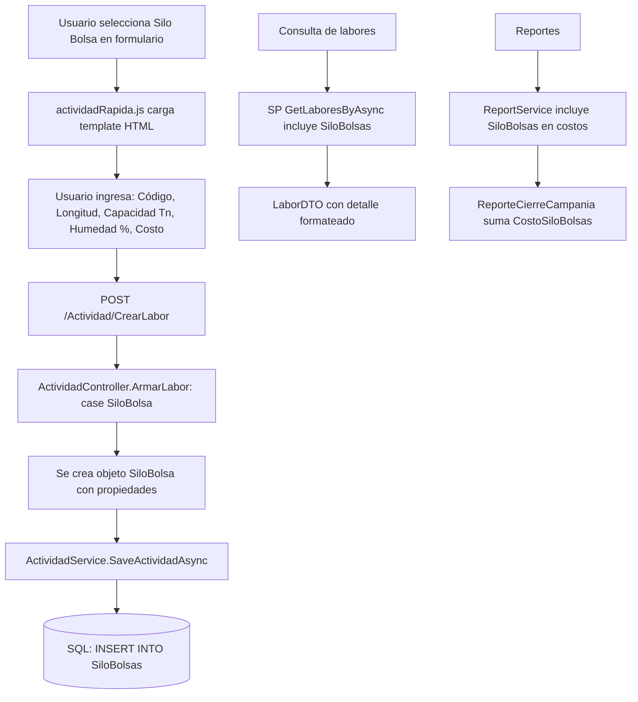

# Plan: Agregar Labor "Silo Bolsa"

## Resumen

Se necesita agregar una nueva labor agrícola llamada **"Silo Bolsa"** (almacenamiento de granos en bolsas plásticas en el campo) siguiendo el mismo patrón de las labores existentes (Siembra, Riego, Cosecha, etc.).

---

## Propiedades de "Silo Bolsa"

| Propiedad | Tipo | Descripción |
|-----------|------|-------------|
| `Codigo` | `string` | Código identificador del silo bolsa (ej: SB-2025-001) |
| `Longitud` | `decimal?` | Longitud del silo bolsa en metros |
| `CapacidadTotalTn` | `decimal?` | Capacidad total almacenada en toneladas |
| `HumedadGrano` | `decimal?` | Humedad del grano al momento del embolsado (%) |
| `Observacion` | `string` | Observaciones (heredado de ILabor) |
| `Costo` | `decimal?` | Costo total (heredado de ILabor) |

**Icono:** `ph-package` — **Color:** `#8B5E3C` (marrón tierra, representando almacenamiento)

**Nota:** El cultivo referenciado se obtiene del `CicloCultivo` vinculado (patrón estándar).

---

## Archivos a Modificar / Crear

### 1. [`AgroForm.Model/EnumClass.cs`](../AgroForm.Model/EnumClass.cs:43) — Agregar nuevo valor al enum

Agregar `SiloBolsa = 9` en `TipoActividadEnum`:

```csharp
public enum TipoActividadEnum
{
    AnalisisSuelo = 1,
    Siembra = 2,
    Pulverizacion = 3,
    Fertilizado = 4,
    Riego = 5,
    Monitoreo = 6,
    Cosecha = 7, 
    OtrasLabores = 8,
    [Display(Name = "Silo Bolsa")]
    SiloBolsa = 9
}
```

### 2. [`AgroForm.Model/Actividades/SiloBolsa.cs`](../AgroForm.Model/Actividades/) — Nuevo modelo (CREAR)

```csharp
using System;
using System.Collections.Generic;
using System.Linq;
using System.Text;
using System.Threading.Tasks;

namespace AgroForm.Model.Actividades
{
    public class SiloBolsa : EntityBaseWithLicencia, ILabor, IEntityBaseWithCampania, IEntityBaseWithMoneda
    {
        public DateTime Fecha { get; set; }
        public string Observacion { get; set; } = string.Empty;
        public decimal? Costo { get; set; }
        public decimal? CostoARS { get; set; }
        public decimal? CostoUSD { get; set; }

        // Propiedades específicas
        public string Codigo { get; set; } = string.Empty;
        public decimal? Longitud { get; set; }
        public decimal? CapacidadTotalTn { get; set; }
        public decimal? HumedadGrano { get; set; }

        // Relaciones base (ILabor)
        public int IdLote { get; set; }
        public Lote Lote { get; set; } = null!;
        public int IdTipoActividad { get; set; }
        public TipoActividad TipoActividad { get; set; } = null!;
        public int? IdUsuario { get; set; }
        public Usuario Usuario { get; set; } = null!;
        public int IdMoneda { get; set; }
        public Moneda Moneda { get; set; } = null!;
        public bool EsDolar => Moneda != null && Moneda.Id == 2;
        public int IdCampania { get; set; }
        public Campania Campania { get; set; } = null!;
        public int IdCicloCultivo { get; set; }
        public CicloCultivo CicloCultivo { get; set; } = null!;
    }
}
```

### 3. [`AgroForm.Web/Models/Actividades/SiloBolsaVM.cs`](../AgroForm.Web/Models/Actividades/) — Nuevo ViewModel (CREAR)

```csharp
using AgroForm.Model;

namespace AgroForm.Web.Models
{
    public class SiloBolsaVM : ActividadVM
    {
        public string Codigo { get; set; } = string.Empty;
        public decimal? Longitud { get; set; }
        public decimal? CapacidadTotalTn { get; set; }
        public decimal? HumedadGrano { get; set; }
    }
}
```

### 4. [`AgroForm.Model/Actividades/LaborDTO.cs`](../AgroForm.Model/Actividades/LaborDTO.cs) — Sin cambios

`LaborDTO` no tiene propiedades específicas por tipo, el detalle se genera en el SP/Service. No requiere modificación.

### 5. [`AgroForm.Data/DBContext/AppDbContext.cs`](../AgroForm.Data/DBContext/AppDbContext.cs) — Agregar DbSet y configuración

**a) Agregar DbSet** (línea ~43):
```csharp
public DbSet<SiloBolsa> SiloBolsas { get; set; }
```

**b) Agregar configuración de EF** (después de `OtraLabor`, ~línea 625):
```csharp
modelBuilder.Entity<SiloBolsa>(entity =>
{
    entity.ToTable("SiloBolsas");
    entity.HasKey(e => e.Id);
    entity.HasIndex(e => e.IdLicencia);

    entity.Property(e => e.Codigo).HasMaxLength(50);
    entity.Property(e => e.Longitud).HasColumnType("decimal(10,2)");
    entity.Property(e => e.CapacidadTotalTn).HasColumnType("decimal(10,2)");
    entity.Property(e => e.HumedadGrano).HasColumnType("decimal(5,2)");

    entity.Property(e => e.Costo).HasColumnType("decimal(18,4)");
    entity.Property(e => e.CostoARS).HasColumnType("decimal(18,4)");
    entity.Property(e => e.CostoUSD).HasColumnType("decimal(18,4)");

    // Relaciones base
    entity.HasOne(a => a.Lote)
        .WithMany(l => l.SiloBolsas)
        .HasForeignKey(a => a.IdLote)
        .OnDelete(DeleteBehavior.Cascade);

    entity.HasOne(a => a.TipoActividad)
        .WithMany()
        .HasForeignKey(a => a.IdTipoActividad)
        .OnDelete(DeleteBehavior.Restrict);

    entity.HasOne(a => a.Usuario)
        .WithMany()
        .HasForeignKey(a => a.IdUsuario)
        .OnDelete(DeleteBehavior.Restrict);

    entity.HasOne(a => a.Campania)
        .WithMany()
        .HasForeignKey(a => a.IdCampania)
        .OnDelete(DeleteBehavior.Restrict);

    entity.HasOne(h => h.Moneda)
        .WithMany()
        .HasForeignKey(h => h.IdMoneda)
        .OnDelete(DeleteBehavior.Restrict);

    entity.HasOne(a => a.CicloCultivo)
        .WithMany(cc => cc.SiloBolsas)
        .HasForeignKey(a => a.IdCicloCultivo)
        .OnDelete(DeleteBehavior.Restrict);
});
```

### 6. [`AgroForm.Model/Lote.cs`](../AgroForm.Model/Lote.cs) — Agregar colección y costos

**a) Agregar colección** (~línea 30):
```csharp
public List<SiloBolsa> SiloBolsas { get; set; } = new();
```

**b) Agregar en `CostoTotalLaboresArs`** (~línea 41, después de OtrasLabores):
```csharp
(SiloBolsas.Any(_ => _.Costo != null) ? SiloBolsas.Sum(x => x.CostoARS.GetValueOrDefault()) : 0);
```

**c) Agregar en `CostoTotalLaboresUsd`** (~línea 51, después de OtrasLabores):
```csharp
(SiloBolsas.Any(_ => _.Costo != null) ? SiloBolsas.Sum(x => x.CostoUSD.GetValueOrDefault()) : 0);
```

### 7. [`AgroForm.Model/Actividades/CicloCultivo.cs`](../AgroForm.Model/Actividades/CicloCultivo.cs) — Agregar colección

Agregar junto a las otras colecciones de actividades:
```csharp
public List<SiloBolsa> SiloBolsas { get; set; } = new();
```

### 8. [`AgroForm.Business/Services/ActividadService.cs`](../AgroForm.Business/Services/ActividadService.cs) — Registrar repositorio y consultas

**a) Constructor** — Agregar repositorio (~línea 39):
```csharp
var repoSiloBolsa = unitOfWork.Repository<SiloBolsa>();
```

**b) Diccionario `_reposPorTipo`** (~línea 50):
```csharp
{ TipoActividadEnum.SiloBolsa, repoSiloBolsa },
```

**c) Diccionario `_reposPorTipoClr`** (~línea 62):
```csharp
{ typeof(SiloBolsa), repoSiloBolsa },
```

**d) Método `GetLaboresByAsyncLegacy`** — Agregar bloque de consulta (después de OtrasLabores, ~línea 345):
```csharp
try
{
    var siloBolsas = await aplicarFiltros((_reposPorTipo[TipoActividadEnum.SiloBolsa] as IGenericRepository<SiloBolsa>).Query()).Select(sb => new LaborDTO
    {
        Id = sb.Id,
        IdTipoActividad = sb.TipoActividad.Id,
        TipoActividad = sb.TipoActividad.Nombre,
        IconoTipoActividad = sb.TipoActividad.Icono,
        IconoColorTipoActividad = sb.TipoActividad.ColorIcono,
        Fecha = sb.Fecha,
        Responsable = sb.RegistrationUser,
        RegistrationDate = sb.RegistrationDate,
        Detalle = $"Código: {sb.Codigo}, Capacidad: {sb.CapacidadTotalTn} Tn, Longitud: {sb.Longitud} m, Humedad: {sb.HumedadGrano}%",
        Costo = sb.Costo,
        CostoUSD = sb.CostoUSD,
        CostoARS = sb.CostoARS,
        IdCampania = sb.IdCampania,
        Campania = sb.Campania.Nombre,
        Observacion = sb.Observacion,
        IdLote = sb.IdLote,
        Lote = sb.Lote.Nombre,
        Campo = sb.Lote.Campo.Nombre,
        EsDolar = sb.IdMoneda == (int)Monedas.DolarOficial
    }).ToListAsync();
    labores.AddRange(siloBolsas);
}
catch (Exception ex)
{
    _logger.LogError(ex, "Error cargando silo bolsas");
}
```

**e) Método `GetLaboresByAsync`** — El SP maneja esto, no requiere cambios aquí.

**f) Método `GetLaboresByAsync(int idActividad, TipoActividadEnum idTipoActividad)`** — Agregar case (~línea 494):
```csharp
case TipoActividadEnum.SiloBolsa:
    var repoSilo = repoObj as IGenericRepository<SiloBolsa>;
    return await repoSilo.Query()
        .Include(s => s.Lote)
            .ThenInclude(l => l.Campo)
        .Include(s => s.TipoActividad)
        .Include(s => s.Moneda)
        .FirstOrDefaultAsync(s => s.Id == idActividad);
```

**g) Método `DeteleActividadAsync`** — Agregar case:
```csharp
case TipoActividadEnum.SiloBolsa:
    var repoSiloBolsaDel = repoObj as IGenericRepository<SiloBolsa>;
    var entitySilo = await repoSiloBolsaDel.GetByIdAsync(idActividad);
    if (entitySilo != null) await repoSiloBolsaDel.DeleteAsync(entitySilo);
    break;
```

### 9. [`Script SQL/sp.sql`](../Script SQL/sp.sql) — Agregar consulta UNION ALL en Stored Procedure

Agregar después de la sección de OtrasLabores (~línea 362):

```sql
UNION ALL

-- ==============================
-- S I L O   B O L S A
-- ==============================
SELECT
    sb.Id,
    sb.IdTipoActividad,
    ta.Nombre,
    ta.Icono,
    ta.ColorIcono,
    sb.Fecha,
    sb.RegistrationUser,
    sb.RegistrationDate,
    CONCAT('Código: ', ISNULL(sb.Codigo, 'N/A'),
           ', Capacidad: ', ISNULL(FORMAT(sb.CapacidadTotalTn, 'N1'), 'N/A'), ' Tn',
           ', Longitud: ', ISNULL(FORMAT(sb.Longitud, 'N1'), 'N/A'), ' m',
           ', Humedad: ', ISNULL(FORMAT(sb.HumedadGrano, 'N1'), 'N/A'), '%'),
    sb.Costo,
    sb.CostoUSD,
    sb.CostoARS,
    sb.IdCampania,
    camp.Nombre,
    sb.Observacion,
    sb.IdLote,
    l.Nombre,
    campo.Nombre,
    CAST(CASE WHEN sb.IdMoneda = 2 THEN 1 ELSE 0 END AS BIT),
    sb.IdCicloCultivo,
    CONCAT(c2.Nombre, CASE WHEN cc.FechaFin IS NULL THEN '' ELSE ' (Cerrado)' END) AS CicloCultivoNombre
FROM SiloBolsas sb
INNER JOIN Lotes l ON l.Id = sb.IdLote
INNER JOIN Campos campo ON campo.Id = l.IdCampo
INNER JOIN Campanias camp ON camp.Id = sb.IdCampania
INNER JOIN TiposActividad ta ON ta.Id = sb.IdTipoActividad
INNER JOIN CicloCultivos cc ON cc.Id = sb.IdCicloCultivo
INNER JOIN Cultivos c2 ON c2.Id = cc.IdCultivo
WHERE sb.IdLicencia = @IdLicencia
  AND (@IdCampaniaFilter IS NULL OR sb.IdCampania = @IdCampaniaFilter)
  AND (@IdLoteFilter IS NULL OR sb.IdLote = @IdLoteFilter)
  AND (@IdsLotes IS NULL OR sb.IdLote IN (SELECT Id FROM @LotesFilter))
```

### 10. [`AgroForm.Web/Controllers/ActividadController.cs`](../AgroForm.Web/Controllers/ActividadController.cs) — Agregar case en ArmarLabor

En el switch de [`ArmarLabor`](../AgroForm.Web/Controllers/ActividadController.cs:122), agregar después de `case TipoActividadEnum.OtrasLabores`:

```csharp
case TipoActividadEnum.SiloBolsa:
    actividad = new SiloBolsa
    {
        Codigo = model.DatosEspecificos?.Codigo ?? string.Empty,
        Longitud = model.DatosEspecificos?.Longitud,
        CapacidadTotalTn = model.DatosEspecificos?.CapacidadTotalTn,
        HumedadGrano = model.DatosEspecificos?.HumedadGrano,
    };
    break;
```

### 11. [`AgroForm.Web/Models/IndexVM/ActividadRapidaVM.cs`](../AgroForm.Web/Models/IndexVM/ActividadRapidaVM.cs) — Agregar propiedades en DatosEspecificosVM

Agregar al final de la clase `DatosEspecificosVM`:

```csharp
// Silo Bolsa
public string? Codigo { get; set; }
public decimal? Longitud { get; set; }
public decimal? CapacidadTotalTn { get; set; }
public decimal? HumedadGrano { get; set; }
```

### 12. [`AgroForm.Web/Views/Shared/Components/ActividadRapida/Default.cshtml`](../AgroForm.Web/Views/Shared/Components/ActividadRapida/Default.cshtml) — Agregar template HTML

Agregar dentro de `<div id="templates">`, después del template de Cosecha:

```html
<!-- SILO BOLSA -->
<div id="templateSiloBolsa">
    <div class="card mb-3">
        <div class="card-header" style="background-color: #8B5E3C; color: white;">
            <h6 class="card-title mb-0">
                <i class="ph ph-package me-1"></i>Datos de Silo Bolsa
            </h6>
        </div>
        <div class="card-body">
            <div class="row">
                <div class="col-md-3">
                    <div class="mb-3">
                        <label for="codigoSiloBolsa" class="form-label">Código</label>
                        <input type="text" class="form-control" id="codigoSiloBolsa" name="Codigo"
                               placeholder="Ej: SB-2025-001" maxlength="50">
                    </div>
                </div>
                <div class="col-md-3">
                    <div class="mb-3">
                        <label for="longitudSiloBolsa" class="form-label">Longitud (m)</label>
                        <input type="number" class="form-control" id="longitudSiloBolsa" name="Longitud"
                               min="0.01" step="0.01" placeholder="Ej: 60">
                    </div>
                </div>
                <div class="col-md-3">
                    <div class="mb-3">
                        <label for="capacidadTotalTn" class="form-label">Capacidad Total (Tn)</label>
                        <input type="number" class="form-control" id="capacidadTotalTn" name="CapacidadTotalTn"
                               min="0.01" step="0.01">
                    </div>
                </div>
                <div class="col-md-3">
                    <div class="mb-3">
                        <label for="humedadGrano" class="form-label">Humedad del Grano (%)</label>
                        <input type="number" class="form-control" id="humedadGrano" name="HumedadGrano"
                               min="0" max="100" step="0.1">
                    </div>
                </div>
            </div>
            <div class="row">
                <div class="col-md-5">
                    <div class="mb-3">
                        <label for="costoSiloBolsaTotal" class="form-label">Costo</label>
                        <div class="input-group">
                            <span class="input-group-text" id="labelMonedaCostoSiloBolsa">$</span>
                            <input type="number" class="form-control" id="costoSiloBolsaTotal"
                                   name="Costo" min="0.01" step="0.01">
                            <div class="form-check form-switch ms-2">
                                <input class="form-check-input" type="checkbox" id="switchMonedaCostoSiloBolsa">
                                <label class="form-check-label" for="switchMonedaCostoSiloBolsa">ARS</label>
                            </div>
                        </div>
                    </div>
                </div>
            </div>
        </div>
    </div>
</div>
```

### 13. [`AgroForm.Web/wwwroot/js/views/actividadRapida.js`](../AgroForm.Web/wwwroot/js/views/actividadRapida.js) — Registrar template

**a) Mapeo de templates** (~lín ea 22):
```javascript
'SiloBolsa': '#templateSiloBolsa',
```

**b) Función `cargarDatosParaSelects`** — Agregar case:
```javascript
case 'SiloBolsa':
    cargarSwitchMoneda("switchMonedaCostoSiloBolsa", "labelMonedaCostoSiloBolsa");
    break;
```

### 14. [`AgroForm.Web/wwwroot/js/views/actividad.js`](../AgroForm.Web/wwwroot/js/views/actividad.js) — Agregar case en edición

En [`cargarDatosEspecificosEditar`](../AgroForm.Web/wwwroot/js/views/actividad.js:169), agregar después del case 8:

```javascript
case 9: // SiloBolsa
    if (datosEspecificos.codigo != null) $('#codigoSiloBolsa').val(datosEspecificos.codigo);
    if (datosEspecificos.longitud != null) $('#longitudSiloBolsa').val(datosEspecificos.longitud);
    if (datosEspecificos.capacidadTotalTn != null) $('#capacidadTotalTn').val(datosEspecificos.capacidadTotalTn);
    if (datosEspecificos.humedadGrano != null) $('#humedadGrano').val(datosEspecificos.humedadGrano);
    if (datosEspecificos.costo != null) $('#costoSiloBolsaTotal').val(datosEspecificos.costo);
    if (datosEspecificos.esDolar != null) $('#switchMonedaCostoSiloBolsa').prop('checked', !!datosEspecificos.esDolar).trigger('change');
    break;
```

### 15. [`AgroForm.Business/Services/ReportService.cs`](../AgroForm.Business/Services/ReportService.cs) — Costos

**a) En [`GetComparativaCamposAsync`](../AgroForm.Business/Services/ReportService.cs:24)** — Agregar `.Include`:
```csharp
.Include(l => l.CicloCultivos)
    .ThenInclude(c => c.SiloBolsas)
```

**b) En [`ObtenerCostosARS`](../AgroForm.Business/Services/ReportService.cs:1471)**:
```csharp
foreach (var sb in lote.SiloBolsas) total += sb.CostoARS.GetValueOrDefault();
```

**c) En [`ObtenerCostosUSD`](../AgroForm.Business/Services/ReportService.cs:1487)**:
```csharp
foreach (var sb in lote.SiloBolsas) total += sb.CostoUSD.GetValueOrDefault();
```

### 16. [`AgroForm.Model/ReporteCierreCampania.cs`](../AgroForm.Model/ReporteCierreCampania.cs) — Costos de cierre

**a) Agregar propiedades**:
```csharp
public decimal CostoSiloBolsasArs { get; set; }
public decimal CostoSiloBolsasUsd { get; set; }
```

**b) Actualizar `CostoTotalArs`**:
```csharp
public decimal CostoTotalArs => ... + CostoOtrasLaboresArs + CostoSiloBolsasArs;
```

**c) Actualizar `CostoTotalUsd`**:
```csharp
public decimal CostoTotalUsd => ... + CostoOtrasLaboresUsd + CostoSiloBolsasUsd;
```

**d) Actualizar configuración EF en `AppDbContext`** (~línea 700, donde se configuran los decimales):
```csharp
entity.Property(e => e.CostoSiloBolsasArs).HasColumnType("decimal(18,4)");
entity.Property(e => e.CostoSiloBolsasUsd).HasColumnType("decimal(18,4)");
```

### 17. [`AgroForm.Web/Utilities/MapsterConfig.cs`](../AgroForm.Web/Utilities/MapsterConfig.cs) — Sin cambios

Mapster mapea automáticamente por nombre, no requiere configuración adicional.

### 18. Script SQL de migración — Crear tabla

```sql
CREATE TABLE [dbo].[SiloBolsas] (
    [Id] INT IDENTITY(1,1) NOT NULL,
    [IdLicencia] INT NOT NULL,
    [RegistrationDate] DATETIME2 NOT NULL,
    [RegistrationUser] NVARCHAR(MAX),
    [ModificationDate] DATETIME2,
    [ModificationUser] NVARCHAR(MAX),
    
    [Fecha] DATETIME2 NOT NULL,
    [Observacion] NVARCHAR(MAX) NOT NULL DEFAULT '',
    [Costo] DECIMAL(18,4),
    [CostoARS] DECIMAL(18,4),
    [CostoUSD] DECIMAL(18,4),
    
    [Codigo] NVARCHAR(50) NOT NULL DEFAULT '',
    [Longitud] DECIMAL(10,2),
    [CapacidadTotalTn] DECIMAL(10,2),
    [HumedadGrano] DECIMAL(5,2),
    
    [IdLote] INT NOT NULL,
    [IdTipoActividad] INT NOT NULL,
    [IdUsuario] INT,
    [IdMoneda] INT NOT NULL,
    [IdCampania] INT NOT NULL,
    [IdCicloCultivo] INT NOT NULL,
    
    CONSTRAINT [PK_SiloBolsas] PRIMARY KEY ([Id]),
    CONSTRAINT [FK_SiloBolsas_Lotes] FOREIGN KEY ([IdLote]) REFERENCES [Lotes]([Id]),
    CONSTRAINT [FK_SiloBolsas_TiposActividad] FOREIGN KEY ([IdTipoActividad]) REFERENCES [TiposActividad]([Id]),
    CONSTRAINT [FK_SiloBolsas_Usuarios] FOREIGN KEY ([IdUsuario]) REFERENCES [Usuarios]([Id]),
    CONSTRAINT [FK_SiloBolsas_Monedas] FOREIGN KEY ([IdMoneda]) REFERENCES [Monedas]([Id]),
    CONSTRAINT [FK_SiloBolsas_Campanias] FOREIGN KEY ([IdCampania]) REFERENCES [Campanias]([Id]),
    CONSTRAINT [FK_SiloBolsas_CicloCultivos] FOREIGN KEY ([IdCicloCultivo]) REFERENCES [CicloCultivos]([Id])
);
CREATE INDEX [IX_SiloBolsas_IdLicencia] ON [SiloBolsas]([IdLicencia]);
```

Además, insertar el registro en la tabla `TiposActividad`:

```sql
INSERT INTO TiposActividad (Id, Nombre, Icono, ColorIcono, IdLicencia)
VALUES (9, 'Silo Bolsa', 'ph-package', '#8B5E3C', NULL);
```

---

## Checklist de Archivos

| # | Archivo | Acción |
|---|---------|--------|
| 1 | `AgroForm.Model/EnumClass.cs` | ✏️ Agregar `SiloBolsa = 9` |
| 2 | `AgroForm.Model/Actividades/SiloBolsa.cs` | 🆕 Crear modelo |
| 3 | `AgroForm.Web/Models/Actividades/SiloBolsaVM.cs` | 🆕 Crear ViewModel |
| 4 | `AgroForm.Data/DBContext/AppDbContext.cs` | ✏️ Agregar `DbSet` y configuración EF |
| 5 | `AgroForm.Model/Lote.cs` | ✏️ Agregar colección y costos |
| 6 | `AgroForm.Model/Actividades/CicloCultivo.cs` | ✏️ Agregar colección |
| 7 | `AgroForm.Business/Services/ActividadService.cs` | ✏️ Registrar repo y consultas |
| 8 | `Script SQL/sp.sql` | ✏️ Agregar UNION ALL |
| 9 | `AgroForm.Web/Controllers/ActividadController.cs` | ✏️ Agregar case en ArmarLabor |
| 10 | `AgroForm.Web/Models/IndexVM/ActividadRapidaVM.cs` | ✏️ Agregar propiedades en DatosEspecificosVM |
| 11 | `AgroForm.Web/Views/Shared/Components/ActividadRapida/Default.cshtml` | ✏️ Agregar template HTML |
| 12 | `AgroForm.Web/wwwroot/js/views/actividadRapida.js` | ✏️ Registrar template y datos |
| 13 | `AgroForm.Web/wwwroot/js/views/actividad.js` | ✏️ Agregar case edición |
| 14 | `AgroForm.Business/Services/ReportService.cs` | ✏️ Agregar costos |
| 15 | `AgroForm.Model/ReporteCierreCampania.cs` | ✏️ Agregar costos de cierre |
| 16 | Script SQL migración | ➕ Crear tabla + insert TipoActividad |

---

## Diagrama de Flujo


