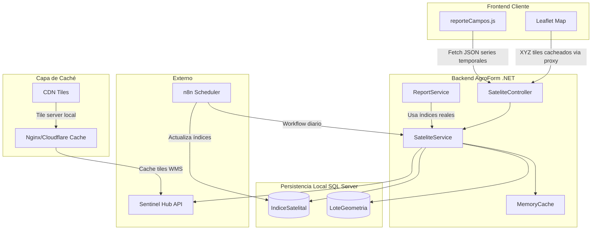
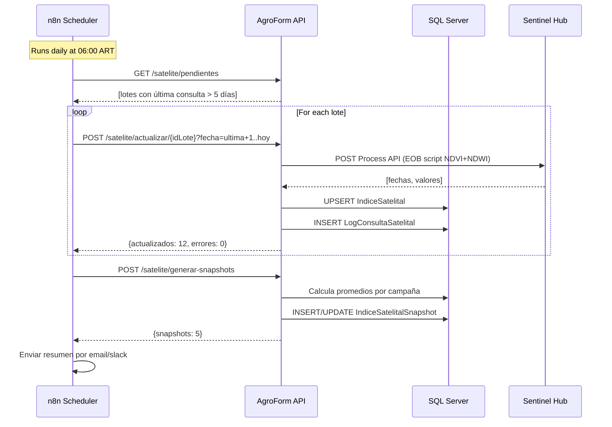
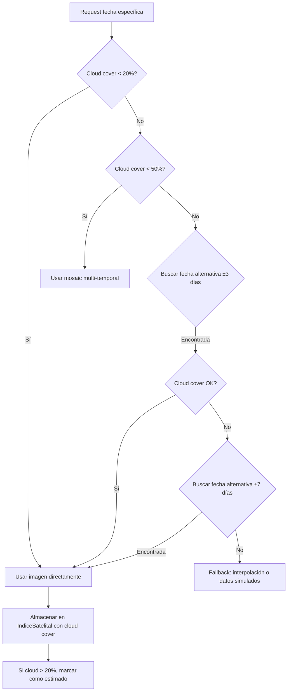
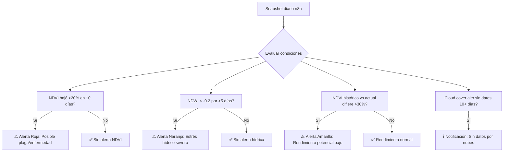
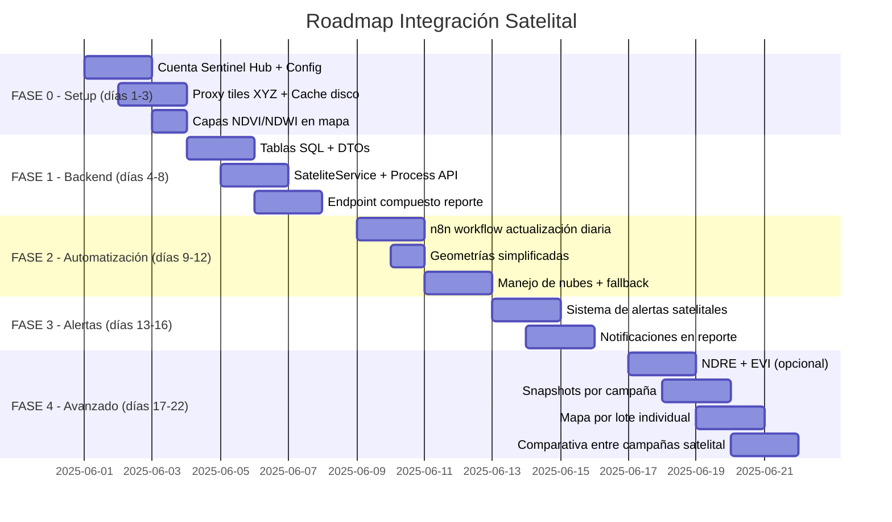

# Auditoría Técnica y Arquitectura Mejorada: Integración de Índices Satelitales

## Contexto del análisis
- **Sistema**: AgroForm — SaaS agrario .NET 8 + Leaflet + SQL Server
- **Stack actual**: Backend ASP.NET Core, frontend JS vanilla (jQuery), VPS Linux, n8n
- **Estado**: NDVI simulado por días desde siembra
- **Código clave revisado**: [`ReportService.cs`](AgroForm.Business/Services/ReportService.cs:1092), [`reporteCampos.js`](AgroForm.Web/wwwroot/js/views/reporteCampos.js:377), [`ReportesDto.cs`](AgroForm.Business/Contracts/ReportesDto.cs:150), [`Campo.cs`](AgroForm.Model/Campo.cs:16), [`StartupHelper.cs`](AgroForm.Business/StartupHelper.cs:22), [`ServiceExtensions.cs`](AgroForm.Web/Utilities/ServiceExtensions.cs:7)

---

## 1. Auditoría del Plan Original

### Fortalezas
- ✅ Elección correcta de Sentinel Hub como fuente (mejor relación calidad/precio para MVP)
- ✅ Uso de Leaflet para overlays (ya implementado en [`renderizarMapa()`](AgroForm.Web/wwwroot/js/views/reporteCampos.js:377))
- ✅ Reconocimiento de que el NDVI actual es simulado y debe reemplazarse
- ✅ Separación en fases clara

### Debilidades críticas
| # | Problema | Riesgo |
|---|----------|--------|
| ❌ | **Sin estrategia de caché** | El free tier de Sentinel Hub (30k req/mes) se agotaría en días con múltiples usuarios |
| ❌ | **Sin persistencia local** | Dependencia total de API externa en tiempo real = latencia + límites + sin historial |
| ❌ | **WMS directo desde frontend** | El `instanceId` quedaría expuesto en el JS del cliente = riesgo de seguridad |
| ❌ | **Sin manejo de nubes** | Muchas fechas devuelven NDVI=null sin fallback → UX pobre |
| ❌ | **Polígonos sin optimizar** | [`Campo.CoordenadasPoligono`](AgroForm.Model/Campo.cs:16) es JSON string sin simplificación → geometrías pesadas |
| ❌ | **Sin scheduler automático** | Cada request sería on-demand → picos de consumo + sin datos si el usuario no consulta |
| ❌ | **Sin soporte multitenant** | No considera que cada licencia (cliente) tendrá sus propios lotes y límites |

### Riesgos del plan original para un SaaS productivo
1. **Límite de API**: 30k requests/mes gratis. Con 10 usuarios consultando 10 lotes/día = 3000 req/mes ≈ 10% del cupo. Con 100 usuarios = inviable.
2. **Latencia en vivo**: WMS directo desde frontend + sin caché = cada carga de mapa = request a Sentinel Hub = 1-3 segundos de espera.
3. **Cobertura de nubes**: Argentina tiene alta nubosidad estacional. Sin manejo de esto, el usuario ve mapas vacíos.
4. **Sin datos históricos**: Si no persisten localmente, no se pueden hacer comparativas con campañas anteriores.

---

## 2. Arquitectura Mejorada Propuesta



### Principios arquitectónicos
1. **Proxy obligatorio**: Toda comunicación con Sentinel Hub pasa por backend .NET (nunca directa desde frontend)
2. **Persistencia primero**: Los índices se almacenan localmente antes de servirse al frontend
3. **Caché multinivel**: MemoryCache + SQL + Nginx/CDN
4. **Scheduler offload**: n8n se encarga de la actualización diaria, no el usuario on-demand

---

## 3. Estrategia de Mapas: XYZ > WMS > WMTS

### Análisis comparativo para Leaflet + Sentinel Hub

| Aspecto | WMS | WMTS | **XYZ Tiles** |
|---------|-----|------|---------------|
| **Latencia** | Media (server-side render) | Baja (tiles pre-renderizados) | **Mínima** |
| **Cacheabilidad** | Baja (cada request es único) | Alta (tiles con URL fija) | **Máxima** |
| **Consumo API Sentinel** | Alto (1 request = 1 render) | Medio | **Bajo** (tiles cacheados) |
| **Complejidad backend** | Baja | Media | **Media-alta** |
| **Leaflet compatibilidad** | `L.tileLayer.wms()` | `L.tileLayer()` con URL template | `L.tileLayer()` nativo |
| **Calidad visual** | Variable según parámetros | Consistente | **Consistente** |
| **Escalabilidad** | Mala (render por usuario) | Buena | **Excelente** |

### Recomendación: Proxy de XYZ tiles

En lugar de WMS directo o WMTS, implementar un **proxy de tiles XYZ** en .NET:

```
Flujo recomendado:
Frontend → /satelite/tiles/{z}/{x}/{y}.png?indice=NDVI&fecha=2025-01-15
         → Backend verifica si el tile existe en disco/caché
         → Si no existe: lo genera desde Sentinel Hub WMS y lo cachea
         → Si existe: lo sirve desde disco con Cache-Control: public, max-age=31536000
```

**Ventajas**:
- Los tiles se generan **una vez** y se cachean para siempre
- Múltiples usuarios ven el mismo tile sin consumir API
- Se puede precargar con n8n
- Se puede servir desde Nginx directamente

**Implementación**:

```csharp
[HttpGet("tiles/{z}/{x}/{y}.png")]
public async Task<IActionResult> GetTile(
    int z, int x, int y,
    [FromQuery] string indice,
    [FromQuery] string fecha)  // ⚠️ Siempre YYYY-MM-DD explícito, nunca null
{
    // Validar que fecha sea explícita y válida
    if (!DateOnly.TryParseExact(fecha, "yyyy-MM-dd", out _))
        return BadRequest("fecha debe ser YYYY-MM-DD explícito");
    
    var tilePath = GetCachedTilePath(z, x, y, indice, fecha);
    
    if (System.IO.File.Exists(tilePath))
        return PhysicalFile(tilePath, "image/png");
    
    // Proxy a Sentinel Hub
    var tileBytes = await _sateliteService.FetchTileAsync(z, x, y, indice, fecha);
    
    if (tileBytes == null)
        return NotFound("No hay datos para esta fecha");
    
    // Cachear localmente con TTL 7 días
    Directory.CreateDirectory(Path.GetDirectoryName(tilePath)!);
    await System.IO.File.WriteAllBytesAsync(tilePath, tileBytes);
    
    return File(tileBytes, "image/png");
}

// Cache key determinístico con fecha explícita
private string GetCachedTilePath(int z, int x, int y, string indice, string fecha)
{
    // Formato: tiles/{indice}/{fecha}/{z}/{x}/{y}.png
    // Ejemplo: tiles/NDVI/2025-01-15/12/345/678.png
    return Path.Combine(_tilesRoot, indice, fecha, z.ToString(), x.ToString(), $"{y}.png");
}
```

---

## 4. Estrategia de Caché Completa

### Niveles de caché

```mermaid
graph TB
    subgraph "Nivel 1: Navegador"
        A[Cache-Control headers]
        A -->|Tiles: 1 año| B[Browser Cache]
        A -->|Series: 1 hora| B
    end
    subgraph "Nivel 2: CDN / Nginx"
        C[Nginx proxy cache]
        C -->|Tiles: 1 año| D[FastCGI Cache]
        C -->|API JSON: 5 min| D
    end
    subgraph "Nivel 3: Backend Memory"
        E[IMemoryCache .NET]
        E -->|Índices promedio: 30 min| F[RAM]
        E -->|Último valor: 5 min| F
    end
    subgraph "Nivel 4: SQL Server"
        G[(IndiceSatelital)]
        G -->|Datos persistidos| H[Histórico]
        G -->|Último snapshot| H
    end
    subgraph "Nivel 5: Sentiel Hub"
        I[API Externa]
    end
```



### Qué cachear, dónde y por cuánto

| Dato | Cache | TTL | Estrategia de invalidación |
|------|-------|-----|---------------------------|
| **Tile individual (PNG)** | Disco (file system) + Browser Cache | **7 días (MVP)** → **30 días** después | Sentinel reprocesa imágenes. Si cambia color map o script, los tiles viejos quedan obsoletos. 7 días es seguro para empezar. |
| **Serie temporal NDVI/NDWI (JSON)** | MemoryCache | **30 min** | Al completarse nueva actualización desde n8n |
| **Último índice promedio** | MemoryCache | **5 min** | Al refrescar reporte |
| **Lista de fechas disponibles** | MemoryCache | **1 hora** | Al completarse nuevo scan de n8n |
| **Geometría de lote simplificada** | SQL + MemoryCache | **1 día** | Solo si el usuario edita el polígono |
| **Token de acceso Sentinel Hub** | MemoryCache | **55 min** (token expira a los 60 min) | Renovación automática |

### ⚠️ Política explícita: NO guardar PNG tiles en MemoryCache

Los tiles son binarios pesados (10-50 KB c/u). Con muchas combinaciones (zoom, fecha, índice), MemoryCache se llena rápido y compite con datos más valiosos.

**MemoryCache se usa SOLO para**:
- Tokens OAuth de Sentinel Hub
- Series temporales JSON (NDVI/NDWI por fecha)
- Índices promedio del último snapshot

**Los tiles van a**:
- Disco (file system del VPS) con TTL 7 días
- Browser Cache (via `Cache-Control: public, max-age=604800`)

### Tamaño estimado de caché
- **1 tile PNG**: ~10-50 KB
- **1 campo típico (10 lotes, serie 6 meses)**: ~20 tiles = 200 KB-1 MB
- **100 campos cacheados**: ~20-100 MB en disco
- **Total aceptable**: < 2 GB en disco para tiles

---

## 5. Persistencia Local — Tablas SQL

### Tablas recomendadas

```sql
-- ============================================
-- Tabla 1: Índices satelitales por lote
-- ============================================
CREATE TABLE IndiceSatelital (
    Id INT IDENTITY PRIMARY KEY,
    IdLote INT NOT NULL FOREIGN KEY REFERENCES Lote(Id),
    IdLicencia INT NULL FOREIGN KEY REFERENCES Licencia(Id),
    FechaCaptura DATE NOT NULL,          -- Fecha de la imagen satelital
    FechaConsulta DATETIME2 NOT NULL,     -- Cuándo se consultó/procesó
    Fuente VARCHAR(50) NOT NULL DEFAULT 'Sentinel-2',  -- Sentinel-2, Landsat-9
    ResolucionMts INT NOT NULL DEFAULT 10,
    CloudCover DECIMAL(5,2),             -- 0.00 a 100.00
    NDVI DECIMAL(5,3),                   -- -1.000 a 1.000
    NDWI DECIMAL(5,3),                   -- -1.000 a 1.000
    EVI DECIMAL(5,3) NULL,               -- Opcional
    NDRE DECIMAL(5,3) NULL,              -- Opcional
    SAVI DECIMAL(5,3) NULL,              -- Opcional
    GNDVI DECIMAL(5,3) NULL,             -- Opcional
    EsValido BIT NOT NULL DEFAULT 1,      -- False si cloud cover > umbral
    IdCampania INT NULL FOREIGN KEY REFERENCES Campania(Id),
    
    INDEX IX_IndiceSatelital_Lote_Fecha (IdLote, FechaCaptura DESC),
    INDEX IX_IndiceSatelital_Licencia (IdLicencia),
    INDEX IX_IndiceSatelital_Fecha (FechaCaptura)
);

-- ============================================
-- ⏳ Tabla 2: Snapshots de campaña (DIFERIDO a FASE 4)
-- ============================================
-- Los snapshots promediados NO se implementan en MVP.
-- Se calculan sobre la marcha con AVG(NDVI) WHERE IdCampania = @id
-- La tabla física se creará cuando se necesiten analytics avanzados.
-- Ver: FASE 4 del roadmap.

-- ============================================
-- Tabla 2 (MVP): Geometrías optimizadas de lotes
-- ============================================
CREATE TABLE LoteGeometria (
    Id INT IDENTITY PRIMARY KEY,
    IdLote INT NOT NULL FOREIGN KEY REFERENCES Lote(Id),
    GeometriaOriginal NVARCHAR(MAX) NOT NULL,  -- GeoJSON original
    GeometriaSimplificada NVARCHAR(MAX) NOT NULL,  -- GeoJSON simplificado
    ToleranciaSimplificacion DECIMAL(10,6),    -- Tolerancia usada
    AreaHa DECIMAL(10,4),                     -- Área calculada desde geometría
    CentroLat DECIMAL(10,7),
    CentroLng DECIMAL(10,7),
    BoundsJson NVARCHAR(500),                 -- Bounding box
    FechaCalculo DATETIME2 NOT NULL,
    
    INDEX IX_LoteGeometria_Lote (IdLote)
);

-- ============================================
-- Tabla 3 (MVP): Log de consultas a Sentinel Hub
-- ⚠️ Métricas separadas: tiles NO cuentan para el límite "caro"
-- Los tiles son livianos y se cachean. Lo valioso/caro son:
--   - Process API calls (series temporales)
--   - Consultas analíticas (estadísticas por campaña)
-- Los tiles se registran en el log pero con TipoConsulta = 'TILE'
-- para poder filtrarlos en los reportes de consumo.
-- ============================================
CREATE TABLE LogConsultaSatelital (
    Id BIGINT IDENTITY PRIMARY KEY,
    IdLote INT NULL,
    FechaConsulta DATETIME2 NOT NULL,
    TipoConsulta VARCHAR(50),  -- 'TIME_SERIES', 'TILE', 'CURRENT_INDEX'
    IndiceSolicitado VARCHAR(50),  -- 'NDVI', 'NDWI', 'ALL'
    FechaDesde DATE,
    FechaHasta DATE,
    Parametros NVARCHAR(MAX),  -- JSON con params usados
    DuracionMs INT,
    Exitoso BIT NOT NULL,
    ErrorMessage NVARCHAR(500) NULL,
    CostoEstimado DECIMAL(10,8),  -- Costo en USD estimado del request
    IdLicencia INT NULL,
    
    INDEX IX_Log_Fecha (FechaConsulta DESC),
    INDEX IX_Log_Lote (IdLote)
);
```

### ¿Por qué persistir localmente? (5 razones)

1. **Rendimiento**: Consultar SQL es 10-50ms vs 500-3000ms contra Sentinel Hub
2. **Confiabilidad**: Fallos de red / límites de API no afectan la visualización
3. **Historial**: Se pueden comparar campañas 2023 vs 2024 sin volver a consultar
4. **Analytics**: Datos históricos almacenados = dataset para ML predictivo futuro
5. **Costo**: Un request a Sentinel cuesta ~$0.001-0.01. Persistiendo, pagas 1 vez y sirves 1000 veces

---

## 6. Scheduler Automático con n8n

### Arquitectura del workflow



### Workflow n8n recomendado

```json
{
  "name": "Actualización Diaria Índices Satelitales",
  "nodes": [
    {
      "name": "Schedule Trigger",
      "type": "n8n-nodes-base.scheduleTrigger",
      "parameters": {
        "rule": {
          "interval": [
            { "field": "cron", "expression": "0 6 * * *" }
          ]
        }
      }
    },
    {
      "name": "HTTP Request - Get lotes pendientes",
      "type": "n8n-nodes-base.httpRequest",
      "parameters": {
        "url": "https://agroform.app/api/satelite/pendientes?dias=5",
        "method": "GET",
        "authentication": "genericCredentialType"
      }
    },
    {
      "name": "SplitInBatches",
      "type": "n8n-nodes-base.splitInBatches",
      "parameters": { "batchSize": 10 }
    },
    {
      "name": "HTTP Request - Update lote",
      "type": "n8n-nodes-base.httpRequest",
      "parameters": {
        "url": "=/api/satelite/actualizar/{{ $json.idLote }}",
        "method": "POST",
        "sendQuery": true,
        "queryParameters": {
          "fechaDesde": "={{ $json.ultimaFecha }}",
          "fechaHasta": "={{ new Date().toISOString().split('T')[0] }}"
        }
      }
    },
    {
      "name": "Wait (rate limit 1s)",
      "type": "n8n-nodes-base.wait",
      "parameters": { "amount": 1, "unit": "seconds" }
    }
  ]
}
```

### Frecuencia óptima
- **Diaria** (06:00 ART): Actualización de lotes activos (con cultivo en campaña actual)
- **Semanal**: Lotes sin actividad (campos en barbecho)
- **Bajo demanda**: Cuando usuario fuerza refresh desde el reporte

### Optimización de consumo API
- Solo actualizar lotes con última consulta > 5 días
- Batch de 10 lotes por minuto para evitar rate limiting
- Saltar días con cloud cover > 80% (no gastar request en imágenes inservibles)

---

## 7. Índices Agronómicos Priorizados

### Tabla de índices recomendados

| Índice | Fórmula | Prioridad | Cuándo usarlo | Limitaciones |
|--------|---------|-----------|---------------|--------------|
| **NDVI** | (NIR-RED)/(NIR+RED) | **MVP** | Vigor vegetal general | Satura en cultivos densos (NDVI > 0.8) |
| **NDWI** | (GREEN-NIR)/(GREEN+NIR) | **MVP** | Contenido de agua en vegetación | Sensible a suelo desnudo |
| **NDRE** | (NIR-RE)/(NIR+RE) | **FASE 2** | Estado en cultivos avanzados (maíz, soja GR) | Requiere banda Red Edge (B5 en Sentinel-2) |
| **EVI** | 2.5*(NIR-RED)/(NIR+6*RED-7.5*BLUE+1) | **FASE 2** | Zonas con alta biomasa | Más complejo, menos intuitivo |
| **SAVI** | (NIR-RED)/(NIR+RED+L)*(1+L) | **FASE 2** | Suelo desnudo o baja cobertura | Requiere factor L (suelo) |
| **GNDVI** | (NIR-GREEN)/(NIR+GREEN) | **FASE 3** | Clorofila y nitrógeno | Menos sensible que NDRE |
| **LAI** | Índice de Área Foliar | **FASE 3** | Modelos de crecimiento | Requiere calibración |

### Recomendación para MVP
**NDVI + NDWI** es suficiente. El NDVI es el estándar de la industria y los productores lo entienden. El NDWI agrega valor hídrico inmediato.

### Saturación de NDVI en cultivos argentinos
- **Soja en R5 (llenado de granos)**: NDVI > 0.85 → saturado. Usar NDRE en estos casos.
- **Maíz en VT (panojamiento)**: NDVI > 0.90 → saturado. NDRE muestra diferencias.
- **Trigo en espigazón**: NDVI > 0.80 → en el límite.
- **Pasturas**: NDVI funciona bien en todo el ciclo.

Para el MVP, mostrar advertencia visual si NDVI > 0.85: *"Cultivo en etapa avanzada, considerar NDRE para mayor precisión"*.

---

## 8. Manejo de Nubes y Calidad de Imágenes

### Estrategia completa



### Thresholds recomendados

| Uso | Cloud Cover máximo | Acción |
|-----|-------------------|--------|
| **Tile de mapa (visual)** | 30% | Se muestra pero se marca "nublado" con advertencia |
| **Serie temporal** | 20% | Se excluye el punto, se interpola linealmente |
| **Snapshot de campaña** | 10% | Solo observaciones de alta calidad |
| **Alerta automática** | 5% | Solo alertar si la imagen es confiable |

### Fallback UX
```javascript
// En el frontend, cuando el backend devuelve datos con nubes:
if (dato.esValido === false) {
    // Mostrar punto en gris (no en la curva)
    // Tooltip: "Dato estimado - Imagen con nubes el 15/01"
    // Línea punteada conectando puntos válidos
}
```

---

## 9. Optimización de Geometrías de Lotes

### Problema detectado
[`Campo.CoordenadasPoligono`](AgroForm.Model/Campo.cs:16) se almacena como JSON string, pero:
- Sin validación de proyección espacial (SRID)
- Sin simplificación de geometría
- Posiblemente con puntos redundantes

### Estrategia de simplificación

```csharp
// Usando NetTopologySuite (.NET spatial library)
using NetTopologySuite.Geometries;
using NetTopologySuite.Simplify;

public string SimplificarGeometria(string geoJsonOriginal, double tolerancia = 0.0001)
{
    var reader = new NetTopologySuite.IO.GeoJsonReader();
    var geometry = reader.Read<Polygon>(geoJsonOriginal);
    
    // Douglas-Peucker simplification
    // Tolerancia: 0.0001 grados ≈ 10 metros en Argentina
    var simplificada = DouglasPeuckerSimplifier.Simplify(geometry, tolerancia);
    
    // Validar que no pierda más del 1% del área original
    if ((simplificada.Area / geometry.Area) < 0.99)
    {
        // Reducir tolerancia y reintentar
        simplificada = DouglasPeuckerSimplifier.Simplify(geometry, tolerancia * 0.5);
    }
    
    var writer = new NetTopologySuite.IO.GeoJsonWriter();
    return writer.Write(simplificada);
}
```

### Impacto esperado
| Tipo de lote | Puntos originales | Puntos simplificados | Reducción |
|-------------|-------------------|---------------------|-----------|
| Lote cuadrado (50 ha) | 5-10 | 5 | 0-50% |
| Lote irregular (20 ha) | 50-200 | 15-30 | **70-85%** |
| Lote muy complejo (100 ha) | 500+ | 30-50 | **90%+** |

- **Payload API reducido** de ~50 KB a ~2 KB
- **Menor costo en Sentinel Hub** (procesar geometría más pequeña = menos unidades de procesamiento)
- **Tiempo de consulta reducido** de ~2s a ~500ms

### Librería recomendada
[`NetTopologySuite`](https://github.com/NetTopologySuite/NetTopologySuite) — es el port .NET de JTS (Java Topology Suite), estándar en el mundo GIS.

---

## 10. Estrategia Backend/Frontend

### ⚠️ Resiliencia HTTP con Polly (obligatorio)

Sentinel Hub puede: tardar respuestas, rate limitar (429), cortar conexiones, o fallar intermitentemente. Sin un manejo robusto, el pipeline de n8n falla a mitad de batch y deja datos inconsistentes.

```xml
<!-- NuGet: Microsoft.Extensions.Http.Polly -->
<PackageReference Include="Microsoft.Extensions.Http.Polly" Version="8.0.0" />
```

```csharp
// En Program.cs — HttpClient resiliente para Sentinel Hub
builder.Services.AddHttpClient("SentinelHub", client =>
{
    client.BaseAddress = new Uri("https://services.sentinel-hub.com/");
    client.Timeout = TimeSpan.FromSeconds(30);
})
.AddTransientHttpErrorPolicy(p => p
    .WaitAndRetryAsync(3, retryAttempt =>
        TimeSpan.FromSeconds(Math.Pow(2, retryAttempt))))  // 2s, 4s, 8s
.AddTransientHttpErrorPolicy(p => p
    .CircuitBreakerAsync(5, TimeSpan.FromSeconds(30)))  // 5 fallos → 30s abierto
.AddPolicyHandler(Policy.TimeoutAsync<HttpResponseMessage>(10));  // Timeout 10s por request
```

**Estrategia**:
| Patrón | Configuración | Qué protege |
|--------|--------------|-------------|
| **Retry** | 3 reintentos con backoff exponencial (2s, 4s, 8s) | Fallos transitorios de red |
| **Circuit Breaker** | 5 fallos → 30s abierto | Sentinel Hub caído o degradado |
| **Timeout** | 10s por request | Requests que cuelgan |
| **Caché de fallback** | Si falla todo, servir último dato conocido de SQL | Que el usuario siempre vea algo |

### Arquitectura recomendada: **Endpoint único agregado**

```mermaid
graph LR
    subgraph "Frontend (1 request)"
        A[reporteCampos.js]
    end
    subgraph "Backend (1 endpoint compuesto)"
        B[GET /reporte/integral/{idCampo}]
        C[ReportService]
        D[SateliteService]
    end
    subgraph "Datos"
        E[(SQL Server)]
        F[MemoryCache]
        G[Sentinel Hub]
    end
    
    A -->|1 fetch| B
    B --> C
    C -->|datos agronómicos| E
    C -->|índices satelitales| D
    D -->|cache hit| F
    D -->|cache miss + pendiente| G
    D -->|histórico| E
    B -->|respuesta única| A
```

### Por qué NO múltiples fetches desde frontend

| Enfoque | Ventajas | Desventajas |
|---------|----------|-------------|
| **Múltiples fetches** | + Simplicidad frontend | - 3-5 requests por carga de reporte<br>- Latencias acumuladas (3-8s)<br>- Sincronización compleja<br>- Mayor consumo de datos móviles |
| **Endpoint único** ✅ | + 1 request, 1 respuesta<br>- Latencia total ~1-2s<br>- Fácil de cachear<br>- Backend controla todo | + Mayor complejidad backend |

### Implementación recomendada

**Modificar [`ReporteController.GetReporteCampoIntegral`](AgroForm.Web/Controllers/ReporteController.cs:122) para incluir datos satelitales:**

```csharp
[HttpPost("[action]")]
public async Task<IActionResult> GetReporteCampoIntegral([FromBody] ReporteCampoRequest request)
{
    // 1. Obtener datos agronómicos (ya existe)
    var result = await _reportService.GetReporteCampoIntegralAsync(request.IdCampo, request.IdCampania);
    
    // 2. Obtener índices satelitales del lote principal
    var lotes = await _loteService.GetLotesByCampoAsync(request.IdCampo);
    var lotePrincipal = lotes.FirstOrDefault();
    
    if (lotePrincipal != null)
    {
        var indices = await _sateliteService.GetIndicesRecientesAsync(lotePrincipal.Id, request.IdCampania);
        result.Data.ResumenEjecutivo.NDVIPromedio = indices.NDVIPromedio ?? result.Data.ResumenEjecutivo.NDVIPromedio;
        result.Data.ResumenEjecutivo.NDWIPromedio = indices.NDWIPromedio;
        
        // Agregar al DTO de evolución
        if (indices.SerieTemporal?.Any() == true)
        {
            result.Data.EvolucionCultivo.Evolucion = indices.SerieTemporal
                .Select(s => new DatoEvolucion 
                { 
                    Fecha = s.Fecha, 
                    NDVI = s.NDVI,
                    // Mantener temperatura/precipitación de datos locales
                })
                .ToList();
        }
    }
    
    return Ok(new GenericResponse<ReporteCampoIntegralDto> { 
        Success = true, 
        Object = result.Data 
    });
}
```

---

## 11. Alertas Inteligentes

### Sistema de alertas basado en índices reales



### Categorías de alertas

| Alerta | Disparador | Severidad | Valor comercial |
|--------|-----------|-----------|-----------------|
| **Caída NDVI** | NDVI baja >20% en <10 días | **Alta** | Detección temprana de plagas. El productor puede actuar a tiempo. |
| **Estrés hídrico** | NDWI < -0.2 por >5 días seguidos | **Alta** | Decisión de riego diferencial. Ahorro de agua. |
| **Anomalía vs histórica** | NDVI actual < 70% del promedio histórico para misma fecha | **Media** | Identificación de lotes con problemas crónicos. |
| **Falta de datos** | Sin imagen válida por >10 días | **Baja** | Transparencia: el usuario sabe que falta información. |
| **Rebrote anómalo** | NDVI aumenta en etapa de senescencia | **Media** | Posible maleza o cultivo voluntario. |
| **Potencial bajo** | NDVI máximo < 0.5 en campaña | **Media** | Alerta temprana de bajo rendimiento esperado. |

### Ejemplo de alerta en el frontend

```javascript
// Alertas que se agregarían al array actual en reporteCampos.js
{
    tipo: "Estrés Hídrico",
    severidad: "Alta",  // o "Media" según intensidad
    mensaje: "NDWI de -0.25 detectado en Lote 5. El cultivo muestra síntomas de estrés hídrico.",
    recomendacion: "Evaluar necesidad de riego en los próximos 3 días. Priorizar zonas con NDWI < -0.3.",
    fecha: "2025-01-15",
    icono: "ph-drop-half",
    valorActual: -0.25,
    umbral: -0.2,
    afectaLotes: [5, 7]  // Lotés afectados
}
```

---

## 12. Costos y Límites Reales de Sentinel Hub

### Plan gratuito (Free Tier)

| Recurso | Límite | Equivalente práctico |
|---------|--------|---------------------|
| **Instancias** | 1 | 1 configuración de capas |
| **Requests WMS/WMTS** | 30,000/mes | ~1,000 tiles/día |
| **Requests Process API** | 30,000/mes | ~1,000 consultas de serie temporal/día |
| **Requests BYOC** | 1,000/mes | ~33/día |
| **Máx. resolución** | 213m/pixel (WMS) | Suficiente para vista general |
| **Usuarios simultáneos** | ~10-20 | Limitante serio |

### Consumo estimado para AgroForm

| Escenario | Requests/día | Requests/mes | Plan necesario |
|-----------|-------------|-------------|---------------|
| **MVP** (10 campos, 1 usuario) | ~50 tiles + 10 series | ~1,800 | **Gratis** ✅ |
| **Early** (50 campos, 5 usuarios) | ~250 tiles + 50 series | ~9,000 | **Gratis** ✅ |
| **Growth** (200 campos, 20 usuarios) | ~1,000 tiles + 200 series | ~36,000 | **$50-100/mes** ⚠️ |
| **Scale** (500+ campos, 100 usuarios) | ~5,000 tiles + 500 series | ~165,000 | **$200-500/mes** 💰 |

### ⚠️ Métricas separadas: tiles ≠ consultas analíticas

**Los tiles de mapa NO deberían contar igual que las consultas analíticas.**

| Métrica | Lo que mide | Qué es valioso/caro |
|---------|-------------|-------------------|
| **Tiles servidos** | Visualizaciones de mapa (zoom, pan) | **Bajo valor**. Se cachean. Un tile se genera 1 vez, se ve 100 veces. |
| **Consultas analíticas** | Series temporales, estadísticas | **Alto valor**. Son datos nuevos, únicos, no cacheables. |

Los tiles pueden explotar artificialmente por el zoom del usuario (un campo visto desde zoom 10-16 genera ~50 tiles). Por eso:

1. **Medir separado**: `LogConsultaSatelital.TipoConsulta = 'TILE'` vs `'TIME_SERIES'`
2. **El límite de free tier (30k/mes) se mide sobre consultas analíticas**, no tiles
3. **Los tiles se generan 1 vez y se cachean 7 días** — no impactan el límite real

### Estrategias para reducir costos

1. **Caché de tiles agresivo** (FASE 1): Reduce requests WMS en ~90%
2. **Batch processing con n8n** (FASE 2): Una consulta Process API obtiene 30+ fechas
3. **Compartir tiles entre usuarios**: Mismo campo, mismo tile = 1 request para N usuarios
4. **Reducir frecuencia**: En barbecho, actualizar semanal en vez de diario
5. **Precarga nocturna**: n8n actualiza de madrugada cuando la API tiene menos carga
6. **Polly retry + circuit breaker** para evitar requests duplicados por timeouts

### Cuándo migrar a pago
- Cuando superes 20 usuarios activos simultáneos reportando
- Plan **"Sentinel Hub Small"** (~$50/mes): 100,000 requests/mes + resolución completa
- Plan **"Sentinel Hub Medium"** (~$200/mes): 500,000 requests/mes

---

## 13. Roadmap por Fases (Revisado)



---

## 14. Recomendaciones Específicas para SaaS Agrario Argentino

### Realidades del contexto argentino
1. **Conectividad rural**: Muchos usuarios acceden desde zonas con internet limitado. Optimizar payloads es crítico.
2. **Estacionalidad inversa**: Las campañas van de octubre a marzo. Los picos de uso son en verano.
3. **Nubosidad estacional**: Diciembre-febrero es época de lluvias en gran parte de la región pampeana → más imágenes nubladas.
4. **Moneda**: Los costos de Sentinel Hub son en USD. Considerar en pricing.

### Decisiones clave para Argentina

| Decisión | Recomendación | Motivo |
|----------|--------------|--------|
| **Zona horaria para scheduler** | 06:00 ART (09:00 UTC) | Antes de que los usuarios empiecen a trabajar, datos listos |
| **Resolución primaria** | 10m (Sentinel-2) | Suficiente para lotes > 5 ha (99% de los casos) |
| **SRID** | EPSG:4326 (WGS84) | Compatible con Leaflet y GPS de campo |
| **Formatos de exportación** | GeoJSON para frontend, Shapefile para descarga | Estándar en Argentina |
| **Idioma de índices** | "Vigor vegetal" en vez de "NDVI" para productores no técnicos | Mejor UX |

### Estrategia de pricing (recomendación)
- **Plan básico**: NDVI simulado (actual) — sin costo satelital
- **Plan profesional**: NDVI/NDWI real + alertas — $X/mes adicional
- **Plan premium**: NDRE, mapas de prescripción, IA predictiva — $XX/mes

Esto alinea el costo de Sentinel Hub con el ingreso del SaaS.

---

## 15. Correcciones Incorporadas Post-Revisión

| # | Cambio solicitado | Decisión | Implementación |
|---|------------------|----------|----------------|
| 1 | **TTL de caché tiles** | 7 días MVP → 30 días después | `Cache-Control: max-age=604800` |
| 2 | **CacheKey con fecha explícita** | Siempre YYYY-MM-DD, nunca null | `tiles/{indice}/{fecha}/{z}/{x}/{y}.png` |
| 3 | **No guardar PNG en MemoryCache** | MemoryCache solo para tokens + JSON | Tiles van a disco + browser cache |
| 4 | **Polly HTTP resilience** | Retry + Circuit Breaker + Timeout | `AddTransientHttpErrorPolicy` con backoff 2s, 4s, 8s |
| 5 | **Métricas separadas tiles vs analytics** | Tiles no cuentan para el límite "caro" | `TipoConsulta` en LogConsultaSatelital |
| 6 | **Simplificar SQL para MVP** | IndiceSatelitalSnapshot se difiere a FASE 4 | Solo 3 tablas: IndiceSatelital + LoteGeometria + LogConsultaSatelital |
| 7 | **Rate limiting por licencia** | ⏳ DIFERIDO — preparar estructura, NO implementar | `IdLicencia` en tablas listo, lógica de throttling en backlog |

## 16. Resumen de Cambios Prioritarios Respecto al Plan Original

| Ítem | Plan original | Plan mejorado | Impacto |
|------|--------------|---------------|---------|
| **Capa de mapas** | WMS directo desde frontend | **Proxy XYZ tiles con caché en disco** | Seguridad + performance + ahorro 90% requests |
| **Persistencia** | No persiste | **Tablas SQL** (3 tablas MVP) | Historial + analytics + offline-capable |
| **Scheduler** | No tiene | **n8n workflow diario** | Datos siempre actualizados sin depender del usuario |
| **Nubes** | No maneja | **Thresholds + fallback + interpolación** | UX robusta |
| **Geometrías** | Usa GeoJSON crudo | **Simplificación con NetTopologySuite** | 70-90% menos payload |
| **Alertas** | Solo NDVI bajo | **6 tipos de alertas con umbrales** | Valor comercial real |
| **Endpoint** | Múltiples fetches | **Endpoint único compuesto** | 1 request vs 3-5 |
| **Costos** | Sin considerar | **Cache-driven + Polly + métricas separadas** | Gratis hasta 50 campos |
| **Multitenant** | No considerado | **IdLicencia en tablas + índices** | Preparado para crecimiento |
| **Seguridad** | instanceId en frontend | **Proxy backend con auth** | Sin exposición de credenciales |

---

## 17. Conclusión Final

> **Nota final**: Este plan incorpora 7 correcciones de la revisión técnica. Los cambios clave fueron: TTL de caché reducido a 7 días, fecha explícita en cache keys, MemoryCache solo para JSON/tokens, Polly para resiliencia HTTP, métricas separadas tiles vs analytics, tabla IndiceSatelitalSnapshot diferida a FASE 4, y rate limiting por licencia en backlog.

El plan original era un buen **MVP conceptual** pero tenía problemas estructurales que lo hacían inviable para un SaaS productivo con múltiples clientes.

La arquitectura mejorada propuesta:
1. **Reduce costos de API** en ~90% mediante caché + persistencia + scheduler
2. **Mejora UX** con datos siempre disponibles (no depende de API externa)
3. **Prepara el terreno para IA** con datos históricos almacenados (ML predictivo en el futuro)
4. **Escala** de 10 a 500 campos sin cambiar la arquitectura
5. **Alinea el pricing** con los costos reales de Sentinel Hub

**Prioridad de implementación**: FASE 0 (setup + proxy XYZ + capas NDVI/NDWI) es el primer entregable visible para el usuario en < 3 días.
