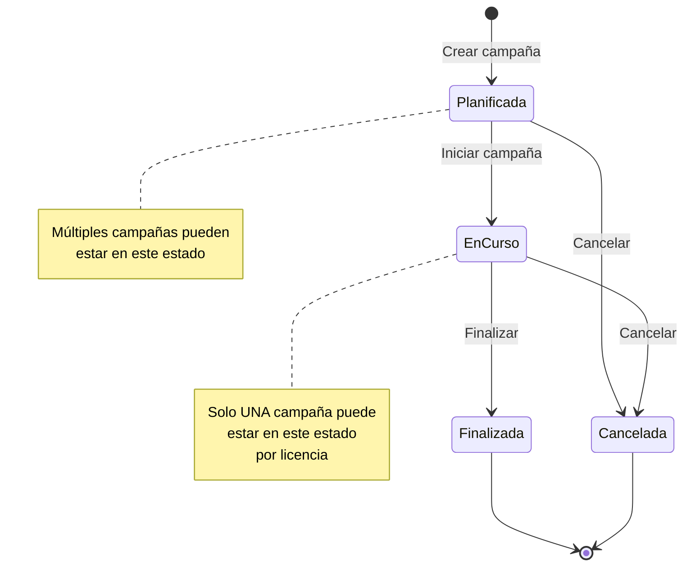
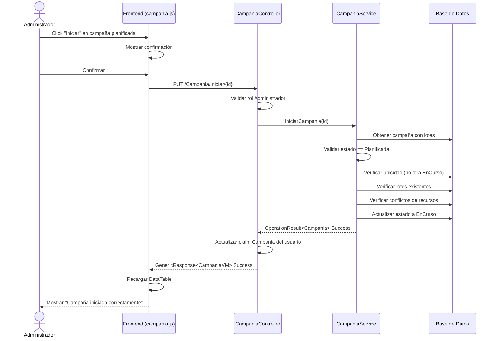

# Plan: Transición de Estado de Campaña — De "Planificada" a "En Curso"

## 1. Resumen Ejecutivo

Actualmente el sistema permite crear campañas con estado [`Planificada`](AgroForm.Model/EnumClass.cs:28) (valor `0` del enum [`EstadosCamapaña`](AgroForm.Model/EnumClass.cs:26)). Sin embargo, **no existe un mecanismo explícito para iniciar una campaña** (transición de `Planificada` → `EnCurso`). El flujo actual solo contempla:

- Creación → `Planificada`
- Finalización → `Finalizada`
- (No hay método para iniciar/cancelar)

Este plan describe todas las validaciones necesarias y los cambios requeridos para implementar la transición de estado `Planificada` → `EnCurso` (mostrada en UI como "Iniciada").

### Requisito adicional: Dropdown de campañas solo muestra "En Curso"

Actualmente el [`CampaniasViewComponent`](AgroForm.Web/Components/CampaniasViewComponent.cs:30-32) filtra campañas para mostrar tanto `EnCurso` como `Planificadas` en el dropdown selector. El requerimiento es que **solo se muestren las campañas en estado `EnCurso`** en ese dropdown, ya que el selector es para elegir la campaña activa sobre la cual se van a realizar operaciones.

---

## 2. Estado Actual del Sistema

### 2.1. Modelo de Datos

| Campo | Tipo | Descripción |
|-------|------|-------------|
| [`Campania.EstadosCampania`](AgroForm.Model/Campania.cs:13) | `EstadosCamapaña` enum | Estado actual de la campaña |
| [`Campania.FechaInicio`](AgroForm.Model/Campania.cs:14) | `DateTime` | Fecha de inicio planificada |
| [`Campania.FechaFin`](AgroForm.Model/Campania.cs:15) | `DateTime?` | Fecha de finalización (se asigna al cerrar) |

### 2.2. Estados Disponibles

```csharp
public enum EstadosCamapaña
{
    Planificada,  // 0 - Estado inicial al crear
    EnCurso,      // 1 - Activa, mostrada como "En Curso" / "Iniciada"
    Finalizada,   // 2 - Cerrada
    Cancelada     // 3 - Cancelada
}
```

### 2.3. Servicios Existentes

| Método | Ubicación | Descripción |
|--------|-----------|-------------|
| [`CreateAsync`](AgroForm.Business/Services/CampaniaService.cs:17) | `CampaniaService.cs` | Crea campaña en estado `Planificada` |
| [`FinalizarCampaña`](AgroForm.Business/Services/CampaniaService.cs:105) | `CampaniaService.cs` | Cambia estado a `Finalizada` y asigna `FechaFin` |
| [`GetCurrent`](AgroForm.Business/Services/CampaniaService.cs:40) | `CampaniaService.cs` | Obtiene campaña activa del usuario |
| [`GetCurrentByLicencia`](AgroForm.Business/Services/CampaniaService.cs:60) | `CampaniaService.cs` | Obtiene campaña activa por licencia |

### 2.4. Interfaz de Servicio

```csharp
public interface ICampaniaService : IServiceBase<Campania>
{
    Task<OperationResult<Campania>> GetCurrent();
    Task<OperationResult<Campania>> GetCurrentByLicencia(int? idLicencia);
}
```

### 2.5. Frontend (JavaScript)

En [`campania.js`](AgroForm.Web/wwwroot/js/views/campania.js:89-101), las campañas en estado "Iniciada" (que corresponde a `Planificada` en el enum) muestran botones de **Editar** y **Eliminar**. No existe un botón "Iniciar" para las campañas planificadas.

---

## 3. Diagrama de Estados (Máquina de Estados)



---

## 4. Validaciones Requeridas para la Transición Planificada → EnCurso

### 4.1. Regla de Unicidad: Solo una campaña "En Curso" por licencia

**Descripción**: No puede existir más de una campaña en estado `EnCurso` para la misma licencia.

**Validación**:
- Consultar todas las campañas de la licencia actual donde `EstadosCampania == EnCurso`
- Si existe al menos una, rechazar la transición con mensaje: *"Ya existe una campaña en curso. Debe finalizarla antes de iniciar una nueva."*

**Código referencial**:
```csharp
var enCurso = await GetQuery()
    .AnyAsync(c => c.IdLicencia == _userContext.IdLicencia 
                && c.EstadosCampania == EstadosCamapaña.EnCurso);
if (enCurso)
    return OperationResult<Campania>.Failure(
        "Ya existe una campaña en curso. Debe finalizarla antes de iniciar una nueva.",
        "CAMPAIGN_ALREADY_IN_PROGRESS");
```

### 4.2. Validación de Estado Actual

**Descripción**: Solo se puede iniciar una campaña que esté en estado `Planificada`.

**Validación**:
- Verificar que `campania.EstadosCampania == EstadosCamapaña.Planificada`
- Si no, rechazar con mensaje: *"Solo se pueden iniciar campañas en estado Planificada."*

### 4.3. Validación de Fecha de Inicio

**Descripción**: La campaña no debería iniciarse antes de su `FechaInicio` planificada (o permitir un margen razonable).

**Validación**:
- Comparar `campania.FechaInicio` con la fecha/hora actual (Argentina)
- Si `FechaInicio > DateTime.Now`, se puede permitir con advertencia, o rechazar según regla de negocio
- **Opción recomendada**: Permitir inicio anticipado (hasta 7 días antes) pero no antes. Si `FechaInicio` es más de 7 días en el futuro, rechazar.

### 4.4. Validación de Existencia de Lotes

**Descripción**: Una campaña debe tener al menos un lote asignado para poder iniciarse.

**Validación**:
- Verificar que `campania.Lotes.Count > 0`
- Si no hay lotes, rechazar con mensaje: *"La campaña debe tener al menos un lote asignado para poder iniciarse."*

### 4.5. Validación de Conflictos de Recursos (Campos/Lotes)

**Descripción**: Verificar que los lotes/campos asignados a esta campaña no estén siendo utilizados en otra campaña activa.

**Validación**:
- Obtener todos los `IdCampo` de los lotes de la campaña a iniciar
- Verificar si esos mismos campos están asignados a lotes de otra campaña en estado `EnCurso`
- Si hay conflicto, rechazar con mensaje: *"Uno o más campos/lotes ya están asignados a otra campaña en curso."*

### 4.6. Validación de Licencia Activa

**Descripción**: La licencia asociada debe estar activa y no vencida.

**Validación**:
- Verificar que `campania.IdLicencia` corresponda a una licencia activa
- Si la licencia es de prueba (`EsPrueba`), verificar que `FechaFinPrueba` no haya vencido

### 4.7. Validación de Nombre Único (Opcional)

**Descripción**: Opcionalmente, verificar que no exista otra campaña con el mismo nombre en la misma licencia (ya se valida en creación, pero podría reforzarse).

---

## 5. Cambios Requeridos

### 5.1. Interfaz [`ICampaniaService`](AgroForm.Business/Contracts/ICampaniaService.cs)

Agregar nuevo método:

```csharp
Task<OperationResult<Campania>> IniciarCampania(int id);
```

### 5.2. Servicio [`CampaniaService`](AgroForm.Business/Services/CampaniaService.cs)

Agregar método [`IniciarCampania`] con todas las validaciones del punto 4:

```csharp
public async Task<OperationResult<Campania>> IniciarCampania(int id)
{
    try
    {
        // 1. Obtener la campaña con sus lotes
        var response = await GetByIdAsync(id);
        if (!response.Success || response.Data == null)
            return OperationResult<Campania>.Failure(
                "No se encontró la campaña", "NOT_FOUND");

        var campania = response.Data;

        // 2. Validar estado actual
        if (campania.EstadosCampania != EstadosCamapaña.Planificada)
            return OperationResult<Campania>.Failure(
                "Solo se pueden iniciar campañas en estado Planificada.",
                "INVALID_STATE");

        // 3. Validar unicidad (solo una EnCurso por licencia)
        var existeEnCurso = await GetQuery()
            .AnyAsync(c => c.IdLicencia == _userContext.IdLicencia 
                        && c.EstadosCampania == EstadosCamapaña.EnCurso
                        && c.Id != id);
        if (existeEnCurso)
            return OperationResult<Campania>.Failure(
                "Ya existe una campaña en curso. Debe finalizarla antes de iniciar una nueva.",
                "CAMPAIGN_ALREADY_IN_PROGRESS");

        // 4. Validar lotes
        if (campania.Lotes == null || campania.Lotes.Count == 0)
            return OperationResult<Campania>.Failure(
                "La campaña debe tener al menos un lote asignado para poder iniciarse.",
                "NO_LOTS");

        // 5. Validar conflictos de recursos (campos usados en otra campaña activa)
        var campoIds = campania.Lotes.Select(l => l.IdCampo).Distinct().ToList();
        var conflicto = await _unitOfWork.Repository<Lote>()
            .Query()
            .AnyAsync(l => campoIds.Contains(l.IdCampo)
                        && l.IdCampania != id
                        && l.Campania.EstadosCampania == EstadosCamapaña.EnCurso);
        if (conflicto)
            return OperationResult<Campania>.Failure(
                "Uno o más campos ya están asignados a otra campaña en curso.",
                "RESOURCE_CONFLICT");

        // 6. Validar fecha (opcional - permitir inicio hasta 7 días antes)
        var fechaLimite = campania.FechaInicio.AddDays(-7);
        if (TimeHelper.GetArgentinaTime() < fechaLimite)
            return OperationResult<Campania>.Failure(
                "La campaña no puede iniciarse antes de los 7 días previos a su fecha planificada.",
                "DATE_TOO_EARLY");

        // 7. Cambiar estado
        campania.EstadosCampania = EstadosCamapaña.EnCurso;
        await UpdateAsync(campania);

        return OperationResult<Campania>.SuccessResult(campania);
    }
    catch (Exception ex)
    {
        _logger.LogError(ex, "Error al iniciar la campaña con ID {Id}", id);
        return OperationResult<Campania>.Failure(
            $"Ocurrió un problema al iniciar la campaña: {ex.Message}",
            "DATABASE_ERROR");
    }
}
```

### 5.3. Controlador [`CampaniaController`](AgroForm.Web/Controllers/CampaniaController.cs)

Agregar endpoint:

```csharp
[HttpPut("{id}")]
public async Task<IActionResult> Iniciar(int id)
{
    var gResponse = new GenericResponse<CampaniaVM>();
    try
    {
        ValidarAutorizacion(new[] { Roles.Administrador });
        
        var result = await _service.IniciarCampania(id);
        if (!result.Success)
        {
            gResponse.Success = false;
            gResponse.Message = result.ErrorMessage;
            return BadRequest(gResponse);
        }

        // Actualizar claim del usuario a la nueva campaña activa
        await UpdateClaimAsync("Campania", id.ToString());

        gResponse.Success = true;
        gResponse.Object = Map<Campania, CampaniaVM>(result.Data);
        gResponse.Message = "Campaña iniciada correctamente";
        return Ok(gResponse);
    }
    catch (Exception ex)
    {
        _logger.LogError(ex, "Error al iniciar campaña {Id}", id);
        gResponse.Success = false;
        gResponse.Message = "Ocurrió un error al iniciar la campaña";
        return BadRequest(gResponse);
    }
}
```

### 5.4. Frontend [`campania.js`](AgroForm.Web/wwwroot/js/views/campania.js)

**Cambios en la DataTable** (línea ~89-101):

Agregar botón "Iniciar" para campañas en estado "Planificada" (mostrado como "Iniciada"):

```javascript
// ----- ESTADO: PLANIFICADA (Iniciada) -----
if (estado === 'Iniciada') {
    botones += `
        <button type="button" class="btn btn-outline-primary btn-edit"
                title="Editar" data-id="${data}">
            <i class="ph ph-pencil"></i>
        </button>
        <button type="button" class="btn btn-outline-danger btn-delete"
                title="Eliminar" data-id="${data}">
            <i class="ph ph-trash"></i>
        </button>
        <button type="button" class="btn btn-outline-success btn-iniciar ms-3"
                title="Iniciar campaña" data-id="${data}" data-nombre="${row.nombre}">
            <i class="ph ph-play"></i>
            <span class="d-none d-sm-inline">Iniciar</span>
        </button>
    `;
}
```

**Agregar manejador de evento** (después de la línea ~168):

```javascript
$('#tblCampanias tbody').on('click', '.btn-iniciar', function () {
    var id = $(this).data('id');
    var nombre = $(this).data('nombre');
    iniciarCampania(id, nombre);
});
```

**Agregar función `iniciarCampania`**:

```javascript
function iniciarCampania(id, nombre) {
    mostrarConfirmacion(
        `¿Está seguro de que desea iniciar la campaña "${nombre}"?`,
        'Iniciar Campaña'
    ).then((result) => {
        if (result.isConfirmed) {
            mostrarLoading('Iniciando campaña...');
            $.ajax({
                url: '/Campania/Iniciar/' + id,
                type: 'PUT',
                headers: {
                    'RequestVerificationToken': $('input[name="__RequestVerificationToken"]').val()
                },
                success: function (response) {
                    cerrarAlertas();
                    if (response.success) {
                        mostrarExito(response.message || 'Campaña iniciada correctamente');
                        table.ajax.reload();
                    } else {
                        mostrarError(response.message || 'Error al iniciar campaña');
                    }
                },
                error: function (xhr) {
                    cerrarAlertas();
                    var msg = 'Error al conectar con el servidor';
                    if (xhr.responseJSON && xhr.responseJSON.message) {
                        msg = xhr.responseJSON.message;
                    }
                    mostrarError(msg);
                }
            });
        }
    });
}
```

### 5.5. Actualizar Mapa de Colores de Estado

En [`campania.js` línea 57-62](AgroForm.Web/wwwroot/js/views/campania.js:57), actualizar el mapa de colores:

```javascript
const estadoColors = {
    'Iniciada': 'secondary',    // Planificada → badge secondary
    'En Curso': 'info',         // EnCurso → badge info
    'Finalizada': 'success',    // Finalizada → badge success
    'Cancelada': 'danger'       // Cancelada → badge danger
};
```

---

## 6. Pruebas Unitarias

Agregar en [`CampaniaServiceTests.cs`](AgroForm.Tests/Services/CampaniaServiceTests.cs):

| Test | Descripción |
|------|-------------|
| `IniciarCampania_DebeCambiarEstadoCorrectamente` | Crear campaña Planificada → llamar Iniciar → verificar EnCurso |
| `IniciarCampania_DebeRechazar_CuandoYaExisteUnaEnCurso` | Crear 2 campañas, iniciar 1 → intentar iniciar otra → error |
| `IniciarCampania_DebeRechazar_CuandoNoEstaPlanificada` | Crear campaña en Finalizada → intentar iniciar → error |
| `IniciarCampania_DebeRechazar_CuandoNoTieneLotes` | Crear campaña sin lotes → intentar iniciar → error |
| `IniciarCampania_DebeRechazar_CuandoRecursoEnConflicto` | Crear 2 campañas con mismo campo → iniciar 1 → intentar iniciar otra → error |
| `IniciarCampania_DebeRechazar_CuandoIdNoExiste` | Llamar con ID inexistente → error NOT_FOUND |
| `IniciarCampania_DebeAsignarClaimAlUsuario` | Verificar que al iniciar se actualice el claim Campania |

---

## 7. Consideraciones Adicionales

### 7.1. Seguridad
- Solo usuarios con rol `Administrador` pueden iniciar campañas (ya validado en controlador)
- La validación multi-tenant por `IdLicencia` ya está cubierta por el Global Query Filter en [`AppDbContext`](AgroForm.Data/DBContext/AppDbContext.cs)

### 7.2. Concurrencia
- Usar transacción explícita si es necesario para evitar race conditions en la verificación de unicidad
- Considerar un lock optimista con `Timestamp`/`RowVersion` en la entidad `Campania`

### 7.3. Impacto en [`GetCurrentByLicencia`](AgroForm.Business/Services/CampaniaService.cs:60)
Actualmente este método busca campañas en estado `EnCurso` o `Planificada`. Después del cambio, solo debería devolver `EnCurso` para la campaña activa. Revisar si es necesario ajustar.

### 7.4. Notificaciones
- Considerar enviar notificación a los operadores cuando una campaña se inicie
- Registrar en auditoría el cambio de estado con usuario y timestamp

---

## 8. Resumen de Archivos a Modificar

| Archivo | Cambio |
|---------|--------|
| [`AgroForm.Business/Contracts/ICampaniaService.cs`](AgroForm.Business/Contracts/ICampaniaService.cs) | Agregar método `IniciarCampania(int id)` |
| [`AgroForm.Business/Services/CampaniaService.cs`](AgroForm.Business/Services/CampaniaService.cs) | Implementar `IniciarCampania` con validaciones |
| [`AgroForm.Web/Controllers/CampaniaController.cs`](AgroForm.Web/Controllers/CampaniaController.cs) | Agregar endpoint `Iniciar(int id)` |
| [`AgroForm.Web/wwwroot/js/views/campania.js`](AgroForm.Web/wwwroot/js/views/campania.js) | Agregar botón "Iniciar", evento y función |
| [`AgroForm.Web/Components/CampaniasViewComponent.cs`](AgroForm.Web/Components/CampaniasViewComponent.cs) | Cambiar filtro a solo `EnCurso` |
| [`AgroForm.Tests/Services/CampaniaServiceTests.cs`](AgroForm.Tests/Services/CampaniaServiceTests.cs) | Agregar tests unitarios |

---

## 9. Cambio Adicional: Dropdown de Campañas Solo Muestra "En Curso"

### 9.1. Problema Actual

El [`CampaniasViewComponent`](AgroForm.Web/Components/CampaniasViewComponent.cs:30-32) actualmente filtra:

```csharp
vm.Campanias = campañasResponse.Data.Where(_ =>
                    _.EstadosCampania == EnumClass.EstadosCamapaña.EnCurso
                    || _.EstadosCampania == EnumClass.EstadosCamapaña.Planificada).ToList();
```

Esto causa que campañas planificadas (que aún no se han iniciado) aparezcan en el dropdown selector de campaña activa, lo cual es incorrecto porque el usuario no debería poder seleccionar una campaña planificada como su contexto de trabajo.

### 9.2. Cambio Requerido

Modificar el filtro en [`CampaniasViewComponent.cs`](AgroForm.Web/Components/CampaniasViewComponent.cs:30) para que solo incluya campañas `EnCurso`:

```csharp
vm.Campanias = campañasResponse.Data.Where(_ =>
                    _.EstadosCampania == EnumClass.EstadosCamapaña.EnCurso).ToList();
```

### 9.3. Impacto

- El dropdown solo mostrará campañas activas (en curso)
- Cuando no haya ninguna campaña en curso, se mostrará el mensaje "No hay campañas disponibles"
- Las campañas planificadas solo serán visibles y gestionables desde la pantalla de administración de campañas (DataTable en [`Campania/Index`](AgroForm.Web/Controllers/CampaniaController.cs:27))
- Al iniciar una campaña (nueva funcionalidad), automáticamente aparecerá en el dropdown

### 9.4. Archivo a Modificar

| Archivo | Cambio |
|---------|--------|
| [`AgroForm.Web/Components/CampaniasViewComponent.cs`](AgroForm.Web/Components/CampaniasViewComponent.cs) | Cambiar filtro de `EnCurso || Planificada` a solo `EnCurso` |

---

## 10. Flujo Completo (Secuencia)


