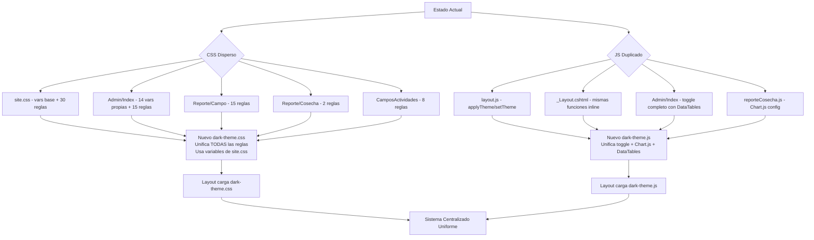

# Plan: Centralización y Estandarización del Tema Oscuro

## 1. Diagnóstico de la Situación Actual

### 1.1. Múltiples puntos de definición de `data-theme="dark"`

Se detectaron **5 ubicaciones** donde se define lógica relacionada con el tema oscuro:

| # | Archivo | Tipo | ¿Qué contiene? |
|---|---------|------|----------------|
| 1 | [`wwwroot/css/site.css`](AgroForm.Web/wwwroot/css/site.css:17) | CSS | Variables CSS base (`--app-bg`, `--surface`, `--surface-2`, `--text`, `--text-muted`, `--border`) + ~30 reglas `[data-theme="dark"]` para componentes Bootstrap |
| 2 | [`Views/Administrador/Index.cshtml`](AgroForm.Web/Views/Administrador/Index.cshtml:42) | CSS inline + JS | **Sistema de variables DUPLICADO** (14 variables propias: `--bg-primary`, `--bg-secondary`, etc.) + ~15 reglas dark + lógica JS de toggle |
| 3 | [`Views/Reporte/Campo.cshtml`](AgroForm.Web/Views/Reporte/Campo.cshtml:133) | CSS inline | ~15 reglas `body[data-theme="dark"]` para componentes específicos del reporte |
| 4 | [`Views/Reporte/Cosecha.cshtml`](AgroForm.Web/Views/Reporte/Cosecha.cshtml:227) | CSS inline | 2 reglas `body[data-theme="dark"]` para KPI cards |
| 5 | [`Views/Shared/Components/CamposActividades/Default.cshtml`](AgroForm.Web/Views/Shared/Components/CamposActividades/Default.cshtml:369) | CSS inline | ~8 reglas `[data-theme="dark"]` para componentes de campos/actividades |

### 1.2. Duplicación de lógica JavaScript de toggle

| # | Archivo | Función |
|---|---------|---------|
| 1 | [`wwwroot/js/layout.js`](AgroForm.Web/wwwroot/js/layout.js:95) | `applyTheme(theme)` y `setTheme(theme)` - funciones centralizadas |
| 2 | [`Views/Shared/_Layout.cshtml`](AgroForm.Web/Views/Shared/_Layout.cshtml:238) | `applyTheme(theme)` y `setTheme(theme)` - **DUPLICADAS** inline |
| 3 | [`Views/Administrador/Index.cshtml`](AgroForm.Web/Views/Administrador/Index.cshtml:1051) | Lógica completa de toggle con manejo de DataTables - **DUPLICADA** |

### 1.3. Inconsistencias de Color Detectadas

#### Problema 1: Dos sistemas de variables CSS distintos
- **`site.css`** usa: `--app-bg`, `--surface`, `--surface-2`, `--text`, `--text-muted`, `--border`
- **`Administrador/Index.cshtml`** usa: `--bg-primary`, `--bg-secondary`, `--bg-tertiary`, `--text-primary`, `--text-secondary`, `--text-muted`, `--border-color`, `--card-bg`, `--card-header-bg`, `--table-bg`, `--table-hover`, `--table-striped`, `--form-bg`, `--modal-bg`, `--nav-bg`, `--btn-close-filter`

**Impacto:** La vista de Administrador tiene su propio sistema de variables con valores diferentes a los de `site.css`. Por ejemplo:
- `site.css` dark `--app-bg`: `#0f1115`
- Admin dark `--bg-primary`: `#0f0f0f`
- `site.css` dark `--surface`: `#161a22`
- Admin dark `--card-bg`: `#1f1f1f`

#### Problema 2: Hardcoded colors en lugar de variables CSS
- [`site.css:529`](AgroForm.Web/wwwroot/css/site.css:529): `[data-theme="dark"] .stat-number { color: #20c997; }` - hardcoded
- [`CamposActividades/Default.cshtml:371`](AgroForm.Web/Views/Shared/Components/CamposActividades/Default.cshtml:371): `[data-theme="dark"] .campo-header { border-bottom-color: #0d6efd !important; }` - hardcoded
- [`CamposActividades/Default.cshtml:389`](AgroForm.Web/Views/Shared/Components/CamposActividades/Default.cshtml:389): `[data-theme="dark"] .ciclo-header { border-left-color: #28a745 !important; }` - hardcoded

#### Problema 3: Selectores inconsistentes
- Algunos usan `[data-theme="dark"]` (site.css, Admin, CamposActividades)
- Otros usan `body[data-theme="dark"]` (Reporte/Campo, Reporte/Cosecha)
- La lógica JS en `layout.js` usa `document.body.setAttribute('data-theme', theme)` mientras que en `_Layout.cshtml` usa `document.body.setAttribute('data-theme', 'dark')` condicional

#### Problema 4: Chart.js dark mode aislado
- [`reporteCosecha.js:985`](AgroForm.Web/wwwroot/js/views/reporteCosecha.js:985): Configuración de Chart.js para dark mode solo en este archivo. Si otros reportes usan Chart.js, no se benefician.

---

## 2. Plan de Acción

### Paso 1: Crear archivo CSS centralizado `dark-theme.css`

**Archivo destino:** [`wwwroot/css/dark-theme.css`](AgroForm.Web/wwwroot/css/dark-theme.css) (nuevo)

**Contenido:**
1. Mantener las variables CSS base de `site.css` como las **únicas** variables del sistema (son las más completas y usadas)
2. Migrar todas las reglas `[data-theme="dark"]` de las vistas inline a este archivo:
   - Reglas de `site.css` (ya están, pero se consolidan aquí)
   - Reglas de `Administrador/Index.cshtml` (DataTables, botones outline, dropdowns, modal-backdrop)
   - Reglas de `Reporte/Campo.cshtml` (alert-card, kpi-card, timeline, score-ring, soil-bar, comparativa, table thead, chart-container, reportLoading)
   - Reglas de `Reporte/Cosecha.cshtml` (kpi-card, indicator-card)
   - Reglas de `CamposActividades/Default.cshtml` (campo-header, campo-section, lote-item, ciclo-header, actividad-item)
3. Reemplazar colores hardcodeados por variables CSS:
   - `#20c997` → `var(--bs-success)` o una nueva variable `--accent`
   - `#0d6efd` → `var(--bs-primary)`
   - `#28a745` → `var(--bs-success)`
   - `rgba(40, 167, 69, 0.15)` → `var(--bs-success-rgb)` con opacidad
   - `rgba(13, 110, 253, 0.1)` → `var(--bs-primary-rgb)` con opacidad
4. Unificar selectores: usar siempre `[data-theme="dark"]` (sin `body` prefijo)

### Paso 2: Crear archivo JS centralizado `dark-theme.js`

**Archivo destino:** [`wwwroot/js/dark-theme.js`](AgroForm.Web/wwwroot/js/dark-theme.js) (nuevo)

**Contenido:**
1. Tomar las funciones `applyTheme()` y `setTheme()` de `layout.js` como base
2. Agregar inicialización automática al cargar el DOM
3. Agregar evento `storage` para detectar cambios de tema entre pestañas
4. Incluir la configuración global de Chart.js para dark mode (migrada desde `reporteCosecha.js`)
5. Agregar un evento personalizado `themeChanged` que otros scripts puedan escuchar
6. Proveer una función `refreshDataTables()` para que DataTables se refresque al cambiar tema (migrado desde `Administrador/Index.cshtml`)

### Paso 3: Modificar `site.css` - Remover reglas dark duplicadas

**Archivo:** [`wwwroot/css/site.css`](AgroForm.Web/wwwroot/css/site.css)

- Mantener SOLO las variables CSS `:root` y `[data-theme="dark"]` (líneas 1-24)
- Mover todas las reglas `[data-theme="dark"]` de componentes (navbar, card, table, form, dropdown, stat-card, etc.) al nuevo `dark-theme.css`
- Opcional: dejar un `@import` o simplemente cargar ambos archivos en el layout

### Paso 4: Modificar `layout.js` - Simplificar

**Archivo:** [`wwwroot/js/layout.js`](AgroForm.Web/wwwroot/js/layout.js)

- Remover las funciones `applyTheme()` y `setTheme()` (ahora en `dark-theme.js`)
- Mantener solo la inicialización del switch de tema, llamando a las funciones de `dark-theme.js`

### Paso 5: Modificar `_Layout.cshtml` - Remover JS inline duplicado

**Archivo:** [`Views/Shared/_Layout.cshtml`](AgroForm.Web/Views/Shared/_Layout.cshtml)

- Remover las funciones `applyTheme()` y `setTheme()` inline (líneas 238-249)
- Agregar `<script src="~/js/dark-theme.js">` y `<link href="~/css/dark-theme.css">`

### Paso 6: Modificar `Administrador/Index.cshtml` - Remover CSS/JS inline

**Archivo:** [`Views/Administrador/Index.cshtml`](AgroForm.Web/Views/Administrador/Index.cshtml)

- Remover todo el bloque `[data-theme="dark"]` de variables CSS (líneas 42-59) y reglas asociadas (líneas 277-351)
- Remover el bloque JS de manejo de tema (líneas 1051-1091)
- Agregar referencias a los nuevos archivos centralizados
- Las reglas específicas de DataTables se migran a `dark-theme.css`

### Paso 7: Modificar vistas de Reportes - Remover CSS inline

**Archivos:**
- [`Views/Reporte/Campo.cshtml`](AgroForm.Web/Views/Reporte/Campo.cshtml) - Remover líneas 133-193
- [`Views/Reporte/Cosecha.cshtml`](AgroForm.Web/Views/Reporte/Cosecha.cshtml) - Remover líneas 227-236

### Paso 8: Modificar `CamposActividades/Default.cshtml` - Remover CSS inline

**Archivo:** [`Views/Shared/Components/CamposActividades/Default.cshtml`](AgroForm.Web/Views/Shared/Components/CamposActividades/Default.cshtml)

- Remover líneas 369-401

### Paso 9: Modificar `reporteCosecha.js` - Remover Chart.js dark config

**Archivo:** [`wwwroot/js/views/reporteCosecha.js`](AgroForm.Web/wwwroot/js/views/reporteCosecha.js)

- Remover el IIFE de Chart.js dark mode (líneas 982-991)
- Suscribirse al evento `themeChanged` si es necesario

---

## 3. Diagrama de Flujo

---

## 4. Mapeo de Variables: Admin → Site.css

| Admin Variable | Valor Dark | Site.css Variable | Valor Dark |
|---------------|-----------|-------------------|-----------|
| `--bg-primary` | `#0f0f0f` | `--app-bg` | `#0f1115` |
| `--bg-secondary` | `#1f1f1f` | `--surface` | `#161a22` |
| `--bg-tertiary` | `#2d2d2d` | `--surface-2` | `#1d2230` |
| `--text-primary` | `#ffffff` | `--text` | `#e9edf3` |
| `--text-secondary` | `#e5e5e5` | *(no existe)* | - |
| `--text-muted` | `#a0a0a0` | `--text-muted` | `rgba(233,237,243,0.7)` |
| `--border-color` | `#404040` | `--border` | `rgba(255,255,255,0.14)` |
| `--card-bg` | `#1f1f1f` | `--surface` | `#161a22` |
| `--card-header-bg` | `#2d2d2d` | `--surface` | `#161a22` |
| `--form-bg` | `#2d2d2d` | `--surface-2` | `#1d2230` |
| `--modal-bg` | `#1f1f1f` | `--surface` | `#161a22` |

**Decisión:** Usar las variables de `site.css` como canónicas. Mapear las reglas de Admin para que usen `--surface`, `--surface-2`, `--text`, `--text-muted`, `--border` en lugar de sus variables propias.

---

## 5. Archivos a Modificar/Crear

### Nuevos archivos:
1. [`wwwroot/css/dark-theme.css`](AgroForm.Web/wwwroot/css/dark-theme.css) - CSS centralizado
2. [`wwwroot/js/dark-theme.js`](AgroForm.Web/wwwroot/js/dark-theme.js) - JS centralizado

### Archivos a modificar:
3. [`wwwroot/css/site.css`](AgroForm.Web/wwwroot/css/site.css) - Mantener solo variables CSS
4. [`wwwroot/js/layout.js`](AgroForm.Web/wwwroot/js/layout.js) - Simplificar, delegar en dark-theme.js
5. [`Views/Shared/_Layout.cshtml`](AgroForm.Web/Views/Shared/_Layout.cshtml) - Agregar referencias, remover JS inline
6. [`Views/Administrador/Index.cshtml`](AgroForm.Web/Views/Administrador/Index.cshtml) - Remover CSS/JS inline
7. [`Views/Reporte/Campo.cshtml`](AgroForm.Web/Views/Reporte/Campo.cshtml) - Remover CSS inline
8. [`Views/Reporte/Cosecha.cshtml`](AgroForm.Web/Views/Reporte/Cosecha.cshtml) - Remover CSS inline
9. [`Views/Shared/Components/CamposActividades/Default.cshtml`](AgroForm.Web/Views/Shared/Components/CamposActividades/Default.cshtml) - Remover CSS inline
10. [`wwwroot/js/views/reporteCosecha.js`](AgroForm.Web/wwwroot/js/views/reporteCosecha.js) - Remover Chart.js config

---

## 6. Riesgos y Consideraciones

1. **Orden de carga:** `dark-theme.css` debe cargarse DESPUÉS de `site.css` para que las reglas específicas puedan sobrescribir las genéricas si es necesario.
2. **Especificidad:** Algunas reglas usan `body[data-theme="dark"]` que tiene mayor especificidad que `[data-theme="dark"]`. Al unificar, verificar que no se pierda especificidad.
3. **DataTables:** Las reglas de DataTables en Admin son específicas de esa vista. Verificar que al moverlas a `dark-theme.css` no afecten negativamente a otras vistas que usen DataTables.
4. **Chart.js:** La configuración de Chart.js debe ejecutarse DESPUÉS de que Chart.js esté cargado. El nuevo módulo debe verificar que `Chart` exista.
5. **Vista Admin (Layout=null):** La vista de Administrador usa `Layout = null`, por lo que NO carga `_Layout.cshtml`. Deberá cargar `dark-theme.css` y `dark-theme.js` explícitamente.
