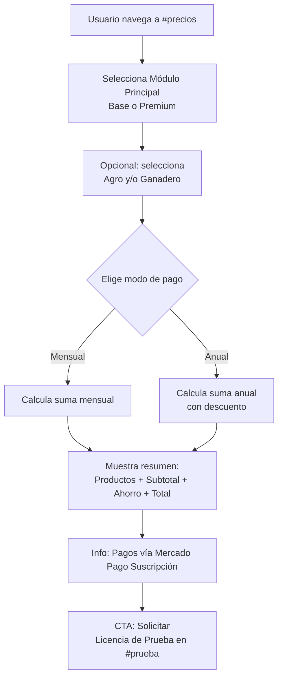

# Plan de Landing Page - AgroForm (AgroLab)

## 1. Resumen

Diseñar una landing page **single-page** para **AgroLab** (sistema de gestión agrícola) basada en el diseño y estructura de [`IntegralShop`](D:\Repositorios\IntegralShop\wwwroot\index.html), pero adaptando todo al stack tecnológico existente de AgroForm:

- ✅ **Phosphor Icons** ( [`<script src="https://unpkg.com/@phosphor-icons/web">`](AgroForm.Web/Views/Shared/_Layout.cshtml:195) ) en lugar de Bootstrap Icons
- ✅ **Paleta de colores del sistema** ( [`--brand-primary: #198754`](AgroForm.Web/wwwroot/css/site.css:39) , [`--brand-secondary: #20c997`](AgroForm.Web/wwwroot/css/site.css:40) )
- ✅ **Nombre de marca:** "AgroLab" (como ya aparece en [`Login.cshtml:52`](AgroForm.Web/Views/Access/Login.cshtml:52) y [`_Layout.cshtml:6`](AgroForm.Web/Views/Shared/_Layout.cshtml:6))
- ✅ **Logo ya existente:** [`images/logo.png`](AgroForm.Web/wwwroot/images/logo.png)
- ✅ **Bootstrap 5.3.3** (misma versión que usa el sistema)

---

## 2. Stack Tecnológico

| Tecnología | Versión | Fuente |
|---|---|---|
| Bootstrap 5 | 5.3.3 | CDN ( [`_Layout.cshtml:8`](AgroForm.Web/Views/Shared/_Layout.cshtml:8) ) |
| Phosphor Icons | Web | CDN ( [`_Layout.cshtml:195`](AgroForm.Web/Views/Shared/_Layout.cshtml:195) ) |
| jQuery | 3.7.1 | CDN ( [`_Layout.cshtml:91`](AgroForm.Web/Views/Shared/_Layout.cshtml:91) ) |
| **Archivo** | HTML estático | `wwwroot/index.html` (independiente de Razor, sin autenticación) |
| **Estilos propios** | CSS | `wwwroot/css/landing.css` (estilos específicos de la landing) |

**Login URL:** [`/Access/Login`](AgroForm.Web/Program.cs:61) (ruta configurada en `Program.cs`)

---

## 3. Estructura de Secciones (Orden Actualizado)

```
┌───────────────────────────────────────────┐
│  NAVBAR (fixed-top, bg-white shadow)      │
│  [Logo AgroLab] Características |         │
│  Tutoriales | Prueba Gratis | Precios     │
│  | Contacto                               │
│  ┌──────────────────┐                     │
│  │ [Iniciar sesión] │ ← btn-outline-success│
│  └──────────────────┘                     │
├───────────────────────────────────────────┤
│  HERO SECTION                             │
│  Imagen de fondo agrícola + overlay oscuro│
│  "El Futuro de la Gestión Agrícola"       │
├───────────────────────────────────────────┤
│  CARACTERÍSTICAS (#caracteristicas)       │
│  Grid 3 columnas de cards con hover       │
│  Botón "Ver todas las características"    │
├───────────────────────────────────────────┤
│  TUTORIALES / DEMO (#demo)                │
│  Video YouTube embebido (16:9)            │
├───────────────────────────────────────────┤
│  CTA - LICENCIA DE PRUEBA (#prueba)       │
│  ═══════════════════════════════════════  │
│   Solicitar licencia de prueba de 30 días │
│  ═══════════════════════════════════════  │
├───────────────────────────────────────────┤
│  MÓDULOS Y SIMULADOR (#precios)           │
│  ┌──────────────────┬──────────────────┐  │
│  │ Módulos Princip. │ Módulos Adic.    │  │
│  │ - Base           │ - Agro           │  │
│  │ - Premium        │ - Ganadero       │  │
│  └──────────────────┴──────────────────┘  │
│  [SIMULADOR INTERACTIVO]                  │
│  Selector módulo + checkboxes + total     │
│  [Info: Pagos vía Mercado Pago Suscripción]│
├───────────────────────────────────────────┤
│  CONTACTO (#contacto)                     │
│  WhatsApp + Email                         │
├───────────────────────────────────────────┤
│  FOOTER (bg-dark text-white)              │
│  Logo | Contacto | Copyright              │
└───────────────────────────────────────────┘

  [MODAL] Todas las características detalladas
```

### Cambios en el orden respecto a IntegralShop:
| Ítem | IntegralShop | AgroLab |
|---|---|---|
| Sección Clientes | Antes de Contacto | ❌ Eliminada |
| **CTA Prueba** | ❌ No existía | ✅ **Agregada ANTES de Módulos** (nueva sección `#prueba`) |
| Info de pago | No mencionaba | ✅ **Mercado Pago Suscripción** con link |
| Link navbar "Prueba Gratis" | ❌ No existía | ✅ Agregado al menú |

### 3.1 Diagrama de flujo del Simulador



---

## 4. Menú de Navegación (Anclas + Login)

| Elemento | Ancla / URL | Descripción |
|---|---|---|
| Logo + AgroLab | `#` | Marca, al inicio |
| Características | `#caracteristicas` | Grid de features |
| Tutoriales | `#demo` | Video demostrativo |
| Prueba Gratis | `#prueba` | CTA licencia de prueba |
| Precios | `#precios` | Módulos + Simulador |
| Contacto | `#contacto` | WhatsApp / Email |
| **Iniciar sesión** | `/Access/Login` | Botón `btn btn-outline-success rounded-pill` alineado a la derecha |

---

## 5. Contenido de las Secciones

### 5.1 Hero

```html
<section class="hero-section text-white text-center d-flex align-items-center justify-content-center"
         style="background-image: url('img/banner-agricultura.webp'); background-size: cover; background-position: center; height: 60vh; min-height: 350px;">
    <div class="container py-5" style="background-color: rgba(0, 0, 0, 0.55); border-radius: 1rem;">
        <h1 class="display-4 fw-bold mb-4">El Futuro de la Gestión Agrícola</h1>
        <p class="lead mb-3">
            Con <strong>AgroLab</strong>, gestioná tus campos, cultivos y ganadería desde cualquier lugar.
        </p>
        <p class="lead">
            Sistema 100% web, rápido, seguro y pensado para el productor agropecuario.
        </p>
    </div>
</section>
```

### 5.2 Características (12 cards - inspiradas en competidores)

Usando **Phosphor Icons** (`ph ph-...`) y estilos de card con hover del sistema:

| # | Característica | Icono PH | Descripción |
|---|---|---|---|
| 1 | Gestión de Campos | `ph-map-trifold` | Administrá múltiples campos con datos de ubicación y superficies |
| 2 | Ciclo de Cultivos | `ph-flower` | Seguimiento completo desde siembra hasta cosecha |
| 3 | Monitoreo Satelital | `ph-satellite` | Imágenes satelitales NDVI para evaluar salud de cultivos |
| 4 | Control de Gastos | `ph-currency-circle-dollar` | Clasificá gastos por campo, cultivo y categoría |
| 5 | Clima en Tiempo Real | `ph-cloud-sun` | Datos meteorológicos para tomar decisiones informadas |
| 6 | Mapas Interactivos | `ph-map-pin` | Visualización georreferenciada de lotes |
| 7 | Reportes PDF | `ph-file-pdf` | Informes automáticos de cierre de campaña |
| 8 | Acopio | `ph-warehouse` | Control de producción almacenada por tipo de grano |
| 9 | Alertas Inteligentes | `ph-bell` | Notificaciones sobre eventos críticos en tus cultivos |
| 10 | Multi-Usuario | `ph-users` | Acceso para todo tu equipo con roles y permisos |
| 11 | App Móvil PWA | `ph-device-mobile` | Accedé desde el celular como app nativa |
| 12 | Dashboard en Tiempo Real | `ph-chart-bar` | Indicadores clave de todas tus operaciones |

### 5.3 Modal de Todas las Características

Agrupado en categorías (similar a IntegralShop pero contenido agropecuario):

| Categoría | Características |
|---|---|
| **Gestión de Campos y Cultivos** | Campos, lotes, ciclos de cultivo, siembra, cosecha, variedades |
| **Monitoreo y Satélite** | Índices NDVI, clima, alertas, mapas interactivos |
| **Gestión Económica** | Gastos, acopio, reportes PDF, cierre de campaña |
| **Operaciones y Configuración** | Roles de usuario, permisos, configuración, PWA |

### 5.4 CTA - Licencia de Prueba (#prueba)

**Ubicación:** Entre Tutoriales y Módulos/Simulador. Accesible desde navbar como "Prueba Gratis".

**Diseño:**
```html
<section class="container py-5" id="prueba">
    <div class="text-center bg-success text-white p-5 rounded-4 shadow">
        <i class="ph ph-rocket-launch display-3 mb-3"></i>
        <h2 class="fw-bold">Probá AgroLab gratis por 30 días</h2>
        <p class="lead mb-4">Sin compromiso. Acceso completo a todas las funcionalidades.</p>
        <a href="#contacto" class="btn btn-light btn-lg rounded-pill px-5 fw-bold">
            <i class="ph ph-rocket-launch me-2"></i>
            Solicitar licencia de prueba de 30 días
        </a>
        <p class="mt-3 small opacity-75">Sin tarjeta de crédito. Sin compromiso.</p>
    </div>
</section>
```

El texto del botón y la cantidad de días se toman de [`AGROFORM_CONFIG`](#7-configuracion-centralizada).

### 5.5 Módulos y Precios

#### Módulos Principales
| Módulo | Precio/mes | Precio/año | Características |
|---|---|---|---|
| **Base** | `$BASE_MONTHLY` | `$BASE_ANNUAL` | 3 campos, 5 usuarios, monitoreo básico, reportes simples |
| **Premium** | `$PREMIUM_MONTHLY` | `$PREMIUM_ANNUAL` | Campos ilimitados, usuarios ilimitados, satélite, clima, alertas |

#### Módulos Adicionales
| Módulo | Precio/mes | Precio/año | Características |
|---|---|---|---|
| **Agro** | `$AGRO_MONTHLY` | `$AGRO_ANNUAL` | Agricultura de precisión, mapas de rendimiento, análisis de suelos |
| **Ganadero** | `$GANADERO_MONTHLY` | `$GANADERO_ANNUAL` | Gestión de rodeo, sanidad animal, pasturas, producción |

### 5.6 Info de Pago - Mercado Pago Suscripción

Agregar dentro de la sección de precios, después del simulador:

```html
<div class="text-center mt-4 p-3 bg-light rounded-3">
    <p class="mb-2">
        <i class="ph ph-credit-card me-2 text-success"></i>
        Todos los pagos se procesan de forma segura a través de 
        <strong>Mercado Pago Suscripción</strong>.
    </p>
    <a href="https://www.mercadopago.com.ar/suscriptions" target="_blank" rel="noopener" class="text-success">
        Más información <i class="ph ph-arrow-right"></i>
    </a>
</div>
```

### 5.7 Contacto

```html
<a href="https://wa.me/549XXXXXXXXX?text=Hola%2C%20quisiera%20recibir%20m%C3%A1s%20informaci%C3%B3n%20sobre%20AgroLab"
   class="btn btn-success btn-lg w-100"
   target="_blank" rel="noopener">
    <i class="ph ph-whatsapp-logo me-2"></i>
    Consultar por WhatsApp
</a>
```

---

## 6. Colores (Basados en el Sistema Existente)

| Rol | Hex | Variable CSS | Uso |
|---|---|---|---|
| Brand Primary | `#198754` | `--brand-primary` | Botones principales, enlaces, acentos |
| Brand Secondary | `#20c997` | `--brand-secondary` | Hovers, badges, detalles |
| Text | `#212529` | `--text` | Texto general |
| Muted | `#6c757d` | `--text-muted` | Descripciones |
| Background | `#f8f9fa` | `--app-bg` | Fondos de sección |
| Dark | `#212529` | - | Footer |
| Ámbar (Agro) | `#fd7e14` | - | Borde módulo Agro |
| Teal (Ganadero) | `#20c997` | - | Borde módulo Ganadero |

---

## 7. Configuración Centralizada (AGROFORM_CONFIG)

Objeto JavaScript al final del HTML, mismo patrón que IntegralShop con [`PRICING_CONFIG`](D:\Repositorios\IntegralShop\wwwroot\index.html:882). **Todo es fácilmente modificable desde acá:**

```javascript
const AGROFORM_CONFIG = {
    // === INFORMACIÓN DE MARCA ===
    brand: {
        name: 'AgroLab',
        slogan: 'El Futuro de la Gestión Agrícola'
    },

    // === PRECIOS DE MÓDULOS (cambiar acá y se actualiza solo) ===
    modules: {
        base:      { monthly: 15000, annual: 150000, name: 'Base',       icon: 'ph-box-seam' },
        premium:   { monthly: 25000, annual: 250000, name: 'Premium',    icon: 'ph-stars' },
        agro:      { monthly: 8000,  annual: 80000,  name: 'Agro',       icon: 'ph-flower' },
        ganadero:  { monthly: 8000,  annual: 80000,  name: 'Ganadero',   icon: 'ph-cow' }
    },

    // Plan recomendado (aparece como "Más popular")
    recommendedPlan: 'premium',

    // === LICENCIA DE PRUEBA (cambiar días, textos, URL) ===
    trial: {
        days: 30,
        enabled: true,
        buttonText: 'Solicitar licencia de prueba de 30 días',
        buttonUrl: '#contacto',
        sectionTitle: 'Probá AgroLab gratis por {days} días',
        sectionSubtitle: 'Sin compromiso. Acceso completo a todas las funcionalidades.'
    },

    // === MERCADO PAGO ===
    payment: {
        provider: 'Mercado Pago Suscripción',
        infoUrl: 'https://www.mercadopago.com.ar/suscriptions',
        message: 'Todos los pagos se procesan de forma segura a través de {provider}.'
    },

    // === CONTACTO (cambiar acá) ===
    contact: {
        whatsapp: '+549XXXXXXXXX',
        email: 'info@agrolab.com',
        whatsappMessage: 'Hola%2C%20quisiera%20recibir%20m%C3%A1s%20informaci%C3%B3n%20sobre%20AgroLab'
    }
};
```

---

## 8. Imágenes

### Ya existen en el sistema y se reutilizan:
| Archivo | Ruta | Uso |
|---|---|---|
| [`logo.png`](AgroForm.Web/wwwroot/images/logo.png) | `/images/logo.png` | Navbar y footer |
| [`favicon.ico`](AgroForm.Web/wwwroot/images/favicon.ico) | `/images/favicon.ico` | Favicon |
| Iconos PWA | `/images/android-launchericon-*.png` | Meta tags |

### Imágenes placeholder (uso de Unsplash / gratuitas):
| Imagen | Tamaño | Origen | Descripción |
|---|---|---|---|
| **Hero Banner** | 1920x800 px | Unsplash (gratuito) | Foto aérea de campos agrícolas. Ej: `https://images.unsplash.com/photo-1500382017468-9049fed747ef?w=1920` |
| **OG Image** | 1200x630 px | Misma imagen hero | Para compartir en redes. Se usará la misma banner redimensionada vía meta tags |

---

## 9. Archivos a Crear

| Archivo | Acción | Descripción |
|---|---|---|
| [`wwwroot/index.html`](AgroForm.Web/wwwroot/) | **Crear** | Landing page completa (HTML estático, sin Razor) |
| [`wwwroot/css/landing.css`](AgroForm.Web/wwwroot/css/) | **Crear** | Estilos específicos de la landing (hero, simulador, cards) |

**IMPORTANTE:** La landing debe ser independiente del layout de Razor para que sea accesible sin autenticación (público general).

---

## 10. Checklist de Implementación (16 Pasos)

- [ ] **Paso 1:** Crear `wwwroot/index.html` con estructura HTML completa (meta tags SEO, Open Graph, Phosphor Icons, Bootstrap 5.3.3)
- [ ] **Paso 2:** Crear `wwwroot/css/landing.css` con estilos: hero overlay, cards hover (`.agrandar-card`), colores del sistema, precios
- [ ] **Paso 3:** Implementar **Navbar** con anchor links + logo + botón "Iniciar sesión" a `/Access/Login`
- [ ] **Paso 4:** Implementar **Hero Section** con overlay oscuro y texto adaptado al agro
- [ ] **Paso 5:** Implementar **Características** (12 cards con Phosphor Icons, grid responsive)
- [ ] **Paso 6:** Implementar **Modal** de características detalladas (4 categorías)
- [ ] **Paso 7:** Implementar **Tutoriales** con video de YouTube embebido
- [ ] **Paso 8:** Implementar **CTA Prueba Gratis** (`#prueba`) con diseño destacado verde
- [ ] **Paso 9:** Implementar **Módulos Principales** (Base, Premium) con precios desde `AGROFORM_CONFIG`
- [ ] **Paso 10:** Implementar **Módulos Adicionales** (Agro, Ganadero) con precios desde `AGROFORM_CONFIG`
- [ ] **Paso 11:** Implementar **Simulador de Costos** (selector + checkboxes + toggle anual + resumen con cálculo)
- [ ] **Paso 12:** Agregar **Info Mercado Pago Suscripción** con link después del simulador
- [ ] **Paso 13:** Implementar **Contacto** con botón de WhatsApp
- [ ] **Paso 14:** Implementar **Footer** con logo, contacto y copyright
- [ ] **Paso 15:** Crear objeto **`AGROFORM_CONFIG`** con todos los valores parametrizables
- [ ] **Paso 16:** Verificar responsive design, anclas funcionales y hover effects

---

## 11. Notas

- **Precios:** Se mantienen los valores del plan por ahora (Base: $15.000/mes - $150.000/año, Premium: $25.000/mes - $250.000/año, Agro: $8.000/mes - $80.000/año, Ganadero: $8.000/mes - $80.000/año). Se cambian fácilmente en `AGROFORM_CONFIG.modules`.
- **WhatsApp/Email:** Se mantienen los placeholders, se configuran en `AGROFORM_CONFIG.contact`.
- **Video:** Se usará el video de YouTube existente como placeholder.
- **Imágenes:** Se usarán imágenes gratuitas de Unsplash como placeholder, no se requiere que el usuario las proporcione.
- **Todo parametrizable:** Precios, días de prueba, textos, datos de contacto, link de Mercado Pago — todo en `AGROFORM_CONFIG`.
- **Nombre:** AgroLab (consistente con el sistema actual).
- **Competidores:** Las 12 características propuestas están basadas en funcionalidades reales de AgroForm (satélite, clima, gastos, acopio, etc.). Si el usuario revisa manualmente los competidores y quiere cambios, se ajustan fácilmente en los textos.
