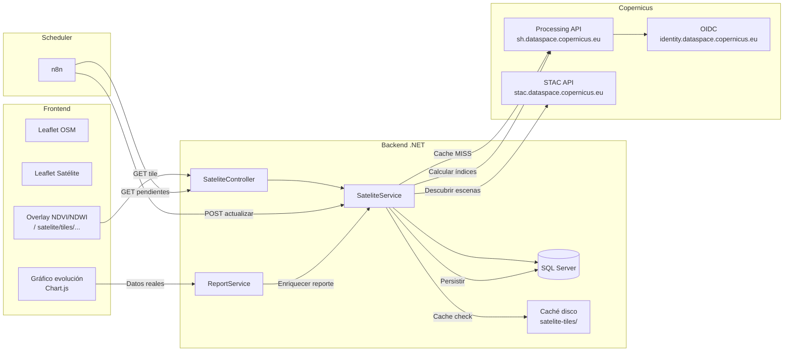

# Plan: Migración de Sentinel Hub → Copernicus Data Space Ecosystem

## Contexto Estratégico

**Decisión:** Abandonamos completamente Sentinel Hub como proveedor de datos satelitales. Reemplazamos por **Copernicus Data Space Ecosystem (CDSE)** usando sus APIs oficiales gratuitas.

**Stack target:** ASP.NET Core 8, SQL Server, Leaflet JS, jQuery, VPS Linux, n8n, SaaS multitenant agrícola.

---

## Índice

1. [Arquitectura MVP simplificada](#1-arquitectura-mvp-simplificada)
2. [Qué eliminar del código actual](#2-qué-eliminar-del-código-actual)
3. [Qué conservar del código actual](#3-qué-conservar-del-código-actual)
4. [Qué cambiar — archivo por archivo](#4-qué-cambiar--archivo-por-archivo)
5. [Estrategia realista para MVP (semanas 1, 2 y 3)](#5-estrategia-realista-para-mvp-semanas-1-2-y-3)
6. [Estrategia de índices (NDVI/NDWI) para MVP](#6-estrategia-de-índices-ndvindwi-para-mvp)
7. [Estrategia de caché simple](#7-estrategia-de-caché-simple)
8. [Costo real: ¿es gratis? límites, riesgos](#8-costo-real-es-gratis-límites-riesgos)
9. [Resultado final esperado: arquitectura pragmática](#9-resultado-final-esperado-arquitectura-pragmática)

---

## 1. Arquitectura MVP Simplificada

```mermaid
flowchart TB
    subgraph "🌐 Navegador - Leaflet"
        A[reporteCampos.js] -->|L.tileLayer| B[/satelite/tiles/...\nBackend Proxy]
        A -->|AJAX| C[/satelite/indices/...\nBackend API]
    end

    subgraph "⚙️ Backend ASP.NET Core"
        B --> D[SateliteController\nGetTile]
        C --> E[SateliteController\nGetIndicesLote/GetIndicesCampo]
        D --> F[SateliteService\nGetTileAsync]
        E --> G[SateliteService\nGetIndicesLoteAsync]
        F --> H{Caché disco\nsatelite-tiles/}
        H -->|MISS| I[Copernicus\nProcessing API\nsh.dataspace.copernicus.eu]
        G --> J[(SQL Server\nIndicesSatelitales)]
        I --> K[AUTH OIDC\nidentity.dataspace.copernicus.eu]
    end

    subgraph "🗓️ Scheduler n8n FASE 2"
        L[n8n] -->|GET /satelite/pendientes| M[Lotes por actualizar]
        L -->|POST /satelite/actualizar/:id| N[Actualizar índices]
        N --> O[STAC API\nstac.dataspace.copernicus.eu]
        O -->|Mejores escenas| P[Processing API\nPromedio por polígono]
        P --> J
    end

    subgraph "🧠 Fallback"
        Q[ReportService\nNDVI simulado] -->|Si no hay datos reales| R[Reporte integral]
    end
```

### Flujo completo para MVP:

1. **Usuario abre reporte de campo** → `ReportService` construye reporte
2. **ReportService** intenta enriquecer con `ISateliteService.GetIndicesCampoAsync`
3. **GetIndicesCampoAsync** busca en SQL (`IndicesSatelitales`) datos persistidos
4. Si NO hay datos → reporte usa NDVI simulado (fallback, no bloquea)
5. Si HAY datos → reemplaza NDVI simulado por real + agrega NDWI
6. **Mapa Leaflet** solicita tiles NDVI/NDWI a `/satelite/tiles/{z}/{x}/{y}.png?indice=NDVI&fecha=YYYY-MM-DD`
7. **Backend** verifica caché de disco → si MISS, llama a Copernicus Processing API
8. **Processing API** (sh.dataspace.copernicus.eu) genera tile PNG con evalscript NDVI
9. Tile se cachea en disco por 7 días y se sirve al frontend

---

## 2. Qué Eliminar del Código Actual

### 2.1 Código específico de Sentinel Hub (ELIMINAR)

| Archivo | Líneas | Qué eliminar | Por qué |
|---------|--------|-------------|---------|
| [`SateliteConfig.cs`](AgroForm.Business/Contracts/SateliteConfig.cs) | **TODO** | Clase `SentinelHubConfig` completa | Reemplazar con `CopernicusConfig` |
| [`SateliteService.cs`](AgroForm.Business/Services/SateliteService.cs) | **50%** | `GetAccessTokenAsync` (endpoint SH), `FetchTileFromSentinelHubAsync`, `FetchStatisticsFromSentinelHubAsync`, `GetEvalScript`, `ParseStatisticsResponse`, `EstimarCosto` | APIs, endpoints, formato de respuesta cambian completamente |
| [`Program.cs`](AgroForm.Web/Program.cs:126-146) | ~20 | Config `SentinelHubConfig`, named HttpClient `SentinelHub`, tile cache path `SentinelHub:TileCacheRoot` | Renombrar a Copernicus |
| [`appsettings.json`](AgroForm.Web/appsettings.json:5-16) | ~12 | Sección `SentinelHub` completa | Reemplazar con sección `Copernicus` |
| [`plan-indices-satelitales-reporte.md`](plans/plan-indices-satelitales-reporte.md) | ~247 | TODO el documento | Plan obsoleto basado en Sentinel Hub |
| [`auditoria-arquitectura-indices-satelitales.md`](plans/auditoria-arquitectura-indices-satelitales.md) | ~786 | TODO el documento | Auditoría basada en Sentinel Hub |

### 2.2 Conceptos a eliminar

- ❌ `InstanceId` de Sentinel Hub — Copernicus NO usa instanceId
- ❌ `services.sentinel-hub.com` — Reemplazar por `sh.dataspace.copernicus.eu`
- ❌ `SentinelHub OAuth` — Reemplazar por `Copernicus OIDC`
- ❌ WMTS con instanceId — Reemplazar por Processing API directa
- ❌ Statistics API (`/api/v1/statistics`) — Usar Processing API con `width:0, height:0`
- ❌ Costo estimado por consulta — Copernicus Processing API es gratis sin costo unitario
- ❌ Límite mensual de requests — No aplica en Copernicus (ver sección 8)
- ❌ Umbral de advertencia — No necesario para MVP
- ❌ TipoConsulta 'CURRENT_INDEX' — Simplificar a solo 'TILE' y 'TIME_SERIES'

---

## 3. Qué Conservar del Código Actual

### 3.1 Archivos que NO cambian (o cambios mínimos)

| Archivo | Estado | Razón |
|---------|--------|-------|
| [`ISateliteService.cs`](AgroForm.Business/Contracts/ISateliteService.cs) | ✅ **Sin cambios** | La interfaz (6 métodos) es genérica, no menciona Sentinel Hub explícitamente excepto en comments XML |
| [`SateliteDto.cs`](AgroForm.Business/Contracts/SateliteDto.cs) | ✅ **Sin cambios** | DTOs genéricos (IndicesSatelitalesLoteDto, DatoIndiceSatelitalDto, etc.) |
| [`ReportesDto.cs`](AgroForm.Business/Contracts/ReportesDto.cs) | ✅ **Sin cambios** | NDWIPromedio, EsSatelital, NDWI ya agregados en FASE 1 |
| [`ReportService.cs`](AgroForm.Business/Services/ReportService.cs) | ✅ **Sin cambios** | Solo depende de `ISateliteService` (interfaz), no de la implementación |
| [`SateliteController.cs`](AgroForm.Web/Controllers/SateliteController.cs) | ✅ **Sin cambios** | Endpoints son genéricos (tiles, indices/lote, indices/campo, pendientes, actualizar, health) |
| [`IndiceSatelital.cs`](AgroForm.Model/Satelital/IndiceSatelital.cs) | ✅ **Sin cambios** | Modelo genérico de persistencia |
| [`LoteGeometria.cs`](AgroForm.Model/Satelital/LoteGeometria.cs) | ✅ **Sin cambios** | Modelo genérico de geometría |
| [`LogConsultaSatelital.cs`](AgroForm.Model/Satelital/LogConsultaSatelital.cs) | ⚠️ **Cambio menor** | Solo cambiar tipos de consulta (eliminar 'CURRENT_INDEX'), comments |
| [`AppDbContext.cs`](AgroForm.Data/DBContext/AppDbContext.cs) | ✅ **Sin cambios** | DbSets genéricos |
| [`indices_satelitales.sql`](Script SQL/indices_satelitales.sql) | ✅ **Sin cambios** | SQL genérico |
| [`reporteCampos.js`](AgroForm.Web/wwwroot/js/views/reporteCampos.js) | ⚠️ **Cambio menor** | Solo cambiar attribución de "Sentinel Hub" a "Copernicus" |

### 3.2 Conceptos a conservar

- ✅ **Proxy de tiles por backend** — El patrón de servidor intermediario es correcto y necesario
- ✅ **Caché en disco** — 7 días TTL, ruta `satelite-tiles/{indice}/{fecha}/{z}/{x}/{y}.png`
- ✅ **Persistencia SQL** — Tabla `IndicesSatelitales` con NDVI, NDWI, cloud cover
- ✅ **Fallback NDVI simulado** — Cuando no hay datos satelitales, se usa la curva matemática existente
- ✅ **DTOs y enriquecimiento** — El código en ReportService que inyecta datos satelitales al reporte
- ✅ **Scheduler n8n** — Endpoints `/satelite/pendientes` y `/satelite/actualizar/:id`
- ✅ **Polly resiliencia** — Retry + circuit breaker (solo renombrar named client)
- ✅ **MemoryCache para datos analíticos** — 15 min TTL para JSON de índices
- ✅ **Log de auditoría** — Tabla `LogsConsultasSatelitales` para trazabilidad

---

## 4. Qué Cambiar — Archivo por Archivo

### 4.1 [`SateliteConfig.cs`](AgroForm.Business/Contracts/SateliteConfig.cs) → REWRITE

**Cambios:**
- Renombrar clase `SentinelHubConfig` → `CopernicusConfig`
- Eliminar `InstanceId` (NO existe en Copernicus)
- Cambiar `BaseUrl` default: `services.sentinel-hub.com` → `sh.dataspace.copernicus.eu`
- Cambiar `AuthUrl` default: `services.sentinel-hub.com/oauth/token` → `identity.dataspace.copernicus.eu/auth/realms/CDSE/protocol/openid-connect/token`
- Conservar: `ClientId`, `ClientSecret`, `TileCacheDias` (7), `TileCacheRoot`
- Eliminar: `LimiteMensual`, `UmbralAdvertencia`, `Resolucion` (innecesarios en Copernicus)
- Agregar: `StacBaseUrl` = `https://stac.dataspace.copernicus.eu`

### 4.2 [`SateliteService.cs`](AgroForm.Business/Services/SateliteService.cs) → REWRITE PARCIAL

**Lo que cambia:**

| Método | Cambio |
|--------|--------|
| `GetTileAsync` | Misma lógica (caché disco → miss → fetch), pero llama a Copernicus Processing API en vez de WMTS con instanceId |
| `GetAccessTokenAsync` | URL de auth cambia a OIDC de Copernicus. Mismo flow `client_credentials`. Response cambia ligeramente (OIDC vs OAuth2) |
| `FetchTileFromSentinelHubAsync` | **Eliminar** → Reemplazar por `FetchTileFromCopernicusAsync`. Usa Processing API en vez de WMTS GetTile. Endpoint: `POST https://sh.dataspace.copernicus.eu/process/v1` con evalscript, bounding box del tile, output PNG |
| `FetchStatisticsFromSentinelHubAsync` | **Eliminar** → Reemplazar por `FetchStatisticsFromCopernicusAsync`. Misma Processing API pero con `width:0, height:0` para obtener estadísticas agregadas por polígono |
| `GetEvalScript` | **Conservar** (los evalscripts NDVI/NDWI son idénticos en Copernicus) |
| `ParseStatisticsResponse` | **Reescribir** — Cambia formato de respuesta (Processing API vs Statistics API) |
| `ActualizarIndicesLoteAsync` | **Reescribir parcial** — Usa STAC API para descubrir mejores escenas, luego Processing API para calcular índices |
| `HealthCheckAsync` | Cambiar endpoint de health check a Copernicus OIDC |
| `EstimarCosto` | **Eliminar** — Copernicus Processing API no tiene costo unitario |
| Constructor | Cambiar `IOptions<SentinelHubConfig>` → `IOptions<CopernicusConfig>`, renombrar `_config` |

### 4.3 [`Program.cs`](AgroForm.Web/Program.cs) → CAMBIOS MÍNIMOS

```csharp
// ANTES (Sentinel Hub)
builder.Services.Configure<SentinelHubConfig>(
    builder.Configuration.GetSection("SentinelHub"));
builder.Services.AddHttpClient("SentinelHub", client =>
{
    client.Timeout = TimeSpan.FromSeconds(30);
})
.AddTransientHttpErrorPolicy(p => p.WaitAndRetryAsync(3, retryAttempt =>
    TimeSpan.FromSeconds(Math.Pow(2, retryAttempt))))
.AddTransientHttpErrorPolicy(p => p.CircuitBreakerAsync(5, TimeSpan.FromSeconds(30)));

// DESPUÉS (Copernicus)
builder.Services.Configure<CopernicusConfig>(
    builder.Configuration.GetSection("Copernicus"));
builder.Services.AddHttpClient("Copernicus", client =>
{
    client.Timeout = TimeSpan.FromSeconds(60); // Processing API puede ser más lenta
})
.AddTransientHttpErrorPolicy(p => p.WaitAndRetryAsync(3, retryAttempt =>
    TimeSpan.FromSeconds(Math.Pow(2, retryAttempt))))
.AddTransientHttpErrorPolicy(p => p.CircuitBreakerAsync(5, TimeSpan.FromSeconds(30)));
```

### 4.4 [`appsettings.json`](AgroForm.Web/appsettings.json) → REWRITE

```json
{
  "ConnectionStrings": {
    "DefaultConnection": "DataSource=app.db;Cache=Shared"
  },
  "Copernicus": {
    "ClientId": "",
    "ClientSecret": "",
    "BaseUrl": "https://sh.dataspace.copernicus.eu",
    "AuthUrl": "https://identity.dataspace.copernicus.eu/auth/realms/CDSE/protocol/openid-connect/token",
    "StacBaseUrl": "https://stac.dataspace.copernicus.eu",
    "TileCacheDias": 7,
    "TileCacheRoot": "satelite-tiles"
  },
  ...
}
```

### 4.5 [`LogConsultaSatelital.cs`](AgroForm.Model/Satelital/LogConsultaSatelital.cs) → COMMENTS + ENUM

- Cambiar comentarios de XML (referencias a Sentinel Hub → Copernicus)
- Simplificar `TipoConsulta`: solo 'TILE' y 'TIME_SERIES' (eliminar 'CURRENT_INDEX')
- Eliminar campo `CostoEstimado` (opcional, o dejar como null siempre)

### 4.6 [`reporteCampos.js`](AgroForm.Web/wwwroot/js/views/reporteCampos.js:420-431) → ATTRIBUTION

```javascript
// ANTES
attribution: 'NDVI &copy; <a href="https://sentinel-hub.com">Sentinel Hub</a>'

// DESPUÉS
attribution: 'NDVI &copy; <a href="https://dataspace.copernicus.eu">Copernicus EU</a>'
```

### 4.7 [`SateliteController.cs`](AgroForm.Web/Controllers/SateliteController.cs:253-266) → HEALTH

```csharp
// ANTES
sentinelHubConnected = ok

// DESPUÉS
copernicusConnected = ok
```

### 4.8 Archivos de plan → REWRITE

- Eliminar: `plans/plan-indices-satelitales-reporte.md`, `plans/auditoria-arquitectura-indices-satelitales.md`
- Nuevo: `plans/plan-copernicus-ecosystem.md` (este documento)

---

## 5. Estrategia Realista para MVP (Semanas 1, 2 y 3)

### Semana 1: Reemplazar tile proxy + auth (DÍAS 1-3)

| Día | Tarea | Archivos afectados |
|-----|-------|-------------------|
| 1 | Registrar cuenta Copernicus, crear OAuth client, probar auth OIDC manual | (nuevas credenciales) |
| 1 | Reescribir `SateliteConfig.cs` → `CopernicusConfig` | [`SateliteConfig.cs`](AgroForm.Business/Contracts/SateliteConfig.cs) |
| 1 | Cambiar `Program.cs`: renombrar config + named client | [`Program.cs`](AgroForm.Web/Program.cs:126-146) |
| 1 | Cambiar `appsettings.json`: sección `Copernicus` | [`appsettings.json`](AgroForm.Web/appsettings.json:5-16) |
| 2 | Reescribir `GetAccessTokenAsync` (OIDC Copernicus) | [`SateliteService.cs:544-573`](AgroForm.Business/Services/SateliteService.cs:544) |
| 2 | Reescribir `FetchTileFromSentinelHubAsync` → `FetchTileFromCopernicusAsync` (Processing API) | [`SateliteService.cs:579-613`](AgroForm.Business/Services/SateliteService.cs:579) |
| 2 | Probar tiles NDVI/NDWI en mapa Leaflet | [`reporteCampos.js:420-431`](AgroForm.Web/wwwroot/js/views/reporteCampos.js:420) |
| 3 | HealthCheck con Copernicus OIDC | [`SateliteService.cs:476-497`](AgroForm.Business/Services/SateliteService.cs:476) |
| 3 | **BUILD + TEST** — Verificar que tiles funcionan en desarrollo | Todos los anteriores |

**Resultado Semana 1:** Mapa NDVI/NDWI funcionando con datos reales de Copernicus (misma experiencia de usuario que antes, pero gratis y sin Sentinel Hub).

### Semana 2: Datos analíticos + SQL persistence (DÍAS 4-6)

| Día | Tarea | Archivos afectados |
|-----|-------|-------------------|
| 4 | Reescribir `ParseStatisticsResponse` para Processing API | [`SateliteService.cs:744-790`](AgroForm.Business/Services/SateliteService.cs:744) |
| 4 | Reescribir `ActualizarIndicesLoteAsync`: STAC + Processing | [`SateliteService.cs:346-471`](AgroForm.Business/Services/SateliteService.cs:346) |
| 5 | Nuevo método `DiscoverBestScenesAsync` (STAC API) | Nuevo en SateliteService |
| 5 | Probar actualización manual de un lote desde `/satelite/actualizar/:id` | [`SateliteController.cs:218-244`](AgroForm.Web/Controllers/SateliteController.cs:218) |
| 6 | Verificar que `ReportService` enriquece con datos reales | [`ReportService.cs:557-635`](AgroForm.Business/Services/ReportService.cs:557) |
| 6 | **BUILD + TEST** — Reporte con NDVI/NDWI reales | Todos |

**Resultado Semana 2:** Reporte de campo muestra NDVI/NDWI reales en resumen ejecutivo y gráfico de evolución. Fallback a simulado cuando no hay datos.

### Semana 3: Scheduler n8n + limpieza (DÍAS 7-9)

| Día | Tarea | Archivos afectados |
|-----|-------|-------------------|
| 7 | Configurar n8n: workflow GET /satelite/pendientes + loop POST /satelite/actualizar/:id | (configuración externa) |
| 7 | Probar actualización batch de lotes vía n8n | [`SateliteService.cs:275-338`](AgroForm.Business/Services/SateliteService.cs:275) |
| 8 | Limpiar código Sentinel Hub residual (comments, constantes, nombres) | Todos los archivos |
| 8 | Actualizar tests unitarios (si existen) | [`AgroForm.Tests/`](AgroForm.Tests/) |
| 9 | Documentar registro Copernicus + configuración | Nuevo README o wiki |
| 9 | **BUILD + TEST FINAL** — Verificación completa | Todos |

**Resultado Semana 3:** Sistema satelital completo con Copernicus. n8n actualiza lotes automáticamente. Sin rastro de Sentinel Hub.

---

## 6. Estrategia de Índices (NDVI/NDWI) para MVP

### 6.1 ¿Cómo obtener NDVI/NDWI de Copernicus sin Sentinel Hub?

La realidad técnica es la siguiente:

**Copernicus Data Space Ecosystem** proporciona la **Processing API** en `sh.dataspace.copernicus.eu`. Esta API es la misma tecnología que Sentinel Hub Process API, pero:
- Está hosteada bajo dominio de Copernicus (`sh.dataspace.copernicus.eu` no `services.sentinel-hub.com`)
- Es GRATUITA para usuarios de Copernicus (sin planes pagos, sin límites artificiales duros)
- Usa autenticación OIDC de Copernicus (no OAuth de Sentinel Hub)
- NO requiere `instanceId` — se autentica directamente con OAuth2

**Para el MVP, usamos la Processing API de Copernicus porque:**

1. **Es la única forma práctica** de obtener tiles NDVI/NDWI sin descargar bands enteras y procesarlas localmente
2. **Es gratis** — ver sección 8
3. **Soporta evalscripts** — los mismos que ya tenemos escritos
4. **Devuelve PNG directo** — listo para servir al frontend
5. **Es lo que Copernicus ofrece oficialmente** como su API de procesamiento

**Alternativa (NO para MVP):** Descargar bands Sentinel-2 vía S3/HTTPS desde Copernicus Data Access, instalar GDAL/NetTopologySuite, calcular índices localmente, generar tiles con SharpMap o similar. Esto es viable pero requiere infraestructura significativa (más RAM, CPU, disco). Lo dejamos para FASE 4 si es necesario.

### 6.2 Tile NDVI/NDVI vía Processing API

```
POST https://sh.dataspace.copernicus.eu/process/v1
Authorization: Bearer <token>

{
  "input": {
    "bounds": {
      "bbox": [x_min, y_min, x_max, y_max],  // Bounding box del tile en EPSG:3857
      "properties": { "crs": "http://www.opengis.net/def/crs/EPSG/0/3857" }
    },
    "data": [{
      "type": "sentinel-2-l2a",
      "dataFilter": {
        "timeRange": {
          "from": "2024-01-01T00:00:00Z",
          "to": "2024-01-01T23:59:59Z"
        },
        "maxCloudCoverage": 80
      }
    }]
  },
  "output": {
    "width": 256,
    "height": 256
  },
  "evalscript": "//VERSION=3\nfunction setup() {\n  return {\n    input: [\"B04\", \"B08\"],\n    output: { bands: 1, sampleType: \"FLOAT32\" }\n  };\n}\nfunction evaluatePixel(sample) {\n  let ndvi = (sample.B08 - sample.B04) / (sample.B08 + sample.B04);\n  return [ndvi];\n}"
}
```

### 6.3 Estadísticas por polígono vía Processing API

Para obtener NDVI/NDWI promedio de un lote (datos analíticos):

```
POST https://sh.dataspace.copernicus.eu/process/v1
Authorization: Bearer <token>

{
  "input": {
    "bounds": {
      "geometry": { "type": "Polygon", "coordinates": [...] },
      "properties": { "crs": "http://www.opengis.net/def/crs/EPSG/0/4326" }
    },
    "data": [{
      "type": "sentinel-2-l2a",
      "dataFilter": {
        "timeRange": {
          "from": "fechaDesde",
          "to": "fechaHasta"
        },
        "maxCloudCoverage": 80
      }
    }]
  },
  "aggregation": {
    "timeInterval": {
      "from": "fechaDesde",
      "to": "fechaHasta"
    },
    "temporalLoops": ["P1D"],
    "evalscript": "...",
    "width": 0,
    "height": 0
  }
}
```

### 6.4 STAC API para descubrimiento (FASE 2)

Para el scheduler n8n, antes de calcular índices, usamos STAC para encontrar las mejores escenas:

```
GET https://stac.dataspace.copernicus.eu/v1/search?collections=sentinel-2-l2a&filter=eo:cloud_cover<20&filter-lang=cql2-text&datetime=2024-01-01/2024-01-31&intersects=...
```

Esto nos permite:
- Saber qué fechas tienen datos disponibles
- Filtrar por cloud cover bajo
- Obtener metadatos de cada escena (resolución, satélite, etc.)

### 6.5 Estrategia de fechas para tiles

La fecha para el tile del mapa se determina así:

1. Buscar en SQL la fecha más reciente con datos válidos para ese lote/campo
2. Si no hay datos, buscar en STAC la escena más reciente < 20% nubes para esa ubicación
3. Si no hay escena reciente, usar el valor por defecto (hoy - 5 días, margen típico de disponibilidad Sentinel-2)

---

## 7. Estrategia de Caché Simple

| Nivel | Tipo | TTL | Qué cachea | Dónde |
|-------|------|-----|------------|-------|
| 1 | **Disco** | 7 días | Tiles PNG (`satelite-tiles/{indice}/{fecha}/{z}/{x}/{y}.png`) | Servidor |
| 2 | **MemoryCache** | 15 min | Datos analíticos JSON (resultados de consultas SQL) | RAM servidor |
| 3 | **Browser** | 7 días | Tiles PNG (Cache-Control: public, max-age=604800) | Navegador |

**Reglas:**
- Tiles expirados se eliminan del disco al detectarse (no hay limpieza programada para MVP)
- En FASE 2, n8n puede ejecutar limpieza de tiles > 7 días
- MemoryCache se invalida cuando se actualizan datos (en `ActualizarIndicesLoteAsync`)
- No hay caché distribuida (Redis) para MVP — innecesario para SaaS pequeño

---

## 8. Costo Real: ¿Es Gratis? Límites y Riesgos

### 8.1 Copernicus Data Space Ecosystem

| Aspecto | Detalle |
|---------|---------|
| **Registro** | Gratuito en `dataspace.copernicus.eu` |
| **Processing API** | Gratis — incluida en el ecosistema |
| **STAC API** | Gratis — sin autenticación necesaria |
| **Data Access** | Gratis — hasta cierto volumen (varios TB/mes) |
| **Límite de requests** | No hay límite documentado estricto, pero hay **rate limiting** para evitar abuso |
| **Rate limiting** | ~100 requests/minuto (no oficial, basado en experiencia de usuarios) |
| **SLA** | No hay SLA — es un servicio público europeo, puede tener intermitencias |
| **Riesgo principal** | El servicio puede estar saturado en horas pico (Europa) |

### 8.2 ¿Cuánto consumirá AgroForm?

**Escenario típico para MVP (10-20 campos, 50-100 lotes):**

| Tipo de consulta | Frecuencia | Requests/día | Requests/mes |
|-----------------|-----------|--------------|--------------|
| Tiles NDVI (mapa) | Por usuario, al abrir reporte | ~50-100 tiles/visita × ~100 visitas | ~5,000-10,000 |
| Análisis lote (scheduler) | 1 vez/día por lote | ~50 lotes × 1 consulta | ~1,500 |
| **Total estimado** | | | **~6,500-11,500/mes** |

El rate limiting de ~100 req/min es más que suficiente. Incluso con 20 usuarios simultáneos viendo reportes, el consumo es muy inferior.

### 8.3 ¿Cuándo dejaría de ser gratis?

- Si AgroForm escala a **miles de lotes y cientos de usuarios** concurriendo
- Si se necesitan actualizaciones diarias de TODOS los lotes simultáneamente
- Solución: en ese punto considerar ON demand pricing de Copernicus O Crear instancia dedicada

### 8.4 Veredicto para MVP

**Copernicus Processing API es completamente viable y gratis para un SaaS agrícola pequeño/mediano en etapa MVP.** El riesgo real no es el costo sino la disponibilidad del servicio (Europa). Para mitigar, tenemos el fallback a NDVI simulado + caché agresiva.

---

## 9. Resultado Final Esperado: Arquitectura Pragmática

### 9.1 Diagrama completo del nuevo sistema



### 9.2 Files finales después de la migración

| Archivo | Estado final |
|---------|-------------|
| `AgroForm.Business/Contracts/CopernicusConfig.cs` | **NUEVO** (reemplaza SateliteConfig.cs) |
| `AgroForm.Business/Contracts/ISateliteService.cs` | Sin cambios (solo comments) |
| `AgroForm.Business/Contracts/SateliteDto.cs` | Sin cambios |
| `AgroForm.Business/Services/SateliteService.cs` | **REESCRITO** (Processing API + STAC) |
| `AgroForm.Business/Services/ReportService.cs` | Sin cambios |
| `AgroForm.Business/Contracts/ReportesDto.cs` | Sin cambios |
| `AgroForm.Web/Controllers/SateliteController.cs` | Sin cambios (solo health message) |
| `AgroForm.Web/Program.cs` | Cambios menores (named client + config) |
| `AgroForm.Web/appsettings.json` | Sección **Copernicus** (reemplaza SentinelHub) |
| `AgroForm.Model/Satelital/IndiceSatelital.cs` | Sin cambios |
| `AgroForm.Model/Satelital/LoteGeometria.cs` | Sin cambios |
| `AgroForm.Model/Satelital/LogConsultaSatelital.cs` | Comments actualizados |
| `Script SQL/indices_satelitales.sql` | Sin cambios |
| `AgroForm.Web/wwwroot/js/views/reporteCampos.js` | Attribution corregida |
| `plans/plan-copernicus-ecosystem.md` | **NUEVO** (este documento) |
| `plans/plan-indices-satelitales-reporte.md` | **ELIMINADO** |
| `plans/auditoria-arquitectura-indices-satelitales.md` | **ELIMINADO** |

### 9.3 Lo que NO cambia para el usuario final

- ✅ Mapa NDVI/NDWI se ve igual (mejores datos)
- ✅ Gráfico de evolución muestra curva real
- ✅ Reporte muestra NDVI/NDWI reales
- ✅ Tiempo de carga similar o mejor (caché)
- ✅ Sin cambios en UI/UX

### 9.4 Lo que cambia invisiblemente

- 🔄 Autenticación: OIDC Copernicus en vez de OAuth Sentinel Hub
- 🔄 Endpoints: `sh.dataspace.copernicus.eu` en vez de `services.sentinel-hub.com`
- 🔄 Sin instanceId, sin límite mensual, sin costos
- 🔄 Datos más actualizados (STAC discovery)
- 🔄 Caché más eficiente (mismo patrón, nuevas URLs)

---

## Resumen Ejecutivo de la Migración

| Item | Antes (Sentinel Hub) | Después (Copernicus) |
|------|---------------------|---------------------|
| **Auth** | OAuth services.sentinel-hub.com | OIDC identity.dataspace.copernicus.eu |
| **Tiles** | WMTS GetTile con instanceId | Processing API con evalscripts |
| **Analítica** | Statistics API | Processing API + STAC |
| **Costo** | 30k requests/mes gratis, luego pago | Ilimitado (rate limited) |
| **InstanceId** | Requerido | NO existe |
| **Registro** | sentinel-hub.com | dataspace.copernicus.eu |
| **Calidad datos** | Sentinel-2 (10m) | Sentinel-2 (10m) |
| **Complejidad** | Media (WMTS simple) | Media-alta (Processing API) |
| **Riesgo** | Límite mensual | Disponibilidad Europa |
