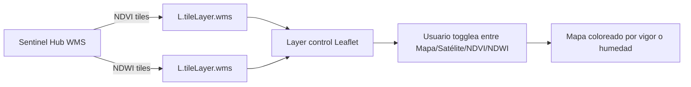
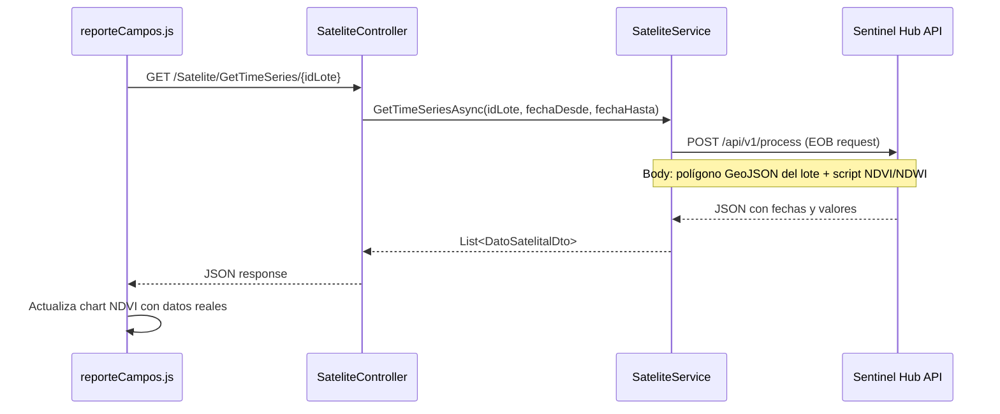

# Plan: Integración de Índices Satelitales (NDVI/NDWI) en Reporte de Campo

## Diagnóstico Actual

- El NDVI en [`ReportService.cs`](AgroForm.Business/Services/ReportService.cs:1092) es **simulado** (fórmula matemática por días desde siembra), no real
- El mapa en [`reporteCampos.js:377`](AgroForm.Web/wwwroot/js/views/reporteCampos.js:377) ya usa Leaflet con OSM + Satélite
- El gráfico de evolución en [`reporteCampos.js:609`](AgroForm.Web/wwwroot/js/views/reporteCampos.js:609) ya muestra curva NDVI (simulada)
- Los DTOs [`DatoEvolucion`](AgroForm.Business/Contracts/ReportesDto.cs:150) y [`ResumenEjecutivoDto`](AgroForm.Business/Contracts/ReportesDto.cs:108) ya tienen campo `NDVI`

## Stack Elegido: **Sentinel Hub** (plan gratuito)

**Por qué Sentinel Hub y no Google Earth Engine:**
- Ofrece **OGC WMS/WMTS** → tiles listos para Leaflet (0 backend)
- API REST para obtener series temporales por polígono
- Plan gratuito: 1 instancia, 30k requests/mes
- Documentación clara para integración web

**Registro necesario:** Crear cuenta gratis en https://www.sentinel-hub.com/ y configurar una instancia.

---

## FASE 1 — Mapa NDVI/NDWI en el mapa del resumen (capa overlay)

**Objetivo:** Agregar capas NDVI y NDWI toggleables al mapa Leaflet existente en [`reporteCampos.js:377`](AgroForm.Web/wwwroot/js/views/reporteCampos.js:377)

### Archivos a modificar

| Archivo | Cambio |
|---|---|
| [`AgroForm.Web/Views/Reporte/Campo.cshtml`](AgroForm.Web/Views/Reporte/Campo.cshtml) | Agregar `instanceId` de Sentinel Hub como constante JS o data-attribute |
| [`AgroForm.Web/wwwroot/js/views/reporteCampos.js`](AgroForm.Web/wwwroot/js/views/reporteCampos.js) | Modificar `renderizarMapa()` para agregar 2 nuevos layers WMS |

### Detalle técnico



**URL WMS de Sentinel Hub:**
```
https://services.sentinel-hub.com/ogc/wms/INSTANCE_ID
```

**Parámetros por capa:**
- NDVI: `layers=NDVI` (renderizador por defecto: rojo-verde)
- NDWI: `layers=NDWI` (renderizador: azul-rojo)

**Código a agregar en `renderizarMapa()`:**

1. Obtener `instanceId` desde un data-attribute en el HTML
2. Crear 2 nuevos `L.tileLayer.wms(...)` para NDVI y NDWI
3. Agregarlos a `baseMaps` o mejor a `overlayMaps` en el control de layers
4. Al seleccionar NDVI, el polígono del campo se vuelve semitransparente

**Resultado:** El usuario puede ver su lote con un "mapa de calor" NDVI superpuesto.

---

## FASE 2 — Series temporales reales de NDVI/NDWI

**Objetivo:** Reemplazar el NDVI simulado del gráfico de evolución (tab "Evolución") con datos reales de Sentinel Hub por polígono.

### Nuevo endpoint backend

**Archivo nuevo:** [`AgroForm.Web/Controllers/SateliteController.cs`](AgroForm.Web/Controllers/SateliteController.cs)

| Endpoint | Método | Descripción |
|---|---|---|
| `GET /Satelite/GetTimeSeries/{idLote}?fechaDesde=...&fechaHasta=...` | GET | Obtiene serie de NDVI y NDWI real para un lote |
| `GET /Satelite/GetCurrentIndex/{idLote}?indice=NDVI` | GET | Obtiene valor actual del índice para mostrar en resumen |

### Nuevo servicio backend

**Archivo nuevo:** [`AgroForm.Business/Services/SateliteService.cs`](AgroForm.Business/Services/SateliteService.cs)

**Archivo nuevo:** [`AgroForm.Business/Contracts/ISateliteService.cs`](AgroForm.Business/Contracts/ISateliteService.cs)



**Script EO (Evaluation Script) a enviar a Sentinel Hub:**
```javascript
// Para NDVI
return evaluatePixel(samples) {
    let ndvi = (samples.B08 - samples.B04) / (samples.B08 + samples.B04);
    return { ndvi: ndvi };
}

// Para NDWI
return evaluatePixel(samples) {
    let ndwi = (samples.B03 - samples.B08) / (samples.B03 + samples.B08);
    return { ndwi: ndwi };
}
```

### DTOs nuevos

**Archivo nuevo:** [`AgroForm.Business/Contracts/SateliteDto.cs`](AgroForm.Business/Contracts/SateliteDto.cs)

```csharp
public class DatoSatelitalDto
{
    public DateTime Fecha { get; set; }
    public decimal? NDVI { get; set; }
    public decimal? NDWI { get; set; }
}

public class IndiceSatelitalDto
{
    public decimal? NDVIPromedio { get; set; }
    public decimal? NDWIPromedio { get; set; }
    public decimal? NDVIMaximo { get; set; }
    public decimal? NDWIMinimo { get; set; }
    public string Estado { get; set; } // "Vigoroso", "Normal", "Estres", "Critico"
    public DateTime? FechaUltimaLectura { get; set; }
    public string Fuente { get; set; } = "Sentinel-2";
    public int ResolucionMts { get; set; } = 10;
}
```

### Modificaciones frontend

| Archivo | Cambio |
|---|---|
| [`reporteCampos.js`](AgroForm.Web/wwwroot/js/views/reporteCampos.js) | Modificar `renderEvolucionChart()` para usar datos reales cuando estén disponibles |

**Flujo:**
1. Cuando se genera el reporte ( [`generarReporte()`](AgroForm.Web/wwwroot/js/views/reporteCampos.js:135) ), después de recibir `reporteData`, hacer un segundo fetch a `/Satelite/GetTimeSeries/{idLote}` 
2. Si hay datos satelitales, reemplazar los valores NDVI simulados con los reales en el chart
3. Actualizar los KPIs de NDVI promedio, máximo, mínimo con valores reales

---

## FASE 3 — Actualizar scores y alertas con datos reales

### Modificaciones backend

**Archivo:** [`ReportService.cs`](AgroForm.Business/Services/ReportService.cs)

| Cambio | Descripción |
|---|---|
| Línea ~663 | Reemplazar NDVI simulado en `ResumenEjecutivoDto.NDVIPromedio` con llamado al servicio satelital |
| Línea ~1526 | Mejorar alerta de "NDVI crítico" usando valor real en lugar de simulado |
| Línea ~676 | Actualizar `EstadoGeneral` basado en NDVI/NDWI real |
| `ResumenEjecutivoDto` | Agregar campo `ScoreHidrico` que use NDWI en lugar de solo días sin lluvia |

### Modificaciones DTOs

**Archivo:** [`ReportesDto.cs`](AgroForm.Business/Contracts/ReportesDto.cs)

| DTO | Cambio |
|---|---|
| [`ResumenEjecutivoDto`](AgroForm.Business/Contracts/ReportesDto.cs:84) | Agregar `NDWIPromedio`, `FuenteIndices`, `FechaUltimoIndice` |
| [`DatoEvolucion`](AgroForm.Business/Contracts/ReportesDto.cs:150) | Agregar `NDWI` (ya tiene NDVI) |

---

## FASE 4 (Futuro/Opcional) — Mapa interactivo por lote

**Objetivo:** Poder ver NDVI/NDWI por lote individual dentro del campo, no solo el promedio.

### Modificaciones frontend

| Archivo | Cambio |
|---|---|
| [`reporteCampos.js`](AgroForm.Web/wwwroot/js/views/reporteCampos.js) | Agregar selector de lote en el mapa + fetch de índice para ese lote específico |

### Nuevos endpoints

| Endpoint | Descripción |
|---|---|
| `GET /Satelite/GetMapTile/{idLote}?indice=NDVI&fecha=2025-01-15` | Devuelve URL de tile WMS recortado al polígono |

---

## Configuración necesaria

### 1. [`appsettings.json`](AgroForm.Web/appsettings.json) — nuevas secciones

```json
{
  "SentinelHub": {
    "InstanceId": "XXXXXXXX-XXXX-XXXX-XXXX-XXXXXXXXXXXX",
    "ClientId": "xxxxxxxx-xxxx-xxxx-xxxx-xxxxxxxxxxxx",
    "ClientSecret": "xxxxxxxxxxxxxxxxxxxxxxxxxxxxxxxxxxxxxxxx",
    "BaseUrl": "https://services.sentinel-hub.com"
  }
}
```

### 2. Registro de servicios en [`Program.cs`](AgroForm.Web/Program.cs)

```csharp
builder.Services.AddHttpClient<ISateliteService, SateliteService>();
builder.Services.Configure<SentinelHubConfig>(builder.Configuration.GetSection("SentinelHub"));
```

---

## Resumen de archivos a crear/modificar

### Archivos NUEVOS

| Archivo | Propósito |
|---|---|
| `AgroForm.Business/Contracts/ISateliteService.cs` | Interface del servicio satelital |
| `AgroForm.Business/Contracts/SateliteDto.cs` | DTOs de datos satelitales |
| `AgroForm.Business/Services/SateliteService.cs` | Servicio que consume API de Sentinel Hub |
| `AgroForm.Web/Controllers/SateliteController.cs` | Endpoints para frontend |

### Archivos a MODIFICAR

| Archivo | Cambios |
|---|---|
| `AgroForm.Web/appsettings.json` | Agregar sección `SentinelHub` |
| `AgroForm.Web/Program.cs` | Registrar `ISateliteService` y `SentinelHubConfig` |
| `AgroForm.Web/Views/Reporte/Campo.cshtml` | Agregar `instanceId` como data-attribute |
| `AgroForm.Web/wwwroot/js/views/reporteCampos.js` | Capas NDVI/NDWI en mapa + chart con datos reales |
| `AgroForm.Business/Contracts/ReportesDto.cs` | Agregar NDWI y campos satelitales |
| `AgroForm.Business/Services/ReportService.cs` | Usar datos satelitales reales en lugar de simulación |

### Archivos a ELIMINAR o MODIFICAR comportamiento

| Archivo | Cambio |
|---|---|
| `AgroForm.Business/Services/ReportService.cs` (líneas 1092-1101) | Reemplazar `CalcularNdviPromedio()` simulado con llamado real |
