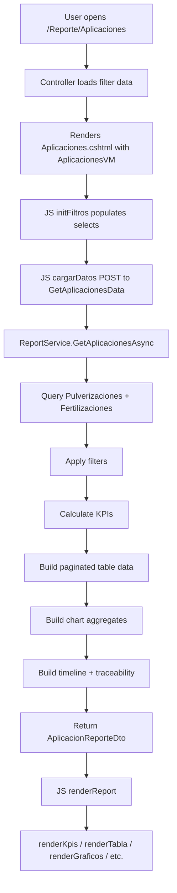

# Plan de Arquitectura: Reporte de Aplicaciones Agrícolas

## 1. Resumen

Módulo completo de reportes que unifica los datos de **Pulverización** y **Fertilización** en un solo dashboard interactivo, con KPIs, tabla dinámica, timeline de lote, análisis de insumos, gráficos, trazabilidad y exportación.

---

## 2. Arquitectura General

```
┌─────────────────────────────────────────────────────────────┐
│                    ReporteController.cs                      │
│  GET  /Reporte/Aplicaciones          → Vista Razor          │
│  POST /Reporte/GetAplicacionesData   → JSON (AJAX)          │
└──────────────────────┬──────────────────────────────────────┘
                       │
┌──────────────────────▼──────────────────────────────────────┐
│                    IReportService                            │
│  Task<OperationResult<AplicacionReporteDto>>                 │
│    GetAplicacionesAsync(filtros)                             │
└──────────────────────┬──────────────────────────────────────┘
                       │
┌──────────────────────▼──────────────────────────────────────┐
│                    ReportService.cs                          │
│  - Query Pulverizaciones + Fertilizaciones con includes     │
│  - Calcular KPIs                                            │
│  - Construir tabla paginada + ordenable                     │
│  - Agrupar datos para gráficos                              │
│  - Construir timeline de lote                               │
│  - Análisis de insumos                                      │
│  - Trazabilidad                                             │
└─────────────────────────────────────────────────────────────┘
```

---

## 3. DTOs (en `ReportesDto.cs`)

### 3.1 Request DTO

```csharp
public class AplicacionesRequest
{
    public int? IdCampania { get; set; }
    public int? IdCampo { get; set; }
    public int? IdLote { get; set; }
    public int? IdCultivo { get; set; }
    public int? IdTipoActividad { get; set; }  // 3=Pulverizacion, 4=Fertilizado, null=Todos
    public int? IdNutriente { get; set; }       // Catalogo TipoNutriente
    public int? IdProducto { get; set; }        // Catalogo ProductoAgroquimico
    public DateTime? FechaDesde { get; set; }
    public DateTime? FechaHasta { get; set; }
    public string OrdenarPor { get; set; } = "Fecha";
    public string OrdenDireccion { get; set; } = "desc";
    public int Pagina { get; set; } = 1;
    public int TamanoPagina { get; set; } = 20;
}
```

### 3.2 Main Report DTO

```csharp
public class AplicacionReporteDto
{
    public AplicacionKpiDto Kpis { get; set; } = new();
    public List<AplicacionLoteDto> DatosLotes { get; set; } = new();
    public List<AplicacionTimelineEventoDto> Timeline { get; set; } = new();
    public AnalisisInsumosDto AnalisisInsumos { get; set; } = new();
    public List<DatoCostoPorProducto> CostosPorProducto { get; set; } = new();
    public List<DatoAplicacionPorTipo> AplicacionesPorTipo { get; set; } = new();
    public List<DatoAplicacionPorCampania> AplicacionesPorCampania { get; set; } = new();
    public List<DatoAplicacionPorCampo> AplicacionesPorCampo { get; set; } = new();
    public List<DatoMapaCalor> MapaCalor { get; set; } = new();
    public List<TrazabilidadAplicacionDto> Trazabilidad { get; set; } = new();
    public PaginacionDto Paginacion { get; set; } = new();
}
```

### 3.3 KPIs

```csharp
public class AplicacionKpiDto
{
    public int TotalAplicaciones { get; set; }
    public int TotalPulverizaciones { get; set; }
    public int TotalFertilizaciones { get; set; }
    public decimal? TotalLitrosAplicados { get; set; }       // Sum VolumenLitrosHa (Pulv)
    public decimal? TotalKgAplicados { get; set; }            // Sum CantidadKgHa (Fert)
    public decimal? CostoTotalARS { get; set; }
    public decimal? CostoTotalUSD { get; set; }
    public decimal? CostoPorHaARS { get; set; }
    public decimal? CostoPorHaUSD { get; set; }
    public decimal? SuperficieTotalHa { get; set; }           // Sum Lote.SuperficieHectareas (distinct)
    public int TotalLotes { get; set; }
    public decimal? PromedioAplicacionesPorLote { get; set; }
    public string? NutrienteMasAplicado { get; set; }         // Nombre del nutriente más usado
    public string? ProductoMasAplicado { get; set; }          // Nombre del producto más usado
    public string Moneda { get; set; } = "ARS";
}
```

### 3.4 Table Row DTO

```csharp
public class AplicacionLoteDto
{
    public int Id { get; set; }
    public string TipoActividad { get; set; } = string.Empty;  // "Pulverización" o "Fertilización"
    public int IdTipoActividad { get; set; }
    public DateTime Fecha { get; set; }
    public string Lote { get; set; } = string.Empty;
    public int IdLote { get; set; }
    public string Campo { get; set; } = string.Empty;
    public string? Cultivo { get; set; }
    public string? Campania { get; set; }
    public string? ProductoONutriente { get; set; }  // ProductoAgroquimico.Nombre o Nutriente.Nombre
    public decimal? Dosis { get; set; }               // Dosis (Pulv) o DosisKgHa (Fert)
    public decimal? CantidadAplicada { get; set; }    // VolumenLitrosHa (Pulv) o CantidadKgHa (Fert)
    public string Unidad { get; set; } = string.Empty; // "L/ha" o "kg/ha"
    public decimal? CostoARS { get; set; }
    public decimal? CostoUSD { get; set; }
    public string? Observacion { get; set; }
    public string? Responsable { get; set; }
    public string? CondicionesClimaticas { get; set; }  // Solo para Pulverización
    public string? MetodoAplicacion { get; set; }        // Solo para Fertilización
}
```

### 3.5 Timeline Event DTO

```csharp
public class AplicacionTimelineEventoDto
{
    public DateTime Fecha { get; set; }
    public string Tipo { get; set; } = string.Empty;  // "Siembra", "Pulverización", "Fertilización", "Cosecha"
    public string Descripcion { get; set; } = string.Empty;
    public string? Lote { get; set; }
    public string? Cultivo { get; set; }
    public string? ProductoONutriente { get; set; }
    public decimal? Cantidad { get; set; }
    public string Unidad { get; set; } = string.Empty;
    public string Icono { get; set; } = string.Empty;
    public string Color { get; set; } = string.Empty;
}
```

### 3.6 Input Analysis DTOs

```csharp
public class AnalisisInsumosDto
{
    public List<ConsumoPorCultivo> ConsumoPorCultivo { get; set; } = new();
    public List<ConsumoPorCampania> ConsumoPorCampania { get; set; } = new();
    public List<ConsumoPorLote> ConsumoPorLote { get; set; } = new();
    public List<ConsumoPorProducto> ConsumoPorProducto { get; set; } = new();
}

public class ConsumoPorCultivo
{
    public string Cultivo { get; set; } = string.Empty;
    public decimal? TotalLitros { get; set; }
    public decimal? TotalKg { get; set; }
    public decimal? CostoTotalARS { get; set; }
    public int CantidadAplicaciones { get; set; }
    public string Color { get; set; } = "#4CAF50";
}

public class ConsumoPorCampania
{
    public string Campania { get; set; } = string.Empty;
    public decimal? TotalLitros { get; set; }
    public decimal? TotalKg { get; set; }
    public decimal? CostoTotalARS { get; set; }
    public int CantidadAplicaciones { get; set; }
}

public class ConsumoPorLote
{
    public string Lote { get; set; } = string.Empty;
    public string Campo { get; set; } = string.Empty;
    public decimal? TotalLitros { get; set; }
    public decimal? TotalKg { get; set; }
    public decimal? CostoTotalARS { get; set; }
    public int CantidadAplicaciones { get; set; }
}

public class ConsumoPorProducto
{
    public string Producto { get; set; } = string.Empty;
    public string Tipo { get; set; } = string.Empty;  // "Agroquímico" o "Fertilizante"
    public decimal? TotalCantidad { get; set; }
    public string Unidad { get; set; } = string.Empty;
    public decimal? CostoTotalARS { get; set; }
    public int CantidadAplicaciones { get; set; }
}
```

### 3.7 Chart Data DTOs

```csharp
public class DatoCostoPorProducto
{
    public string Producto { get; set; } = string.Empty;
    public decimal CostoARS { get; set; }
    public string Tipo { get; set; } = string.Empty;
    public string Color { get; set; } = "#6c757d";
}

public class DatoAplicacionPorTipo
{
    public string Tipo { get; set; } = string.Empty;  // "Pulverización" o "Fertilización"
    public int Cantidad { get; set; }
    public string Color { get; set; } = "#4CAF50";
}

public class DatoAplicacionPorCampania
{
    public string Campania { get; set; } = string.Empty;
    public int CantidadPulverizaciones { get; set; }
    public int CantidadFertilizaciones { get; set; }
    public decimal? CostoTotalARS { get; set; }
}

public class DatoAplicacionPorCampo
{
    public string Campo { get; set; } = string.Empty;
    public int CantidadAplicaciones { get; set; }
    public decimal? TotalLitros { get; set; }
    public decimal? TotalKg { get; set; }
    public decimal? CostoTotalARS { get; set; }
}

public class DatoMapaCalor
{
    public string Lote { get; set; } = string.Empty;
    public string Mes { get; set; } = string.Empty;
    public int CantidadAplicaciones { get; set; }
    public decimal? TotalLitros { get; set; }
    public decimal? TotalKg { get; set; }
}
```

### 3.8 Traceability DTO

```csharp
public class TrazabilidadAplicacionDto
{
    public int Id { get; set; }
    public string TipoActividad { get; set; } = string.Empty;
    public DateTime Fecha { get; set; }
    public string Lote { get; set; } = string.Empty;
    public string Campo { get; set; } = string.Empty;
    public string? Cultivo { get; set; }
    public string? Campania { get; set; }
    public string? ProductoONutriente { get; set; }
    public decimal? Dosis { get; set; }
    public decimal? CantidadAplicada { get; set; }
    public string Unidad { get; set; } = string.Empty;
    public string? Responsable { get; set; }
    public string? Observacion { get; set; }
    public DateTime? RegistrationDate { get; set; }
    public string? RegistrationUser { get; set; }
}
```

---

## 4. Service Method (`IReportService` / `ReportService.cs`)

### Signature

```csharp
Task<OperationResult<AplicacionReporteDto>> GetAplicacionesAsync(
    int? idCampania = null,
    int? idCampo = null,
    int? idLote = null,
    int? idCultivo = null,
    int? idTipoActividad = null,
    int? idNutriente = null,
    int? idProducto = null,
    DateTime? fechaDesde = null,
    DateTime? fechaHasta = null,
    string ordenarPor = "Fecha",
    string ordenDireccion = "desc",
    int pagina = 1,
    int tamanoPagina = 20);
```

### Query Strategy

**Option A (Recommended - Direct Query):** Query `Pulverizacion` and `Fertilizacion` repositories directly with includes, then union in memory. This is more efficient than going through `CicloCultivo` for a report focused only on these two activity types.

```csharp
// 1. Query Pulverizaciones
var pulvQuery = _unitOfWork.Repository<Pulverizacion>().Query()
    .Include(p => p.Lote).ThenInclude(l => l.Campo)
    .Include(p => p.CicloCultivo).ThenInclude(cc => cc.Cultivo)
    .Include(p => p.CicloCultivo).ThenInclude(cc => cc.Campania)
    .Include(p => p.ProductoAgroquimico)
    .Include(p => p.Usuario)
    .Include(p => p.Moneda)
    .Where(p => p.IdLicencia == _userContext.IdLicencia);

// 2. Query Fertilizaciones
var fertQuery = _unitOfWork.Repository<Fertilizacion>().Query()
    .Include(f => f.Lote).ThenInclude(l => l.Campo)
    .Include(f => f.CicloCultivo).ThenInclude(cc => cc.Cultivo)
    .Include(f => f.CicloCultivo).ThenInclude(cc => cc.Campania)
    .Include(f => f.Nutriente)
    .Include(f => f.TipoFertilizante)
    .Include(f => f.MetodoAplicacion)
    .Include(f => f.Usuario)
    .Include(f => f.Moneda)
    .Where(f => f.IdLicencia == _userContext.IdLicencia);

// 3. Apply filters to both queries
// 4. Execute both, union into a common list
// 5. Calculate KPIs from full list
// 6. Paginate + sort for table
// 7. Build chart data groups
// 8. Build timeline (include Siembra + Cosecha from CicloCultivo)
// 9. Build traceability
```

---

## 5. Controller Endpoints (`ReporteController.cs`)

### 5.1 GET: View

```csharp
[HttpGet("[action]")]
public async Task<IActionResult> Aplicaciones()
{
    // Load filter data: Campanias, Campos, Cultivos, TiposActividad, Nutrientes, Productos
    var viewModel = new AplicacionesVM { ... };
    return View(viewModel);
}
```

### 5.2 POST: Data (AJAX)

```csharp
[HttpPost("GetAplicacionesData")]
public async Task<IActionResult> GetAplicacionesData([FromBody] AplicacionesRequest request)
{
    var result = await _reportService.GetAplicacionesAsync(...);
    return Ok(new GenericResponse<AplicacionReporteDto> { ... });
}
```

---

## 6. ViewModel (`AplicacionesVM.cs`)

```csharp
public class AplicacionesVM
{
    public List<FiltroItem> Campanias { get; set; } = new();
    public List<FiltroItem> Campos { get; set; } = new();
    public List<FiltroItem> Lotes { get; set; } = new();
    public List<FiltroItem> Cultivos { get; set; } = new();
    public List<FiltroItem> TiposActividad { get; set; } = new();  // Pulverización, Fertilización
    public List<FiltroItem> Nutrientes { get; set; } = new();
    public List<FiltroItem> Productos { get; set; } = new();
    public string Moneda { get; set; } = "ARS";
}
```

---

## 7. Razor View (`Aplicaciones.cshtml`)

Structure follows the same pattern as `Cosecha.cshtml`:

```
┌─────────────────────────────────────────────────────────────┐
│ Header: "Reporte de Aplicaciones" + Excel/PDF/Ayuda buttons │
├─────────────────────────────────────────────────────────────┤
│ Filters Card:                                               │
│ Campaña | Campo | Lote | Cultivo | Tipo Actividad |         │
│ Nutriente | Producto | Fecha Desde | Fecha Hasta            │
│ [Generar Reporte] [Limpiar]                                 │
├─────────────────────────────────────────────────────────────┤
│ Loading / Empty State                                       │
├─────────────────────────────────────────────────────────────┤
│ KPI Cards (7 KPIs)                                          │
├─────────────────────────────────────────────────────────────┤
│ Tabs:                                                       │
│ 1. Dashboard (charts overview)                              │
│ 2. Datos (table + pagination)                               │
│ 3. Timeline (lot history)                                   │
│ 4. Insumos (input analysis)                                 │
│ 5. Gráficos (all charts)                                    │
│ 6. Trazabilidad                                             │
└─────────────────────────────────────────────────────────────┘
```

### Tab Structure Detail

| Tab | Content |
|-----|---------|
| **Dashboard** | Executive view: 2-column layout with bar chart (costs by product) + pie chart (app types) on top row, timeline chart + heatmap on bottom row |
| **Datos** | Sortable table with all columns, pagination, quick filters |
| **Timeline** | Vertical timeline per lot showing Siembra → Pulverizaciones → Fertilizaciones → Cosecha |
| **Insumos** | Consumption analysis: by crop (bar), by campaign (bar), by lot (table), by product (bar) |
| **Gráficos** | All 6 charts in full size: bar costs by product, pie application types, timeline, heatmap, campaign comparison, field comparison |
| **Trazabilidad** | Full traceability table with expandable rows showing complete audit trail |

---

## 8. JavaScript Module (`reporteAplicaciones.js`)

Structure follows `reporteCosecha.js` pattern:

```
reporteAplicaciones.js
├── State: reporteData, charts{}, sortConfig, currentPage
├── $(document).ready → initFiltros(), initTabs(), cargarDatos()
├── initFiltros() - populate selects, wire events
├── cargarDatos() - AJAX POST to GetAplicacionesData
├── renderReport(data) - orchestrates all rendering
│   ├── renderKpis(kpis)
│   ├── renderDashboard(dashboardData)
│   ├── renderTabla(datos, paginacion)
│   ├── renderPaginacion(paginacion)
│   ├── renderTimeline(timeline)
│   ├── renderInsumos(analisisInsumos)
│   ├── renderGraficos(chartData)
│   │   ├── chartCostosPorProducto()
│   │   ├── chartAplicacionesPorTipo()
│   │   ├── chartTimelineAplicaciones()
│   │   ├── chartMapaCalor()
│   │   ├── chartComparativaCampanias()
│   │   └── chartComparativaCampos()
│   └── renderTrazabilidad(trazabilidad)
├── exportarExcel()
├── exportarPDF()
├── limpiarFiltros()
└── Helpers: formatDate(), escapeHtml(), formatMoneda()
```

### Chart Types

| Chart | Type | Data |
|-------|------|------|
| Costos por Producto | Bar (horizontal) | Top 10 products by cost |
| Aplicaciones por Tipo | Doughnut/Pie | Pulverización vs Fertilización count |
| Timeline de Aplicaciones | Line | Applications over time (monthly) |
| Mapa de Calor | Heatmap (matrix) | Lote × Month intensity |
| Comparativa por Campaña | Grouped Bar | Pulv/Fert counts per campaign |
| Comparativa por Campo | Bar | Total applications per field |

---

## 9. Data Flow Diagram



---

## 10. KPI Calculation Logic

| KPI | Source | Calculation |
|-----|--------|-------------|
| Total Aplicaciones | Pulv.Count + Fert.Count | Simple count |
| Total Litros | Pulv.Sum(VolumenLitrosHa) | Sum of all volumes |
| Total Kg | Fert.Sum(CantidadKgHa) | Sum of all kg |
| Costo Total ARS | Pulv.Sum(CostoARS) + Fert.Sum(CostoARS) | Sum of costs |
| Costo por Ha ARS | CostoTotalARS / SuperficieTotalHa | Division |
| Superficie Total | Lote.SuperficieHectareas (distinct) | Sum of distinct lot areas |
| Promedio Aplicaciones/Lote | TotalAplicaciones / TotalLotes | Division |
| Nutriente más aplicado | Fert group by Nutriente.Nombre | Max by count |
| Producto más aplicado | Pulv group by Producto.Nombre | Max by count |

---

## 11. Timeline Construction

For a selected lot, the timeline combines events from `CicloCultivo`:

1. **Siembra** (from CicloCultivo.Siembras) - Green icon
2. **Pulverizaciones** (from CicloCultivo.Pulverizaciones) - Blue icon
3. **Fertilizaciones** (from CicloCultivo.Fertilizaciones) - Orange icon
4. **Cosecha** (from CicloCultivo.Cosechas) - Yellow icon

All events sorted by `Fecha`, rendered as a vertical timeline with:
- Date on left
- Icon + type in center
- Description on right (product, dose, responsible)

---

## 12. Traceability

For each application record, show:
- **Who**: RegistrationUser, Usuario.Username
- **When**: RegistrationDate, Fecha
- **What**: Producto/Nutriente, Dosis, Cantidad
- **Where**: Lote, Campo, CicloCultivo
- **Why**: Observacion, CondicionesClimaticas
- **Cost**: CostoARS, CostoUSD, Moneda

---

## 13. Performance Considerations

1. **Direct repository queries** for Pulverizacion and Fertilizacion (not through CicloCultivo navigation) to avoid massive joins
2. **Execute both queries in parallel** using `Task.WhenAll`
3. **In-memory aggregation** after fetching (same pattern as existing reports)
4. **Pagination** applied after sorting in memory
5. **Consider adding a stored procedure** if performance becomes an issue with large datasets
6. **Indexes** to consider: Fecha, IdLote, IdCampania, IdCicloCultivo on both tables

---

## 14. Files to Create/Modify

| File | Action | Description |
|------|--------|-------------|
| `AgroForm.Business/Contracts/ReportesDto.cs` | Modify | Add all new DTOs (lines ~523+) |
| `AgroForm.Business/Contracts/IReportService.cs` | Modify | Add `GetAplicacionesAsync` method |
| `AgroForm.Business/Services/ReportService.cs` | Modify | Add `GetAplicacionesAsync` implementation |
| `AgroForm.Web/Controllers/ReporteController.cs` | Modify | Add `Aplicaciones()` and `GetAplicacionesData()` |
| `AgroForm.Web/Models/AplicacionesVM.cs` | Create | ViewModel for the view |
| `AgroForm.Web/Views/Reporte/Aplicaciones.cshtml` | Create | Razor view |
| `AgroForm.Web/wwwroot/js/views/reporteAplicaciones.js` | Create | JavaScript module |

---

## 15. Implementation Order

1. **DTOs** - Define all data structures first
2. **Service Interface** - Add method signature
3. **Service Implementation** - Core business logic
4. **Controller** - Wire up endpoints
5. **ViewModel** - Server-side model for view
6. **Razor View** - HTML + CSS structure
7. **JavaScript Module** - Client-side rendering
8. **Testing** - Verify all features work together
