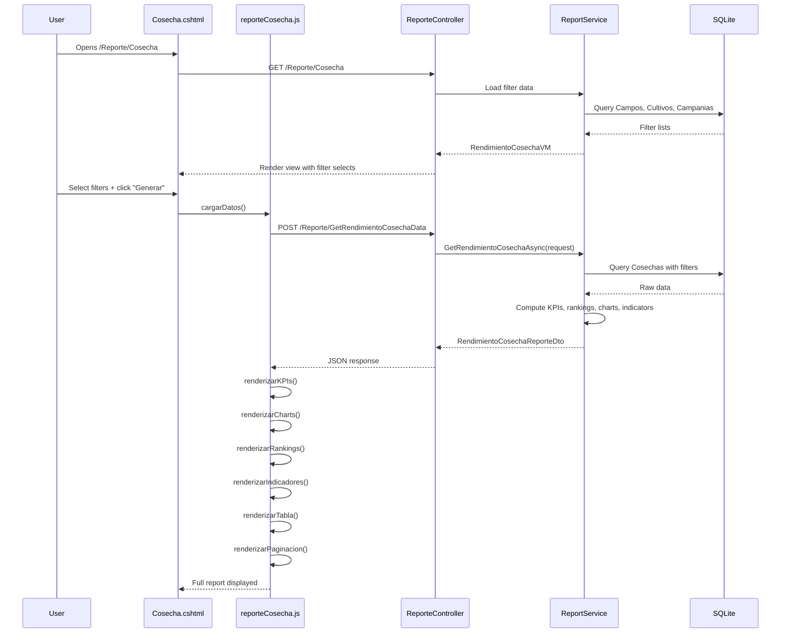

# Plan: Módulo "Rendimiento de Cosecha" (Harvest Yield Report)

## 1. Overview

New standalone report module for the AgroForm system that provides a comprehensive view of harvest yields across lots, fields, crops, and campaigns. Modeled after the existing [`Campo`](AgroForm.Web/Views/Reporte/Campo.cshtml) report in aesthetics and dark mode support, but focused exclusively on yield data from the [`Cosecha`](AgroForm.Model/Actividades/Cosecha.cs) entity.

---

## 2. Architecture

```
┌─────────────────────────────────────────────────────────────────────┐
│                        ReporteController                             │
│  GET  /Reporte/Cosecha              → View                          │
│  POST /Reporte/GetRendimientoCosecha → JSON data                    │
└──────────────────────┬──────────────────────────────────────────────┘
                       │
┌──────────────────────▼──────────────────────────────────────────────┐
│                        IReportService                                │
│  Task<OperationResult<RendimientoCosechaReporteDto>>                │
│    GetRendimientoCosechaAsync(RendimientoCosechaRequest)            │
└──────────────────────┬──────────────────────────────────────────────┘
                       │
┌──────────────────────▼──────────────────────────────────────────────┐
│                        ReportService                                 │
│  - Query Cosecha records via CicloCultivo → Lote → Campo           │
│  - Filter by: IdCampania, IdCampo, IdLote, IdCultivo               │
│  - Compute KPIs, rankings, historical trends                        │
│  - Optimized with server-side pagination & aggregation              │
└──────────────────────┬──────────────────────────────────────────────┘
                       │
┌──────────────────────▼──────────────────────────────────────────────┐
│                        Data Layer (EF Core)                          │
│  Cosecha ← CicloCultivo ← Lote ← Campo                             │
│  Cosecha → Cultivo, Campania, Moneda                                │
└─────────────────────────────────────────────────────────────────────┘
```

---

## 3. Data Model & Relationships

```
Campo (1) ──→ Lote (N) ──→ CicloCultivo (N) ──→ Cosecha (N)
                                                    │
                                                    ├──→ Cultivo
                                                    ├──→ Campania
                                                    └──→ Moneda
```

**Key Cosecha fields used:**
- [`RendimientoTonHa`](AgroForm.Model/Actividades/Cosecha.cs:14) — Yield in tons per hectare
- [`HumedadGrano`](AgroForm.Model/Actividades/Cosecha.cs:15) — Grain moisture %
- [`SuperficieCosechadaHa`](AgroForm.Model/Actividades/Cosecha.cs:16) — Harvested area
- [`Fecha`](AgroForm.Model/Actividades/Cosecha.cs:12) — Harvest date
- [`Costo` / `CostoARS` / `CostoUSD`](AgroForm.Model/Actividades/Cosecha.cs:17-19) — Costs
- [`IdLote → Lote`](AgroForm.Model/Actividades/Cosecha.cs:21-22) — Lot relationship
- [`IdCultivo → Cultivo`](AgroForm.Model/Actividades/Cosecha.cs:30-31) — Crop relationship
- [`IdCampania → Campania`](AgroForm.Model/Actividades/Cosecha.cs:37-38) — Campaign relationship

---

## 4. DTOs (Data Transfer Objects)

All new DTOs go in [`AgroForm.Business/Contracts/ReportesDto.cs`](AgroForm.Business/Contracts/ReportesDto.cs).

### 4.1 `RendimientoCosechaRequest`
```csharp
public class RendimientoCosechaRequest
{
    public int? IdCampania { get; set; }
    public int? IdCampo { get; set; }
    public int? IdLote { get; set; }
    public int? IdCultivo { get; set; }
    public string? SortBy { get; set; }       // e.g., "rendimiento", "humedad", "fecha"
    public bool SortAsc { get; set; } = false;
    public int Page { get; set; } = 1;
    public int PageSize { get; set; } = 20;
    public string? Search { get; set; }       // search by lote/campo name
}
```

### 4.2 `RendimientoCosechaReporteDto` (Main response)
```csharp
public class RendimientoCosechaReporteDto
{
    // KPIs
    public ResumenRendimientoDto Resumen { get; set; } = new();
    
    // Paginated table data
    public List<RendimientoCosechaItemDto> Items { get; set; } = new();
    public int TotalItems { get; set; }
    public int Page { get; set; }
    public int PageSize { get; set; }
    
    // Rankings
    public List<RendimientoRankingDto> RankingMejores { get; set; } = new();
    public List<RendimientoRankingDto> RankingPeores { get; set; } = new();
    
    // Chart data
    public List<RendimientoPorLoteDto> RendimientoPorLote { get; set; } = new();
    public List<RendimientoPorCultivoDto> RendimientoPorCultivo { get; set; } = new();
    public List<RendimientoPorCampaniaDto> RendimientoPorCampania { get; set; } = new();
    public List<RendimientoHistoricoLoteDto> RendimientoHistorico { get; set; } = new();
    public List<RendimientoVsHumedadDto> RendimientoVsHumedad { get; set; } = new();
    
    // Smart indicators
    public List<IndicadorInteligenteDto> Indicadores { get; set; } = new();
    
    // Filter metadata
    public List<FiltroItem> Campos { get; set; } = new();
    public List<FiltroItem> Lotes { get; set; } = new();
    public List<FiltroItem> Cultivos { get; set; } = new();
    public List<FiltroItem> Campanias { get; set; } = new();
}
```

### 4.3 `ResumenRendimientoDto`
```csharp
public class ResumenRendimientoDto
{
    public decimal? RendimientoPromedioTonHa { get; set; }
    public decimal? RendimientoMaximoTonHa { get; set; }
    public decimal? RendimientoMinimoTonHa { get; set; }
    public string? LoteMejorRendimiento { get; set; }
    public string? LotePeorRendimiento { get; set; }
    public decimal? ProduccionTotalTon { get; set; }
    public decimal? SuperficieCosechadaTotalHa { get; set; }
    public decimal? HumedadPromedio { get; set; }
    public int TotalLotes { get; set; }
    public int LotesConRendimiento { get; set; }
    public decimal? VariacionVsCampaniaAnterior { get; set; }  // percentage
    public decimal? RendimientoCampaniaAnterior { get; set; }
}
```

### 4.4 `RendimientoCosechaItemDto` (Table row)
```csharp
public class RendimientoCosechaItemDto
{
    public int IdCosecha { get; set; }
    public int IdLote { get; set; }
    public string Lote { get; set; } = string.Empty;
    public string? Campo { get; set; }
    public string? Cultivo { get; set; }
    public string? Campania { get; set; }
    public DateTime FechaCosecha { get; set; }
    public decimal? RendimientoTonHa { get; set; }
    public decimal? ProduccionTotalTon { get; set; }
    public decimal? HumedadGrano { get; set; }
    public decimal? SuperficieCosechadaHa { get; set; }
    public decimal? CostoARS { get; set; }
    public decimal? CostoUSD { get; set; }
    public int Ranking { get; set; }
}
```

### 4.5 Supporting DTOs
```csharp
public class RendimientoRankingDto
{
    public int IdLote { get; set; }
    public string Lote { get; set; } = string.Empty;
    public string? Campo { get; set; }
    public string? Cultivo { get; set; }
    public decimal? RendimientoTonHa { get; set; }
    public int Ranking { get; set; }
}

public class RendimientoPorLoteDto
{
    public string Lote { get; set; } = string.Empty;
    public string? Campo { get; set; }
    public decimal? RendimientoTonHa { get; set; }
    public decimal? HumedadGrano { get; set; }
}

public class RendimientoPorCultivoDto
{
    public string Cultivo { get; set; } = string.Empty;
    public decimal? RendimientoPromedio { get; set; }
    public decimal? RendimientoMaximo { get; set; }
    public decimal? RendimientoMinimo { get; set; }
    public int CantidadCosechas { get; set; }
}

public class RendimientoPorCampaniaDto
{
    public string Campania { get; set; } = string.Empty;
    public decimal? RendimientoPromedio { get; set; }
    public decimal? RendimientoMaximo { get; set; }
    public decimal? RendimientoMinimo { get; set; }
    public int CantidadCosechas { get; set; }
}

public class RendimientoHistoricoLoteDto
{
    public int IdLote { get; set; }
    public string Lote { get; set; } = string.Empty;
    public string? Campo { get; set; }
    public List<DatoRendimientoHistorico> Historico { get; set; } = new();
}

public class RendimientoVsHumedadDto
{
    public string Lote { get; set; } = string.Empty;
    public decimal? RendimientoTonHa { get; set; }
    public decimal? HumedadGrano { get; set; }
    public string? Cultivo { get; set; }
}

public class IndicadorInteligenteDto
{
    public string Tipo { get; set; } = string.Empty;       // "rendimiento", "humedad", "variacion"
    public string Severidad { get; set; } = "Media";       // "Baja", "Media", "Alta"
    public string Mensaje { get; set; } = string.Empty;
    public string? Recomendacion { get; set; }
    public string Icono { get; set; } = "ph-info";
}
```

---

## 5. ViewModel

New file: [`AgroForm.Web/Models/RendimientoCosechaVM.cs`](AgroForm.Web/Models/RendimientoCosechaVM.cs)

```csharp
public class RendimientoCosechaVM
{
    public List<FiltroItem> Campos { get; set; } = new();
    public List<FiltroItem> Cultivos { get; set; } = new();
    public List<FiltroItem> Campanias { get; set; } = new();
}
```

---

## 6. Service Layer

### 6.1 Interface addition in [`IReportService`](AgroForm.Business/Contracts/IReportService.cs)
```csharp
Task<OperationResult<RendimientoCosechaReporteDto>> GetRendimientoCosechaAsync(
    RendimientoCosechaRequest request);
```

### 6.2 Service implementation in [`ReportService`](AgroForm.Business/Services/ReportService.cs)

**Query strategy** — Direct query on `Cosecha` via `CicloCultivo` navigation (same pattern as existing `GetComparativaCamposAsync`):

```csharp
public async Task<OperationResult<RendimientoCosechaReporteDto>> GetRendimientoCosechaAsync(
    RendimientoCosechaRequest request)
{
    // 1. Base query: Cosechas → CicloCultivo → Lote → Campo
    var query = _unitOfWork.Repository<Cosecha>().Query()
        .Include(c => c.Lote).ThenInclude(l => l.Campo)
        .Include(c => c.Cultivo)
        .Include(c => c.Campania)
        .Include(c => c.CicloCultivo)
        .Where(c => c.IdLicencia == _userContext.IdLicencia)
        .AsQueryable();

    // 2. Apply filters
    if (request.IdCampania.HasValue)
        query = query.Where(c => c.IdCampania == request.IdCampania.Value);
    else if (_userContext.IdCampaña.HasValue)
        query = query.Where(c => c.IdCampania == _userContext.IdCampaña.Value);

    if (request.IdCampo.HasValue)
        query = query.Where(c => c.Lote.IdCampo == request.IdCampo.Value);
    
    if (request.IdLote.HasValue)
        query = query.Where(c => c.IdLote == request.IdLote.Value);
    
    if (request.IdCultivo.HasValue)
        query = query.Where(c => c.IdCultivo == request.IdCultivo.Value);

    if (!string.IsNullOrWhiteSpace(request.Search))
        query = query.Where(c => c.Lote.Nombre.Contains(request.Search) 
            || c.Lote.Campo.Nombre.Contains(request.Search));

    // 3. Compute KPIs (before pagination)
    var allFiltered = await query.ToListAsync();
    
    var resumen = new ResumenRendimientoDto
    {
        TotalLotes = allFiltered.Select(c => c.IdLote).Distinct().Count(),
        LotesConRendimiento = allFiltered.Count(c => c.RendimientoTonHa.HasValue),
        RendimientoPromedioTonHa = allFiltered.Where(c => c.RendimientoTonHa.HasValue)
            .Average(c => c.RendimientoTonHa!.Value),
        RendimientoMaximoTonHa = allFiltered.Where(c => c.RendimientoTonHa.HasValue)
            .Max(c => c.RendimientoTonHa!.Value),
        RendimientoMinimoTonHa = allFiltered.Where(c => c.RendimientoTonHa.HasValue)
            .Min(c => c.RendimientoTonHa!.Value),
        ProduccionTotalTon = allFiltered.Sum(c => 
            (c.RendimientoTonHa ?? 0) * (c.SuperficieCosechadaHa ?? 0)),
        SuperficieCosechadaTotalHa = allFiltered.Sum(c => c.SuperficieCosechadaHa ?? 0),
        HumedadPromedio = allFiltered.Where(c => c.HumedadGrano.HasValue)
            .Average(c => c.HumedadGrano!.Value),
    };

    // Best/worst lot
    var porLote = allFiltered.Where(c => c.RendimientoTonHa.HasValue)
        .GroupBy(c => c.Lote.Nombre)
        .Select(g => new { Lote = g.Key, Promedio = g.Average(c => c.RendimientoTonHa!.Value) })
        .OrderByDescending(x => x.Promedio)
        .ToList();
    
    if (porLote.Any())
    {
        resumen.LoteMejorRendimiento = porLote.First().Lote;
        resumen.LotePeorRendimiento = porLote.Last().Lote;
    }

    // Variation vs previous campaign
    // ... (compute using Campania ordering)

    // 4. Rankings
    var ranking = porLote.Select((x, i) => new RendimientoRankingDto { ... }).ToList();
    
    // 5. Chart data
    // RendimientoPorLote, RendimientoPorCultivo, RendimientoPorCampania, etc.
    
    // 6. Smart indicators
    var indicadores = new List<IndicadorInteligenteDto>();
    // - Lots below average yield
    // - Humidity out of optimal range
    // - Yield variation alerts
    
    // 7. Paginated items
    var totalItems = allFiltered.Count;
    var items = allFiltered
        .OrderByDescending(c => c.RendimientoTonHa ?? 0)
        .Skip((request.Page - 1) * request.PageSize)
        .Take(request.PageSize)
        .Select(c => new RendimientoCosechaItemDto { ... })
        .ToList();

    return OperationResult<RendimientoCosechaReporteDto>.SuccessResult(new RendimientoCosechaReporteDto
    {
        Resumen = resumen,
        Items = items,
        TotalItems = totalItems,
        Page = request.Page,
        PageSize = request.PageSize,
        RankingMejores = ranking.Take(5).ToList(),
        RankingPeores = ranking.TakeLast(5).Reverse().ToList(),
        // ... chart data
        Indicadores = indicadores
    });
}
```

---

## 7. Controller Endpoints

Add to [`ReporteController`](AgroForm.Web/Controllers/ReporteController.cs):

### 7.1 `GET /Reporte/Cosecha` — Returns the view
```csharp
[HttpGet("[action]")]
public async Task<IActionResult> Cosecha()
{
    // Load filter data (campos, cultivos, campanias)
    var campos = await _campoService.GetAllAsync();
    // ... build VM
    return View(viewModel);
}
```

### 7.2 `POST /Reporte/GetRendimientoCosechaData` — Returns JSON
```csharp
[HttpPost("[action]")]
public async Task<IActionResult> GetRendimientoCosechaData(
    [FromBody] RendimientoCosechaRequest request)
{
    var result = await _reportService.GetRendimientoCosechaAsync(request);
    // ... return Ok/ BadRequest with GenericResponse<RendimientoCosechaReporteDto>
}
```

### 7.3 Helper endpoints (reuse existing)
- `GetCampaniasByCampo/{idCampo}` — already exists
- `GetLotesByCampo/{idCampo}` — already exists

---

## 8. Razor View: `Views/Reporte/Cosecha.cshtml`

Modeled after [`Campo.cshtml`](AgroForm.Web/Views/Reporte/Campo.cshtml) structure:

```
┌──────────────────────────────────────────────────────────────┐
│  Header: "Rendimiento de Cosecha" + Export buttons           │
├──────────────────────────────────────────────────────────────┤
│  Filter Row: Campo | Campaña | Lote | Cultivo | Buscar      │
├──────────────────────────────────────────────────────────────┤
│  KPI Cards Row (6 cards):                                   │
│  ┌──────┐ ┌──────┐ ┌──────┐ ┌──────┐ ┌──────┐ ┌──────┐    │
│  │Rend. │ │Mejor │ │Peor  │ │Prod. │ │Área  │ │Humed.│    │
│  │Prom. │ │Lote  │ │Lote  │ │Total │ │Cosech│ │Prom. │    │
│  └──────┘ └──────┘ └──────┘ └──────┘ └──────┘ └──────┘    │
├──────────────────────────────────────────────────────────────┤
│  Charts Section (2x2 grid):                                 │
│  ┌─────────────────────┐ ┌─────────────────────┐            │
│  │ Rendimiento x Lote  │ │ Rendimiento x Cult. │            │
│  │ (Bar Chart)         │ │ (Pie/Doughnut)      │            │
│  ├─────────────────────┤ ├─────────────────────┤            │
│  │ Evolución Histórica │ │ Rend. vs Humedad    │            │
│  │ (Line Chart)        │ │ (Scatter Chart)     │            │
│  └─────────────────────┘ └─────────────────────┘            │
├──────────────────────────────────────────────────────────────┤
│  Rankings Section:                                          │
│  ┌─────────────────────┐ ┌─────────────────────┐            │
│  │ Top 5 Mejores       │ │ Bottom 5 Peores     │            │
│  │ (Medal list)        │ │ (Warning list)      │            │
│  └─────────────────────┘ └─────────────────────┘            │
├──────────────────────────────────────────────────────────────┤
│  Smart Indicators / Alerts                                  │
├──────────────────────────────────────────────────────────────┤
│  Data Table (sortable, searchable, paginated)               │
│  ┌────────────────────────────────────────────────────────┐ │
│  │ # │ Lote │ Campo │ Cultivo │ Fecha │ Rend. │ Hum. │   │ │
│  ├────────────────────────────────────────────────────────┤ │
│  │ ... rows ...                                          │ │
│  └────────────────────────────────────────────────────────┘ │
│  Pagination controls + Excel export                         │
└──────────────────────────────────────────────────────────────┘
```

**Dark mode**: Same pattern as [`Campo.cshtml:133-193`](AgroForm.Web/Views/Reporte/Campo.cshtml:133) — use `body[data-theme="dark"]` selectors with CSS variables (`--surface`, `--border`, `--text`, `--text-muted`).

**CDN scripts** (same as Campo):
- Chart.js 4.4.0
- html2canvas 1.4.1
- jsPDF 2.5.1
- SheetJS (xlsx) 0.18.5

---

## 9. JavaScript: `wwwroot/js/views/reporteCosecha.js`

Modeled after [`reporteCampos.js`](AgroForm.Web/wwwroot/js/views/reporteCampos.js) patterns (~600-800 lines).

### Main functions:
| Function | Purpose |
|----------|---------|
| `cargarDatos()` | Fetch data from `GetRendimientoCosechaData` endpoint |
| `renderizarKPIs(resumen)` | Render 6 KPI cards with icons and formatted values |
| `renderizarCharts(data)` | Create/update all 4 charts |
| `renderizarRankings(mejores, peores)` | Render top/bottom rankings |
| `renderizarIndicadores(indicadores)` | Render smart indicator alerts |
| `renderizarTabla(items)` | Render sortable table rows |
| `renderizarPaginacion(total, page, pageSize)` | Render pagination controls |
| `exportarExcel()` | Export table to XLSX using SheetJS |
| `exportarPDF()` | Export report to PDF using html2canvas + jsPDF |
| `cambiarPagina(page)` | Load specific page |
| `ordenarTabla(colKey)` | Sort table by column |
| `buscar(texto)` | Filter table by search text |

### Chart configurations:
1. **Bar chart** — Rendimiento por Lote (grouped by campo color)
2. **Doughnut/Pie chart** — Rendimiento promedio por Cultivo
3. **Line chart** — Evolución histórica (campaigns on X, yield on Y, one line per lot)
4. **Scatter chart** — Rendimiento vs Humedad (each dot = a cosecha record)

### Utility functions (reuse from reporteCampos.js patterns):
- `formatNum(val, decimals)` — number formatting
- `formatDate(dateStr)` — date formatting
- `getColor(index)` — color palette for charts

---

## 10. Smart Indicators Logic

| Condition | Severity | Message |
|-----------|----------|---------|
| Rendimiento < 80% of average | Alta | "Rendimiento por debajo del promedio del {x}%" |
| Rendimiento > 120% of average | Baja | "Rendimiento superior al promedio del {x}%" |
| Humedad > 18% | Alta | "Humedad de grano elevada ({x}%), riesgo de calidad" |
| Humedad < 10% | Media | "Humedad de grano muy baja ({x}%)" |
| Variation vs prev campaign > 20% | Media | "Variación significativa vs campaña anterior ({x}%)" |
| Lote sin cosecha registrada | Media | "Lote '{name}' sin registro de cosecha en esta campaña" |

---

## 11. File Checklist

| # | File | Action |
|---|------|--------|
| 1 | [`AgroForm.Business/Contracts/ReportesDto.cs`](AgroForm.Business/Contracts/ReportesDto.cs) | Add all new DTOs (lines ~349-550) |
| 2 | [`AgroForm.Business/Contracts/IReportService.cs`](AgroForm.Business/Contracts/IReportService.cs) | Add `GetRendimientoCosechaAsync` method |
| 3 | [`AgroForm.Business/Services/ReportService.cs`](AgroForm.Business/Services/ReportService.cs) | Add full implementation (~200 lines) |
| 4 | [`AgroForm.Web/Models/RendimientoCosechaVM.cs`](AgroForm.Web/Models/RendimientoCosechaVM.cs) | **NEW** — ViewModel |
| 5 | [`AgroForm.Web/Controllers/ReporteController.cs`](AgroForm.Web/Controllers/ReporteController.cs) | Add 2 endpoints (~60 lines) |
| 6 | [`AgroForm.Web/Views/Reporte/Cosecha.cshtml`](AgroForm.Web/Views/Reporte/Cosecha.cshtml) | **NEW** — Razor view (~500 lines) |
| 7 | [`AgroForm.Web/wwwroot/js/views/reporteCosecha.js`](AgroForm.Web/wwwroot/js/views/reporteCosecha.js) | **NEW** — JS rendering (~700 lines) |

---

## 12. Implementation Order

1. **DTOs** — Add all DTO classes to `ReportesDto.cs`
2. **ViewModel** — Create `RendimientoCosechaVM.cs`
3. **Interface** — Add method to `IReportService.cs`
4. **Service** — Implement `GetRendimientoCosechaAsync` in `ReportService.cs`
5. **Controller** — Add `Cosecha()` GET and `GetRendimientoCosechaData()` POST
6. **View** — Create `Cosecha.cshtml` with full dark mode CSS
7. **JavaScript** — Create `reporteCosecha.js` with all rendering logic
8. **Navigation** — Add link to the report in the app's navigation (if needed)

---

## 13. Mermaid: Data Flow



---

## 14. Future Improvements (post-MVP)

- Compare yield against historical averages with anomaly detection
- Export to PDF with full charts (html2canvas + jsPDF)
- Add yield map visualization (if geo data available)
- Weather-adjusted yield analysis
- Variety-level yield comparison
- Integration with NDVI/satellite data for yield prediction
