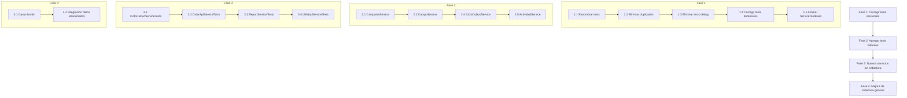

# Plan de Corrección de Tests - Servicios

## Resumen Ejecutivo

Se analizaron **18 archivos de test** para servicios, cubriendo **16 servicios** del proyecto AgroForm. Se identificaron problemas comunes, tests duplicados, servicios sin cobertura, y oportunidades para mejorar la cobertura.

---

## Diagnóstico General

### Problemas Identificados

1. **Inconsistencia en filtrado por licencia**: Algunos tests asumen que servicios como [`CatalogoService`](../AgroForm.Business/Services/CatalogoService.cs:13), [`CultivoService`](../AgroForm.Business/Services/CultivoService.cs), [`TipoActividadService`](../AgroForm.Business/Services/TipoActividadService.cs), [`VariedadService`](../AgroForm.Business/Services/VariedadService.cs), [`LicenciaService`](../AgroForm.Business/Services/LicenciaService.cs), [`MonedaService`](../AgroForm.Business/Services/MonedaService.cs), [`EstadoFenologicoService`](../AgroForm.Business/Services/EstadoFenologicoService.cs) **NO filtran por licencia** (sus entidades no heredan de `EntityBaseWithLicencia`), pero los nombres de los tests sugieren que deberían hacerlo (ej: `GetAllAsync_DebeRetornarSoloLicenciaActual`).

2. **Tests con lógica defensiva/condicional**: Tests como [`GastoServiceTests.DeleteAsync_DebeEliminarSoloDeLicenciaActual`](../AgroForm.Tests/Services/GastoServiceTests.cs:295) usan `Assert.NotEqual` en lugar de `Assert.True`, indicando incertidumbre sobre el resultado esperado.

3. **Tests de depuración (debug)**: Archivos como [`LoteServiceTests`](../AgroForm.Tests/Services/LoteServiceTests.cs) contienen tests como `TestBasico_DebeVerificarAutenticacion` y `TestContexto_DebeVerificarDatosEnContextoDelServicio` que solo imprimen logs sin aserciones significativas.

4. **Tests duplicados**: Varios servicios tienen tests redundantes como `GetByIdAsync_DebeRetornarCorrecto_CuandoIdValido` y `GetByIdAsync_DebeRetornarCorrecto_CuandoExiste` que prueban exactamente lo mismo.

5. **Servicios sin cobertura**: [`CicloCultivoService`](../AgroForm.Business/Services/CicloCultivoService.cs), [`CierreCampaniaService`](../AgroForm.Business/Services/CierreCampaniaService.cs) (tiene tests pero no cubre métodos específicos como `FinalizarCampaña`), [`DolarApiService`](../AgroForm.Business/Externos/DolarApi/DolarApiService.cs), [`PdfService`](../AgroForm.Business/Services/PdfService.cs) (tiene tests pero son frágiles), [`ReportService`](../AgroForm.Business/Services/ReportService.cs), [`UtilidadService`](../AgroForm.Business/Services/UtilidadService.cs).

6. **Tests con nombres engañosos**: Tests nombrados "DebeRetornarSoloLicenciaActual" en servicios que no filtran por licencia (Catalogo, Cultivo, TipoActividad, Variedad, etc.).

7. **Problemas de configuración**: El [`ServiceTestBase`](../AgroForm.Tests/Services/ServiceTestBase.cs) usa `HttpContextAccessorMock` como `Mock<IHttpContextAccessor>` pero luego lo reemplaza con una instancia real `new HttpContextAccessor`, dejando el mock sin uso. Además, `LoggerMock` está declarado pero no se usa en los tests.

---

## Plan de Acción Detallado

### Fase 1: Corrección de Tests Existentes

#### 1.1 Renombrar tests con nombres incorrectos (servicios sin filtro por licencia)

Para los siguientes servicios, renombrar tests que dicen "DebeRetornarSoloLicenciaActual" a "DebeRetornarTodosLosRegistros" o similar:

| Archivo | Tests a renombrar |
|---------|-------------------|
| [`CatalogoServiceTests.cs`](../AgroForm.Tests/Services/CatalogoServiceTests.cs) | `GetAllAsync_DebeRetornarSoloLicenciaActual` → `GetAllAsync_DebeRetornarTodosLosCatalogos` |
| [`CatalogoServiceTests.cs`](../AgroForm.Tests/Services/CatalogoServiceTests.cs) | `GetAllWithDetailsAsync_DebeRetornarSoloLicenciaActual` → `GetAllWithDetailsAsync_DebeRetornarTodosLosCatalogos` |
| [`CatalogoServiceTests.cs`](../AgroForm.Tests/Services/CatalogoServiceTests.cs) | `DeleteAsync_DebeEliminarSoloDeLicenciaActual` → `DeleteAsync_DebeEliminarCorrectamente` |
| [`CultivoServiceTests.cs`](../AgroForm.Tests/Services/CultivoServiceTests.cs) | `GetAllAsync_DebeRetornarSoloLicenciaActual` → `GetAllAsync_DebeRetornarTodosLosCultivos` |
| [`CultivoServiceTests.cs`](../AgroForm.Tests/Services/CultivoServiceTests.cs) | `GetAllWithDetailsAsync_DebeRetornarSoloLicenciaActual` → `GetAllWithDetailsAsync_DebeRetornarTodosLosCultivos` |
| [`CultivoServiceTests.cs`](../AgroForm.Tests/Services/CultivoServiceTests.cs) | `DeleteAsync_DebeEliminarSoloDeLicenciaActual` → `DeleteAsync_DebeEliminarCorrectamente` |
| [`TipoActividadServiceTests.cs`](../AgroForm.Tests/Services/TipoActividadServiceTests.cs) | `GetAllAsync_DebeRetornarSoloLicenciaActual` → `GetAllAsync_DebeRetornarTodosLosTipos` |
| [`TipoActividadServiceTests.cs`](../AgroForm.Tests/Services/TipoActividadServiceTests.cs) | `GetAllWithDetailsAsync_DebeRetornarSoloLicenciaActual` → `GetAllWithDetailsAsync_DebeRetornarTodosLosTipos` |
| [`TipoActividadServiceTests.cs`](../AgroForm.Tests/Services/TipoActividadServiceTests.cs) | `DeleteAsync_DebeEliminarSoloDeLicenciaActual` → `DeleteAsync_DebeEliminarCorrectamente` |
| [`VariedadServiceTests.cs`](../AgroForm.Tests/Services/VariedadServiceTests.cs) | `GetAllAsync_DebeRetornarSoloLicenciaActual` → `GetAllAsync_DebeRetornarTodasLasVariedades` |
| [`VariedadServiceTests.cs`](../AgroForm.Tests/Services/VariedadServiceTests.cs) | `GetAllWithDetailsAsync_DebeRetornarSoloLicenciaActual` → `GetAllWithDetailsAsync_DebeRetornarTodasLasVariedades` |
| [`VariedadServiceTests.cs`](../AgroForm.Tests/Services/VariedadServiceTests.cs) | `DeleteAsync_DebeEliminarSoloDeLicenciaActual` → `DeleteAsync_DebeEliminarCorrectamente` |
| [`LicenciaServiceTests.cs`](../AgroForm.Tests/Services/LicenciaServiceTests.cs) | `GetAllAsync_DebeRetornarTodasLasLicencias` (ya está correcto) |
| [`MonedaServiceTests.cs`](../AgroForm.Tests/Services/MonedaServiceTests.cs) | `GetAllAsync_DebeRetornarTodasLasMonedas` (ya está correcto) |
| [`EstadoFenologicoServiceTests.cs`](../AgroForm.Tests/Services/EstadoFenologicoServiceTests.cs) | `GetAllAsync_DebeRetornarTodosLosEstados` (ya está correcto) |

Además, corregir las aserciones en estos tests para que reflejen correctamente que NO hay filtro por licencia (ej: `Assert.Equal(3, result.Data.Count)` en lugar de `Assert.Equal(2, ...)` cuando se insertan 3 registros).

#### 1.2 Eliminar tests duplicados

| Archivo | Tests duplicados a eliminar |
|---------|----------------------------|
| [`CatalogoServiceTests.cs`](../AgroForm.Tests/Services/CatalogoServiceTests.cs) | `GetByIdAsync_DebeRetornarCorrecto_CuandoExiste` (duplica `GetByIdAsync_DebeRetornarCorrecto_CuandoIdValido`) |
| [`CultivoServiceTests.cs`](../AgroForm.Tests/Services/CultivoServiceTests.cs) | `GetByIdAsync_DebeRetornarCorrecto_CuandoExiste` (duplica `GetByIdAsync_DebeRetornarCorrecto_CuandoIdValido`) |
| [`CultivoServiceTests.cs`](../AgroForm.Tests/Services/CultivoServiceTests.cs) | `UpdateAsync_DebeFuncionarCorrectamente` (duplica `UpdateAsync_DebePreservarDatosOriginales`) |
| [`CultivoServiceTests.cs`](../AgroForm.Tests/Services/CultivoServiceTests.cs) | `DeleteAsync_DebeEliminarCorrectamente_CuandoExiste` (duplica `DeleteAsync_DebeEliminarSoloDeLicenciaActual`) |
| [`TipoActividadServiceTests.cs`](../AgroForm.Tests/Services/TipoActividadServiceTests.cs) | `GetByIdAsync_DebeRetornarCorrecto_CuandoExiste` (duplica `GetByIdAsync_DebeRetornarCorrecto_CuandoIdValido`) |
| [`TipoActividadServiceTests.cs`](../AgroForm.Tests/Services/TipoActividadServiceTests.cs) | `UpdateAsync_DebeFuncionarCorrectamente` (duplica `UpdateAsync_DebePreservarDatosOriginales`) |
| [`VariedadServiceTests.cs`](../AgroForm.Tests/Services/VariedadServiceTests.cs) | `GetByIdAsync_DebeRetornarCorrecto_CuandoExiste` (duplica `GetByIdAsync_DebeRetornarCorrecto_CuandoIdValido`) |
| [`ActividadServiceTestsSimple.cs`](../AgroForm.Tests/Services/ActividadServiceTestsSimple.cs) | Archivo completo (es un subconjunto de `ActividadServiceTests.cs`) |

#### 1.3 Eliminar o refactorizar tests de depuración

| Archivo | Tests problemáticos | Acción |
|---------|-------------------|--------|
| [`LoteServiceTests.cs`](../AgroForm.Tests/Services/LoteServiceTests.cs) | `TestBasico_DebeVerificarAutenticacion` | Eliminar (solo imprime logs) |
| [`LoteServiceTests.cs`](../AgroForm.Tests/Services/LoteServiceTests.cs) | `TestContexto_DebeVerificarDatosEnContextoDelServicio` | Eliminar (solo imprime logs) |

#### 1.4 Corregir tests con lógica defensiva

| Archivo | Test | Corrección |
|---------|------|------------|
| [`GastoServiceTests.cs`](../AgroForm.Tests/Services/GastoServiceTests.cs) | `DeleteAsync_DebeEliminarSoloDeLicenciaActual` | Cambiar aserciones condicionales por `Assert.True(result.Success)` directo |
| [`GastoServiceTests.cs`](../AgroForm.Tests/Services/GastoServiceTests.cs) | `GetAllAsync_DebeRetornarVacio_CuandoNoHayDatos` | Eliminar logs de depuración excesivos |

#### 1.5 Limpiar ServiceTestBase

| Problema | Acción |
|----------|--------|
| `LoggerMock` declarado como `Mock<ILogger<ActividadService>>` pero nunca usado | Eliminar propiedad o convertir a uso real |
| `HttpContextAccessorMock` declarado como `Mock` pero reemplazado por instancia real | Eliminar el mock, dejar solo la instancia real |
| `Console.WriteLine` en tests | Eliminar todos los `Console.WriteLine` de depuración |

---

### Fase 2: Agregar Tests Faltantes para Métodos Específicos

#### 2.1 CampaniaService - Métodos faltantes

| Método | Tests necesarios |
|--------|-----------------|
| [`GetCurrent()`](../AgroForm.Business/Services/CampaniaService.cs:41) | - Debe retornar campaña actual cuando existe - Debe retornar NOT_FOUND cuando no hay campaña actual |
| [`GetCurrentByLicencia(int?)`](../AgroForm.Business/Services/CampaniaService.cs:61) | - Debe retornar campaña en curso para licencia válida - Debe retornar NOT_FOUND cuando no hay campaña - Debe retornar BAD_REQUEST cuando idLicencia es null |
| [`FinalizarCampaña(int)`](../AgroForm.Business/Services/CampaniaService.cs:106) | - Debe cambiar estado a Finalizada - Debe cerrar ciclos activos - Debe retornar NOT_FOUND cuando id inválido |

#### 2.2 CampoService - Métodos faltantes

| Método | Tests necesarios |
|--------|-----------------|
| [`GetHistorialByIdAsync(int)`](../AgroForm.Business/Services/CampoService.cs:61) | - Debe retornar historial con lotes y ciclos de cultivo - Debe retornar NOT_FOUND cuando id inválido |

#### 2.3 CatalogoService - Métodos existentes (ya cubiertos)

Los métodos `GetByType` y `GetAllActive` ya tienen buena cobertura. OK.

#### 2.4 CicloCultivoService - SIN COBERTURA

| Método | Tests necesarios |
|--------|-----------------|
| [`CrearCicloAsync(int, int, int?, EpocaSiembra?)`](../AgroForm.Business/Contracts/ICicloCultivoService.cs:14) | - Debe crear ciclo cuando datos son válidos - Debe retornar error cuando lote no existe |
| [`CerrarCicloAsync(int)`](../AgroForm.Business/Contracts/ICicloCultivoService.cs:19) | - Debe cerrar ciclo activo correctamente - Debe retornar NOT_FOUND cuando id inválido |
| [`ObtenerCicloActivoAsync(int, EpocaSiembra?)`](../AgroForm.Business/Contracts/ICicloCultivoService.cs:24) | - Debe retornar ciclo activo cuando existe - Debe retornar null cuando no hay ciclo activo |
| [`ObtenerCiclosPorLoteAsync(int)`](../AgroForm.Business/Contracts/ICicloCultivoService.cs:29) | - Debe retornar ciclos ordenados por fecha - Debe retornar vacío cuando lote no tiene ciclos |

#### 2.5 ActividadService - Métodos faltantes

| Método | Tests necesarios |
|--------|-----------------|
| [`GetLaboresByAsync(int?, int?, List<int>)`](../AgroForm.Business/Contracts/IActividadService.cs:15) | - Debe filtrar por IdCampania - Debe filtrar por IdLote - Debe filtrar por múltiples IdsLotes |
| [`UpdateActividadAsync(ILabor)`](../AgroForm.Business/Contracts/IActividadService.cs:21) | - Debe actualizar actividad existente - Debe retornar error cuando actividad no existe |
| [`DeteleActividadAsync(int, TipoActividadEnum)`](../AgroForm.Business/Contracts/IActividadService.cs:19) | - Debe eliminar actividad correctamente |

#### 2.6 CierreCampaniaService - Métodos faltantes

| Método | Tests necesarios |
|--------|-----------------|
| Métodos específicos de cierre de campaña (si existen) | Revisar implementación para identificar métodos adicionales |

#### 2.7 UsuarioService - Métodos faltantes

| Método | Tests necesarios |
|--------|-----------------|
| Métodos de autenticación/login (si existen) | Revisar implementación |

---

### Fase 3: Agregar Tests para Servicios Sin Cobertura

#### 3.1 CicloCultivoService (NUEVO archivo)

Crear [`CicloCultivoServiceTests.cs`](../AgroForm.Tests/Services/CicloCultivoServiceTests.cs) con cobertura completa de:
- CRUD básico (heredado de ServiceBase)
- `CrearCicloAsync`
- `CerrarCicloAsync`
- `ObtenerCicloActivoAsync`
- `ObtenerCiclosPorLoteAsync`

#### 3.2 DolarApiService (NUEVO archivo)

Crear [`DolarApiServiceTests.cs`](../AgroForm.Tests/Services/DolarApiServiceTests.cs) con:
- Test de obtención de cotización (con mock de HttpClient)
- Test de manejo de errores de API
- Test de respuesta con datos válidos

#### 3.3 ReportService (NUEVO archivo)

Crear [`ReportServiceTests.cs`](../AgroForm.Tests/Services/ReportServiceTests.cs) con:
- Tests para generación de reportes
- Tests para comparativas

#### 3.4 UtilidadService (NUEVO archivo)

Crear [`UtilidadServiceTests.cs`](../AgroForm.Tests/Services/UtilidadServiceTests.cs) con:
- Tests para cálculos de utilidad
- Tests para márgenes

---

### Fase 4: Mejora de Cobertura en Tests Existentes

#### 4.1 Agregar tests de casos borde

Para TODOS los servicios CRUD, agregar:

| Caso borde | Descripción |
|------------|-------------|
| `CreateAsync` con entidad null | Validar que retorna error |
| `CreateAsync` con nombre duplicado | Validar comportamiento (actualmente permite duplicados) |
| `UpdateAsync` con entidad null | Validar que retorna error |
| `DeleteAsync` con id negativo o cero | Validar que retorna error |
| `GetByIdAsync` con id negativo o cero | Validar que retorna error |

#### 4.2 Agregar tests de integración con datos relacionados

Para servicios que usan `GetAllWithDetailsAsync` con includes:
- Verificar que los datos relacionados se cargan correctamente
- Verificar que el filtro por campaña funciona en los includes

---

## Resumen de Archivos a Modificar/Crear

### Archivos a MODIFICAR:

| Archivo | Cambios |
|---------|---------|
| [`ServiceTestBase.cs`](../AgroForm.Tests/Services/ServiceTestBase.cs) | Limpiar mocks no utilizados, eliminar `LoggerMock` |
| [`ActividadServiceTests.cs`](../AgroForm.Tests/Services/ActividadServiceTests.cs) | Agregar tests para UpdateActividadAsync, DeteleActividadAsync |
| [`ActividadServiceTestsSimple.cs`](../AgroForm.Tests/Services/ActividadServiceTestsSimple.cs) | **ELIMINAR** archivo completo |
| [`CampaniaServiceTests.cs`](../AgroForm.Tests/Services/CampaniaServiceTests.cs) | Agregar tests para GetCurrent, GetCurrentByLicencia, FinalizarCampaña |
| [`CampoServiceTests.cs`](../AgroForm.Tests/Services/CampoServiceTests.cs) | Agregar tests para GetHistorialByIdAsync |
| [`CatalogoServiceTests.cs`](../AgroForm.Tests/Services/CatalogoServiceTests.cs) | Renombrar tests, eliminar duplicados, corregir aserciones |
| [`CultivoServiceTests.cs`](../AgroForm.Tests/Services/CultivoServiceTests.cs) | Renombrar tests, eliminar duplicados, corregir aserciones |
| [`GastoServiceTests.cs`](../AgroForm.Tests/Services/GastoServiceTests.cs) | Corregir test defensivo, eliminar logs |
| [`LoteServiceTests.cs`](../AgroForm.Tests/Services/LoteServiceTests.cs) | Eliminar tests de depuración |
| [`TipoActividadServiceTests.cs`](../AgroForm.Tests/Services/TipoActividadServiceTests.cs) | Renombrar tests, eliminar duplicados, corregir aserciones |
| [`VariedadServiceTests.cs`](../AgroForm.Tests/Services/VariedadServiceTests.cs) | Renombrar tests, eliminar duplicados, corregir aserciones |

### Archivos a CREAR:

| Archivo | Contenido |
|---------|-----------|
| [`CicloCultivoServiceTests.cs`](../AgroForm.Tests/Services/CicloCultivoServiceTests.cs) | Tests completos para CicloCultivoService |
| [`DolarApiServiceTests.cs`](../AgroForm.Tests/Services/DolarApiServiceTests.cs) | Tests para DolarApiService |
| [`ReportServiceTests.cs`](../AgroForm.Tests/Services/ReportServiceTests.cs) | Tests para ReportService |
| [`UtilidadServiceTests.cs`](../AgroForm.Tests/Services/UtilidadServiceTests.cs) | Tests para UtilidadService |

---

## Orden de Ejecución Sugerido

---

## Notas Adicionales

1. **Prioridad**: Fase 1 es la más crítica (corrige tests existentes que fallan). Fase 2 y 3 agregan valor pero pueden hacerse en paralelo.

2. **Riesgo**: Al renombrar tests, asegurarse de que el nombre refleje EXACTAMENTE lo que el servicio hace. Si un servicio no filtra por licencia, el test no debe sugerir que lo hace.

3. **Dependencia**: Los tests de `CicloCultivoService` (Fase 2.4 y 3.1) aparecen en dos fases. En Fase 2 se agregan tests para métodos específicos, en Fase 3 se crea el archivo completo. Unificar en una sola fase para evitar duplicación.

4. **PdfServiceTests**: Los tests existentes son funcionales pero frágiles (dependen de valores exactos como `result.Data.Length > 10000`). Considerar relajar aserciones de tamaño.
